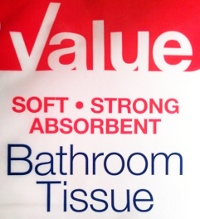
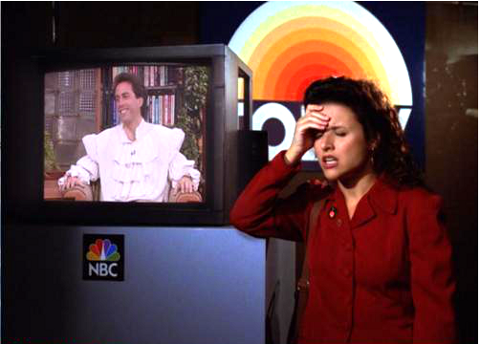

I read this today on the [facebook page](http://www.facebook.com/themigraineproject) of the [The Migraine Project](http://www.themigraineproject.com/):

> „Headache has become a euphemism in society for anything that’s a nuisance, right? ‘Oh, my god, I gotta go to this meeting. What a headache.’ And that’s a problem, because headache gets not respect, which is part of the reason why funding is so wholly inadequate.“
>
> – Dr. David Dodick, Neurologist.

First, I was not sure whether I agree. For one thing, we need figures of speech, someone who blogs knows. One might argue, though, that the use of „headache“ is not like „heartbreaking“. Still, headache is a very generic term.

Furthermore, I pondered. Is it an euphemism? „Bathroom Tissue“ is an euphemism (well-speaking). In contrast to this, the figure of speech above seems rather like to blaspheme (evil-speaking). Yet, it has exactly this euphemism spin to it. We don’t say, for instance, „*this meeting … f\*\*\*ing event*“ or „*pain in the ass*„, nor do we say something seemingly relative harmless (i.e., well-speaking). We use the word „headache“. Only the ignorance makes it an euphemism. Is this twice as bad an euphemism? How would we evaluate this sentence? „Oh, my god, I gotta go to this meeting. What a miggraine.“

Every country has its own euphemisms, I guess. (In German, we get a bit closer to the truth with the bathroom tissue.)

When ignorance makes something an euphemism, it seems to become international. I have seen the same pattern in Germany—including the inadequate funding, David Dodick was referring to. (In case you wonder what adequate funding is, let me give you just two numbers. In the US and Europe, the annual cost of migraine for their economies is astronomical high: \$19.6 billion and €27 billion, respectively.)

Headache diseases are everything but harmless. Migraines cause substantial levels of disability, ranking on a WHO disability scale at 0.7 (scale ranges from 0.0-1.0). In cluster headache suicidal ideations are substantial, occurring in 55% [in a survey of 1134 individuals](http://onlinelibrary.wiley.com/doi/10.1111/j.1526-4610.2011.02028.x/abstract).

Whatever you think of the word „headache“ and the way it’s used out of the head pain context, similar sentences with „migraine“ are also all over the place. Migraine is not as generic a word as headache is. Migraine is a serious disease. (Headache can be a disease but they also can be a a mild symptom of something not worth to worry much about.)

I once read in [The New York Times about the indie folk rock band „The Antlers“](http://www.nytimes.com/2011/05/10/arts/music/new-cds-from-antlers-wild-beasts-and-okkervil-river.html):

> It can get too dour, this image wrangling, like the Decemberists with a migraine.

Have you ever read something similar referring to epilepsy? „*It can get too bustling … like Led Zeppelin with epilepsy?*“ Who would write such a thing?

One more? [The New York Times again in a City Critic](http://www.nytimes.com/2011/08/07/nyregion/paul-gregory-of-focus-lighting-offers-ways-to-illuminate-new-york.html):

> „… a walk into this place brings on an instant migraine“.

Really, I could go on with lots of examples I came across, but I spare you them here. I am sure, everyone has heard these many times.

Ok, here is one I actually liked.

> „I Feel a Ruffle Migraine Coming On.“  
> – Elaine Benes (from sitcom „Seinfeld“)

I liked that because „ruffle“ is a really clever reference to the [early phase of visual disturbances in a migraine with aura](http://www.scilogs.com/gray-matters/migraine-attack-dont-drive/). Was the pun intended? I’m quite sure, but maybe not.

My advice? Just don’t use migraine or even headache completely out of context. Show some respect.
