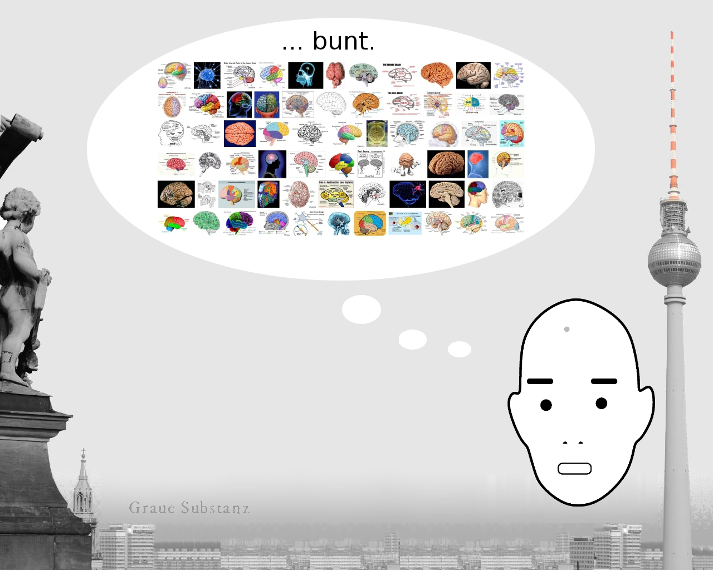
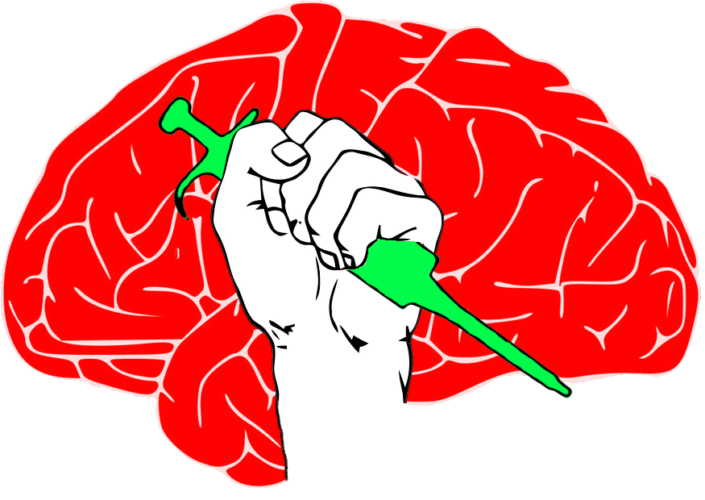
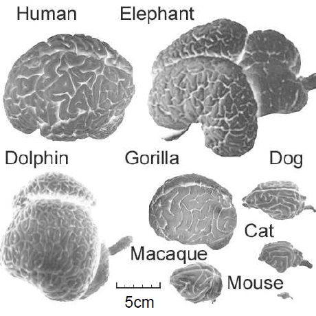
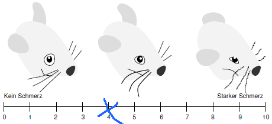
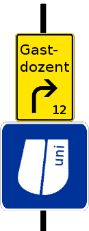
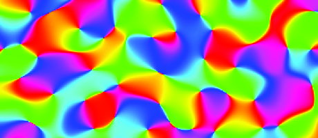

Dieses Jahr gab es (mit diesem) 50 Beiträge in der Grauen Substanz.

**Januar**

Der *Myograph*, auch Froschwecker genannt.

Die Entladung eines elektrischen Fischs lässt den in einer Streckvorrichtung eingespannten Forschschenkel periodisch zucken und die Glocke schlagen: dong, dong, dong. [[Rückklick](https://scilogs.spektrum.de/blogs/blog/graue-substanz/2011-01-12/der-freie-wille-des-froschschenkels)]

**Februar**

Migräne live.

Serene Branson, eine US-Fernsehreporterin, verfiel während ihrer Berichterstattung über die *Grammy Awards* in ein unverständliches Kauderwelsch, bevor ihre Reportage abgebrochen werden musste. Diagnose: Migräneanfall. [[Rückklick](https://scilogs.spektrum.de/blogs/blog/graue-substanz/2011-02-21/schlaganfall-der-keiner-war)]

**März**

Was ist Schmerz?

  
 Mir über die Schulter geschaut: Ein Tafelbild aus meinem Büro. 2012 will ich mehr zum Thema Schmerz bloggen. [[Rückklick](https://scilogs.spektrum.de/blogs/blog/graue-substanz/2011-03-23/was-ist-schmerz)]

**April**

Oh Schreck, das Gehirn ist …

Über das Fehlen einer Bunt-Hirn-Schranke. [[Rückklick](https://scilogs.spektrum.de/blogs/blog/graue-substanz/2011-04-09/bunt-hirn-schranke)]

**Mai**

Arbeitsplatz Wissenschaft.

Ohne Worte. [[Rückklick](https://scilogs.spektrum.de/blogs/blog/graue-substanz/2011-05-01/schluss-mit-45)]

**Juni**

Haben Mäuse Migräne?

[[Rückklick](https://scilogs.spektrum.de/blogs/blog/graue-substanz/2011-06-21/haben-maeuse-migraene)]

**Juli**

Die Juni-Frage wird mit der Maus-Grimassen-Skala beantwortet.

[[Rückklick](https://scilogs.spektrum.de/blogs/blog/graue-substanz/2011-07-15/auf-der-maus-grimassen-skala-eine-4)]

**August**

Beim Blog Speed Dating wählten Leser ihren Favoriten. Damals wie heute wünsche ich mir Rückmeldung, um zukünftige Themen im Blog auswählen zu können.  [[Rückklick](https://scilogs.spektrum.de/blogs/blog/graue-substanz/2011-08-02/migraene-blog-speed-dating)]

**Septemper**

Der Homunculus.

Ohne Worte. Dafür mit … [[Rückklick](https://scilogs.spektrum.de/blogs/blog/graue-substanz/2011-09-26/der-homunculus-ein-daumenlutscher)]

**Oktober**

Migräneforschung muss nicht graue Theorie sein.

In diesem Beirag geht es bunt zu. [[Rückklick](https://scilogs.spektrum.de/blogs/blog/graue-substanz/2011-10-04/satte-spezialisten-ueberreizen-das-gehirn)]

**November**

Wege Tarifsrecht und Gesetzte, die zum Schutz gedacht sind, zu umfahren, nerven mich gewaltig.

Dazu sind noch nicht die letzten Worte geschrieben. [[Rückklick](https://scilogs.spektrum.de/blogs/blog/graue-substanz/2011-11-23/die-umgehung-der-12-jahres-regelung)]

**Dezember**

Der Oktober-Betrag fand seine Fortsetzung.

Nicht nur zur Weihnachtszeit ist Ihr Gehirn so bunt. [[Rückklick](https://scilogs.spektrum.de/blogs/blog/graue-substanz/2011-12-06/wie-licht-migraene-ausloest-hip-hop-neuroscience-fusion)]

---

Ich wünsche allen Lesern schon heute einen Guten Rutsch ins Jahr 2012.
