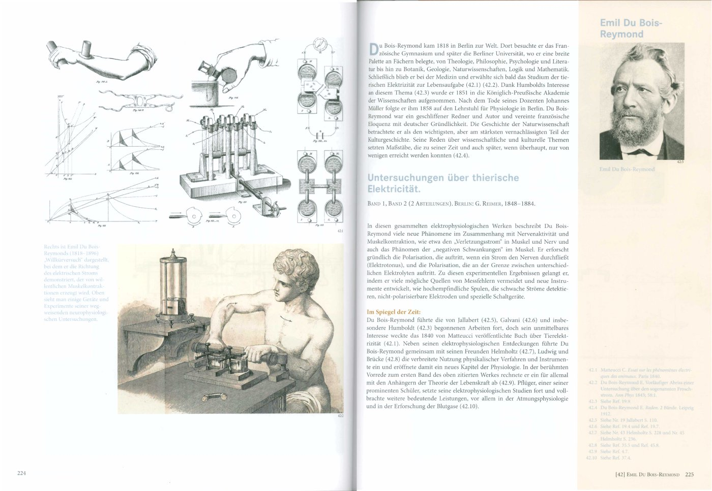
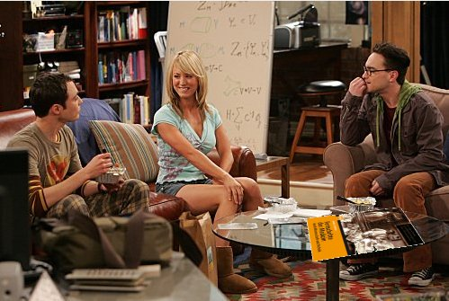

 *Fortschritte der Medizin durch Wissenschaft und Technik: 99 wegweisende Veröffentlichungen aus fünf Jahrhunderten  
 von Andras Gedeon, Spektrum Akademischer Verlag.  
 552 Seiten  
 EUR 59,95 (**[bestellen](http://www.science-shop.de/artikel/1024169))*

**Prolog**

Es ist ok Nerd zu sein. Spätestens seit der US-amerikanischen Sitcom *The Big Bang Theory* wissen das auch die anderen. Bleiben Nerds unter sich, brauchen sie keine Kaffeetischbücher um eine Unterhaltung in Gang zu bringen. Aber so eine gute Idee ist es nicht, unter seinesgleichen zu bleiben.  Spätestens seit *The Big Bang Theory* wissen das auch wir Nerds. Ergo: Nerds brauchen ein Kaffeetischbuch. Hier ist eins.

**99 Veröffentlichungen in 450 Jahren**

Detailreich und ansprechend illustriet werden 99 Veröffentlichungen vorgestellt, deren Einfluss auf die Medizin bedeutend war. Jeweils drei kurze Textblöcke finden sich, ergänzt auf der gegenüberliegenden Seite mit Abbildungen und gefolgt von zwei, manchmal vier weiteren Seiten mit Zeichnungen, Graphiken und Bildern, welche teilweise auch den Kontext zu neueren Arbeiten herstellen. Das ganze 99 mal.

   
 *Emil du Bois Reymond und sein Beitrag zum Fortschritt der Medizin (s.a. Blogpost [Ignorabimus und der Wandel der Physiologie](http://www.brainlogs.de/blogs/blog/graue-substanz/2010-05-03/wandel-der-physiologie)).© Fortschritte der Medzin, Spektrum Akademischer Verlag.*

Die Textblöcke teilen sich auf in eine Kurzbiographie des Autors, gefolgt von Titel und kurzer Zusammenfassung der Publikation und dann ein Text, "Im Spiegel der Zeit" überschrieben, mit Querverbindungen und Angaben zum Einfluss auf spätere Entwicklungen. In einer rechten Spalte ist dann noch ein Portrait des Autoren zu sehen und Referenzen schließen alles ab.

Das Buch ist also im Wesen ein Bilderbuch – eleganter ausgedrückt: ein Atlas der Medizingeschichte. Jedoch ein Bilderbuch nicht nur für Medizininteressierte. Die vorgestellten Veröffentlichungen kommen aus allen Bereichen der Naturwissenschaften. So finden wir z.B. auch James Clerk Maxwell darin mit einer Arbeit zu Kontrollsystemen, die als Vorläufer der Kybernetik gilt. Oder die von Legendre formulierte statistische Methode der kleinsten Quadrate. Da muss der Leser (der Betrachter ist passender) schon etwas nachdenken, bis er die Relevanz für die Medizin erkennt.

**Medizin Herzstück der Zivilisation**

In seinem Geleitwort stellt auch der Medizinhistoriker Paul Ulrich Unschuld den interdisziplinären Charakter der Medizin heraus, der noch weiter geht:

> Die Medizin ist das Herzstück der menschlichen Zivilisation. In der Medizin vereinen sich Wissenschaft und Technik, Ethik und Philosophie, Sprache und Soziologie, Politik und Ökonomie und viele andere Komponenten, die in ihrer Gesamtheit das Wesen unserer Kultur ausmachen.

Ein Atlas zur Medizingeschichte bietet also für jeden etwas. Dieser spezielle legt den Schwerpunkt auf die Technik, was den Käuferkreis bei einem Bilderbuch aber nicht notwendigerweise einengt. Wer sich von Abbildungen entführen lassen will, der ist hier bestens bedient.

Für mich ist es ein Kaffeetischbuch im besten Sinn, wenn auch das "Sujet" zunächst fremd erscheint. Es müssen ja nicht immer englische Gärten sein. Eine [Leseprobe](http://www.science-shop.de/sixcms/media.php/370/gedeonleseprobe.pdf) zum reinschnuppern in die ersten beiden vorgestellten Arbeiten von Albrecht Dürrer und Ambroise Paré findet sich im [Scienceshop](http://www.science-shop.de/artikel/1024169).

**Epilog**

  
 *Dr. Sheldon Cooper, Penny und Dr. Leonard Hofstadter sitzen um den Kaffeetisch. Szene aus der Sitcom* The Big Bang Theory. Ob es Leonard gelingt Penny für Technik zu begeistern?

*Nerd Leonard denkt*:

> Hast du etwas Zeit für mich  
>  Dann bringe ich Dir etwas bei  
>  Aus 99 Manuskripten  
>  Auf ihrem Weg zum Horizont  
>  Denkst du vielleicht klug ich sei  
>  Dann bringe ich Dir etwas bei  
>  Aus 99 Manuskripten  
>  Dass Fortschritt von so was kommt

**Verweise zur online Bestellung**

[Direkt bei Springer](http://www.springer.com/spektrum+akademischer+verlag/spektrum-sachbücher/book/978-3-8274-2474-7)

[Fortschritte der Medizin](http://www.science-shop.de/artikel/1024169) im Science-Shop mit [Leseprobe](http://www.science-shop.de/sixcms/media.php/370/gedeonleseprobe.pdf)

  
 (pdf; 8.6 MB)](http://www.science-shop.de/sixcms/media.php/370/gedeonleseprobe.pdf)
