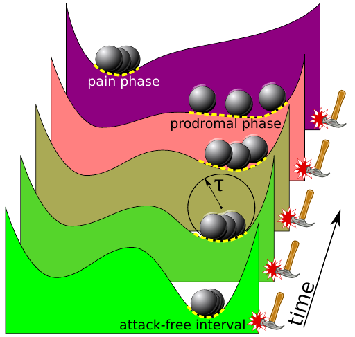

Migräne ist eine von Natur aus dynamische Krankheit. Attacken kommen und gehen – oft unregelmäßig. Im Gehirn laufen dabei die Ereignisse in einem komplexen Geflecht vernetzt und voneinander gegenseitig abhängig ab. Es gibt daher wahrscheinlich keinen einfachen Verlauf dieser Ereignisse von A nach B. In dem neuen Manuskript beschreiben wir deswegen das prinzipielle Verhalten unabhängig vom konkreten Verlauf in diesem komplexen Netzwerk im Rahmen der allgemeinen Theorie der Kipp-Punkte (Tipping Points) und erklären wie Auslöser (trigger) und Vorbotensymptome (prodromal phase) der Migräne von Betroffenen verwechselt werden können.

Über dieses „Mysterium“ wurde auch kürzlich in einem [Nature News Feature (“Aura of mystery”)](http://www.nature.com/nm/journal/v19/n9/full/nm0913-1083.html) berichtet.

Eigentlich ist es gar nicht geheimnisvoll. Verwirrung über scheinbar widersprüchliche Ursachen in der Nähe von Kipp-Punkten ist z.B. im Klimasystem der Erde bekannt und gut untersucht. Der Mechanismus, der diesen scheinbaren Widerspruch (s.u.) aufklärt, ist direkt mit dem Problem der Verwechslung von Symptomen mit Auslösern bei Migräne verwandt. Genau wie bei Migräne betrifft die Verwirrung die “Vorbotensymptome” des Klimawandels.

Ein Kipp-Prozess: Diese Illustration erklärt vereinfacht große Schwankungen nahe am Kipp-Punkt (prodromal phase). Sie wurde u.a. im Rahmen eines Workshops mit 36 führenden Klimaforschern im Oktober 2005 in der britischen Botschaft in Berlin gezeigt und später in der wissenschaftlichen Fachzeitschrift, die von der Akademie der Wissenschaften der Vereinigten Staaten herausgegeben wird, veröffentlicht ([„Tipping elements in the Earth’s climate system“, PNAS](http://www.pnas.org/content/105/6/1786.abstract)). Wir haben diese Theorie für Migräne adaptiert.

Extrem harte Winter, wie die von 2005-06 und 2009, scheinen einer globale Erwärmung zu widersprechen. Richtig ist dagegen, dass solche Ereignisse als Teil großer Schwankungen in der Nähe von einem Kipp-Punkt zu erwarten sind (s. Abbildung).

Es gibt halt keine einfachen Antworten auf einfache Fragen in sogenannten *nichtlinearen* Systemen und eine Interpretation der Kausalität ist schwierig.

So ist es möglich, das Essen von Schokolade für einen Trigger zu halten, während dies tatsächlich eine spezielle Heißhungerattacke ist, oder grelle Lichtblitze als Auslöser zu interpretieren, während in Wahrheit man nur extrem lichtempfindlich ist (Photophobie), Stress ist ebenso ein Beispiel bei dem die Interpretation der Kausalität leicht schief laufen kann. In all diesen und weiteren Fällen können großen Schwankungen in einem bestimmten Untersystem des Gehirns dieses Verwischung zwischen Auslöser und Vorbotensymptom erklären.

Wichtig ist nun, dieses Untersystem im Gehirn zu identifizieren.  Basierend auf einer Hypothese über ein einheitliches Untersystem im Gehirn ([Unitary hypothesis for multiple triggers of the pain and strain of migraine](http://onlinelibrary.wiley.com/doi/10.1002/cne.20688/abstract;jsessionid=5EFD4E6DD4E90D0987528EBE06390EA7.f03t04)), das mehrere Migräneauslöser erklären kann, schlagen wir nun vor, genau dort die großen Schwankungen als [Biomarker der Migräne](http://www.ncbi.nlm.nih.gov/pmc/articles/PMC3840387/) zu suchen.

Dieses Untersystem ist ein Teilnetzwerk und liegt im limbischen System sowie in den prä- und postganglionären parasympathischen Nervenzellen, die das vegetative Nervensystem steuern. Computermodelle und quantitative Modellierungsansätze etablieren sich immer mehr. Gleichzeitig steht die klinische Forschung vor der nicht leichten Aufgabe, wenn schon nicht die mathematische Konzepte genau zu durchdringen, so doch zumindest die relevanten Aussagen in die eigene Forschung zu integrieren. Wir hoffen nun [in einem Projekt im europäischen Rahmenprogramm](http://ec.europa.eu/research/health/medical-research/brain-research/projects/euroheadpain_en.html) diese transdisziplinäre Forschung weiter voranzutreiben.

PS

Drüben in der [Klimalauge](https://scilogs.spektrum.de/klimalounge/) kann man mehr zu Kipp-Prozessen lesen, z.B. [Sicherheitsrisiko Klimaspiralen – Are we “tumbling down the rabbit hole”?](https://scilogs.spektrum.de/klimalounge/sicherheitsrisiko-klimaspiralen-are-we-tumbling-down-the-rabbit-hole/)
