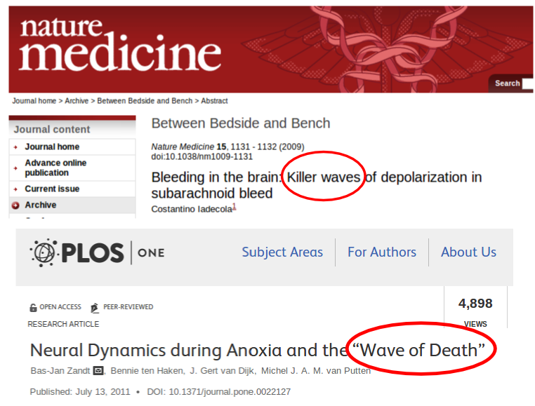

Angeregt durch den Workshop der VolkswagenStiftung wird jetzt in verschiedenen Foren nachgearbeitet. Eine Diskussion über Wissenschaftskommunikation lief gestern auf [Facebook](https://www.facebook.com/alexander.mader.5/posts/1467194213521566).  Daraus will ich einen Aspekt aufgreifen, da er mich als bloggenden Wissenschaftler direkt betrifft.

## Übertreiben für ein Laienpublikum?

Alexander Mäder versucht die auf dem Workshop von Geisteswissenschaftlern vorgebrachten Argumente zu übersetzen, da sie durch die „eher naturwissenschaftlich sozialisierten Kritiker“ eventuell nicht verstanden worden sind. Ich war nicht dabei, kann das also nicht beurteilen. Ich nehme die Argumente erstmal so wie sie  auf Facebook vorgebracht wurden und ausschnittweise hier unten stehen, denn es sind interessante Argumente, die ich jedoch nur bedingt teile.

> Wissenschaftler sind in der Öffentlichkeit präsenter als früher und das ist im Prinzip auch gut so. Allerdings laufen sie dort Gefahr, sich stärker an Geld und Anerkennung zu orientieren als es für die Wahrheitssuche gut wäre. Manche Wissenschaftler haben der Versuchung schon nachgegeben: Sie übertreiben zum Beispiel in den Medien ihre Forschungsergebnisse, um von der Politik mehr Unterstützung zu bekommen. Hier sollte die Wissenschaft gegensteuern, damit sie nicht unnötig Vertrauen verliert.

Im weiteren Verlauf der Diskussion wurden dann zur Illustration die Paper von Fouchier und Kawaoka zu den „Killerviren“ genannt.

> Die waren für eine breite Öffentlichkeit geschrieben. Aber müssen Wissenschaftler in ihren Fachartikeln an ein eventuelles Laienpublikum denken?

## Öffentlichkeit immer mitdenken

Ich wies u.a. darauf hin, dass Wissenschaftler bedenken sollten, dass natürlich immer die breite Öffentlichkeit mitlesen kann. Bei Open Access ganz ohne Probleme und zwischengeschalteten Journalisten oder Wissenschaftlern als Blogger. Das ist durchaus gewollt. Denn Wissenschaftler sind in allen außer ihren eigenen Disziplinen auch nur Laien und können u.U. Sachverhalte nicht besser einschätzen als jeder andere Laie. Gleichzeitig können sich diese fachfernen Wissenschaftler direkt interessieren, sei es, weil sie sich in ein interdisziplinäres Thema erst einarbeiten wollen, sei es, weil sie fachferne Bereichterstatter in einem Bewilligungsausschuss sind oder sei es, weil sie ein Thema schlicht privat interessiert. Letzteres gilt natürlich auch für Laien, die “nichtmals” fachferne Wissenschaftler sind.

Dieses Mitdenken der Öffenlichkeit heißt dabei nicht, auf Jargon in der Fachliteratur zu verzichten. Es bedeutet aber, das Killerschlagzeilen auch in Fachzeitschriften niemals nur nicht ein Augenzwinkern unter Fachkollegen sein kann.

Bei dem Stichwort Killerviren fiel mir nämlich sofort ein, dass auch in meinem Forschungsfeld Paper mit Titel wie „*Wave of death*“ (PLOS ONE, 2011) und „*Killer wave*“ (Nature Medicine, 2009) existieren.

Killerschlagzeilen als Titel in Fachpublikationen.

## Gibt es Killerschlagzeilen in der Wissenschaft für oder trotz Öffentlichkeit?

Meiner Meinung nach führt mehr Öffentlichkeit langfristig zu mehr Maßhalten. Blogs, in denen sich Wissenschaftler unmittelbar äußern, werden auch nachträglich noch die Begriffe erklären oder auseinanderpflücken können. Oder es geschieht in den Kommentaren. Es wird sich langfristig zeigen und rächen ob und wenn man übertreibt. Ich selber kenne die Autoren und habe über diese Arbeiten oben gebloggt. Es gehört jetzt nicht hierher, aber gerne schreibe ich nochmal über diese beiden, nennen wir sie Metaphern: „Wave of death“ und „Killer wave“.

**Anzreizsysteme gibt es immer**

Der Verdacht, dass Kommunikation per se ein wichtiges Anreizsystem ist und zu mehr Missbrauch führt, ist für mich nicht evident. Ja, Öffentlichkeit verschafft gesellschaftlich relevanten Themen mehr Gewicht. Es ist aber nicht so, dass Anreizsysteme ohne die Öffentlichkeit nicht schon immer existiert hätten und folglich sicher immer wieder auch missbraucht wurden. Dazu braucht es nämlich keine Öffentlichkeit – im Gegenteil. Der Gedanke das Wissenschaftler als Gruppe weniger korrupt sind als andere Bevölkerungsgruppen – inklusive Politiker oder Manager – halte ich für naiv.

Wer sich heute mit einer Killerschlagzeile in eine Fachpublikation oder auch Blog wagt, riskiert deutlich mehr als dass er gewinnt, wenn es eine unhaltbare Übertreibung ist. Ohne es genau zu wissen, kommt es mir zwar plausibel vor, dass diese Schlagzeilen in Fachpublikationen eher ein neues Phänomen sind. Und wer z.B. in Nature ein „News and Views” (oder wie oben ein „Between Bedside and Bench“) schreibt, wird von dem Editor angehalten ein Titel „NEEDS TO BE SHORT AND PUNCHY“, man will also Schlagzeilen. Doch das heißt nicht, dass Schlagzeilen missbräuchlich eingesetzt werden und gar im Text dann die Forschungsergebnisse der Schlagzeile angepasst übertrieben würden.

Zumindest halte ich Übertreibung bei geschlossener Kommunikation für wahrscheinlicher als bei offener Kommunikation. Zum Beispiel dass man bei einem internen Begutachtungsprozess gesellschaftliche Relevanz übertreibt und damit Erfolg hat, ist wahrscheinlicher als dass man erfolgreich öffentlich in dieser Richtung übertreibt. Interne Gutachter haben viel weniger Möglichkeiten und Zeit vor Ort schnell Übertreibungen zu entlarven, verglichen zu der Öffentlichkeit (zu denen ja auch andere Wissenschaftler und Journalisten gehören). Des Weiteren verflüchtigen sich diese Übertreibung schon morgen wieder, wenn sie hinter geschlossen Türen stattfinden. Öffentliche Aussagen haben bestand (Beispiel: [Manifest der Gehirnforschung](http://www.spektrum.de/alias/psychologie-hirnforschung/das-manifest/852357) und das darauf folgende [Memorandum „Reflexive Neurowissenschaft“](http://www.psychologie-heute.de/home/lesenswert/memorandum-reflexive-neurowissenschaft/) zehn Jahre später!).

Es ist also nicht die Kommunikation per se, die Gefahren schafft. Was eigentlich dahinter steckt ist die Angst, die Gesellschaft sei nicht reif genug und bekommt durch Kommunikation einen zu großen Einfluss auf die Forschung und würde bestimmte Themen vorziehen und damit den Niedergang der Wissenschaftsfreiheit besiegeln (siehe [Beitrag in der TAZ](http://www.taz.de/Demokratisierung-der-Wissenschaft-/!141685/)).

Öffentlichkeit schafft mehr Transparenz und verhindert eher Missbrauch als dass es diesen befördert, selbst wenn es in einer Übergangszeit und Lernphase erstmal auch anders sein kann. Der Weg geht sowieso nicht zurück zu weniger Öffentlichkeit. Wir Wissenschaftler müssen folglich damit umgehen lernen und unsere Wissenschaftsfreiheit durch Kommunikation verteidigen statt durch Verhinderung der Kommunikation diese scheinbar bewahren zu wollen.
