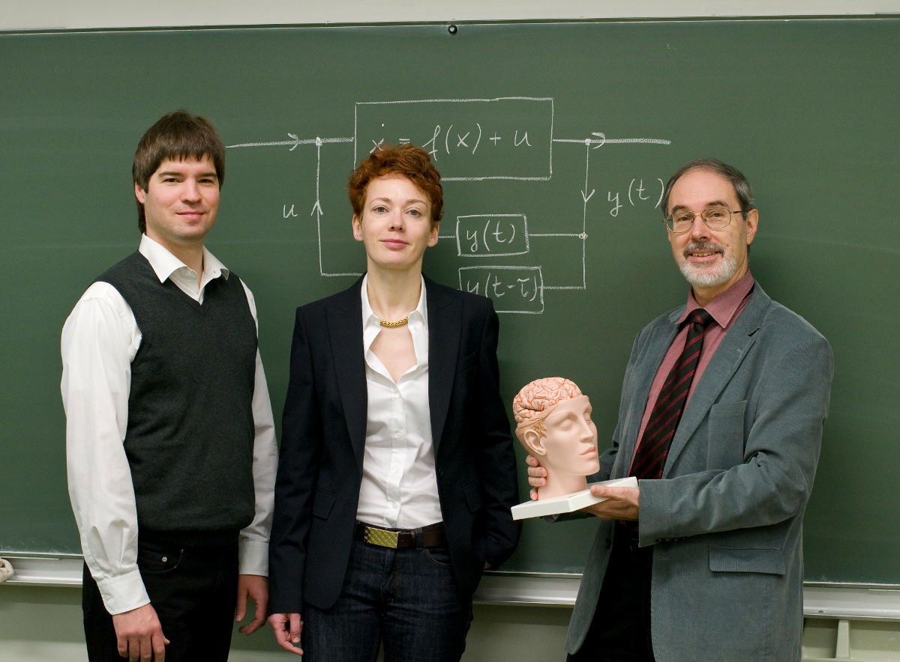

Gestern abend erhielten wir vorab die Nachricht, dass unser Sonderforschungsbereich 910 bewilligt wurde. Das Thema lautet „Kontrolle selbstorganisierender nichtlinearer Systeme: Theoretische Methoden und Anwendungskonzepte“. Dazu, insbesondere zu meinem Teilprojekt, gleich mehr.

Soeben erschien dann auch die Pressemitteilungen der [Deutschen Forschungsgemeinschaft](http://www.dfg.de/service/presse/pressemitteilungen/2010/pressemitteilung_nr_65/index.html) (DFG) und die der [TU Berlin](http://www.tu-berlin.de/?93708). Ein [Sonderforschungsbereich](http://www.dfg.de/foerderung/programme/koordinierte_programme/sfb/index.html) (SFB) war die Köngisklasse der Forschungsförderung zu Zeiten als wir noch nicht von Exzellenz sprachen. Und ein SFB definiert auch heute noch eine wichtige strategische Ausrichtung für eine Universität. Die Beteiligung u.a. aller sechs Professoren der theoretischen Physik der TU Berlin an diesem Sonderforschungsbereich hebt die zentrale Bedeutung des Themas „Nichtlineare Dynamik und Kontrolle“ hervor.

  
*Sonderforschungsbereich 910 (SFB 910): „Control of self-organizing nonlinear systems: Theoretical methods and concepts of application“ Prof. Dr. Eckehard Schöll, PhD (Sprecher), Prof. Dr. Sabine Klapp (stellv. Sprecherin) Dr. Philipp Hövel (Geschäftsführer). Darstellung auf der Tafel: Kontrolle durch eine Rückkopplungsschleife*. © TU-Pressestelle/Dahl*.*

Mein [Teilprojekt](http://www.itp.tu-berlin.de/sfb910/sonderforschungsbereich_910/project_groups/b_concepts_of_application/tp_b7/), dessen Fragestellung ich zusammen mit dem Sprecher des SFB, Eckehard Schöll, entwickelt habe, hat zwei zusammenhängende Teile, die *interne* und *externe* Kontrolle pathologischer Hirnaktivität.  In der von der DFG geforderten kurzen Zusammenfassung formulierten wir dies so:

> Wir wollen theoretisch untersuchen, wie interne Kontrollmechanismen im Gehirn das Auftreten von Reaktions-Diffusions-basierten nichtlinearen Erregungswellen, d.h.  *spreading depression* (SD), verhindern, und wie bei  deren Ausfall SD-Wellen durch externe Kontrolle unterdrückt werden können. SD ist eine pathologische  Aktivität in der menschlichen Hirnrinde; sie ist verknüpft mit Migräne, Schlaganfall und verschiedenen  Hirnverletzungen. Die Kontrolle der SD durch externe Neuromodulation ist von klinischer Bedeutung, weil SD vorübergehende neurologische Ausfälle verursacht, in deren Folge Kopfschmerzen (bei Migräne) oder dauerhafte Hirnschäden (bei Schlaganfall und Hirnverletzungen) auftreten.

Beide Teile erforschen die Kontrolle einer bestimmten pathologischen Hirnaktivität. Zum einen wollen wir uns fragen, wie kontrolliert das Gehirn sich selbst, um eine Übererregung zu verhindern? Zum andern, wie können wir durch Neuromodulation – damit meine ich externe, nicht-medikamentöse Stimulation der Nervenaktivität – diese pathologische Hirnaktivität unterdrücken, wenn sie auftritt?

Diese bestimmte pathologische Hirnaktivität, also die im Zitat oben als „Reaktions-Diffusions-basierte nichtlineare Erregungswelle“ umschriebene, sogenannte *spreading depression* (SD), war schon oft Thema meines Blogs. Der Neurologe Jens Dreier nennt in der Zeitschrift [NeuroForum](http://nwg.glia.mdc-berlin.de/de/neuroforum/2009/4/) „SD das mit weitem Abstand wichtigste pathophysiologische Phänomen des Hirns“.  Auch wenn wir als Forscher sicher nicht immer die größte Distanz zu *unserem* Forschungsobjekt haben, ist das in meinen Augen nicht übertrieben.

Ich selbst vergleiche gerne SD im Hirn mit einer La-Ola-Welle im Fußballstadion. Keine nahliegende Assoziation bei der medizinischen Bedeutung dieses Phänomens, aber mechanistisch durchaus passend.

Wie im Stadion Fußballfans ihre Erregung durch Aufspringen und Hinsetzen ihren Sitznachbarn weitergeben, so läuft im Gehirn von Nervenzelle zu Nervenzelle eine Übererregung durch die Hirnwindungen in dessen Folge die Nervenzellen zusammenbrechen (vollständig depolarisieren). Dass es nicht ständig zu solchen Übererregungen kommt, ist allein schon ein Rätsel. Denn im Gehirn sitzt ungeheuer dicht gepackt Nervenzelle an Nervenzelle, deren Wesen es ist, erregt zu sein und dies weiterzugeben.

Die externe Neuromodulation können Sie sich in diesem La-Ola-Wellen-Bild als einen Bienenschwarm vorstellen, der unkoordiniert einige Fußballfans aufschreckt und zwar kurz bevor die La-Ola-Welle ankommt und so deren Weiterleitung verhindert. Der Bienenschwarm wäre z.B. ein lokalisiertes elektromagnetisches Feld, welches Nervenzellen durch die Schädeldecke hindurch erregt. Wir wollen uns in den nächsten vier Jahren fragen, wo und wie genau der Bienenschwarm welche Fußballfans aufschrecken muss, um die La Ola zu unterbinden.

Ich werde über den Verlauf dieses Forschungsprojektes natürlich berichten. Bis dahin sei auf die folgenden acht Beiträge verwiesen, in denen ich bisher über dieses Thema geschrieben habe:

* „[Geist einer Sattel-Knoten-Verzweigung](http://www.brainlogs.de/blogs/blog/graue-substanz/2009-11-02/geist-einer-sattel-knoten-verzweigung)“ vom 2. Nov. 2009,
* „[Killerwellen vom Ozean ins Gehirn](http://www.brainlogs.de/blogs/blog/graue-substanz/2009-11-12/killerwelle)“ vom 12. Nov. 2009,
* „[Europa, Fußballstadion, Großhirnrinde](http://www.brainlogs.de/blogs/blog/graue-substanz/2010-01-19/efg)“ vom 19. Jan. 2010,
* „[Das Wo und Wann der Neuromodulation](http://www.brainlogs.de/blogs/blog/graue-substanz/2010-03-02/neuromodulation)“ vom 2. März 2010,
* „[Magnetschlag auf den Hinterkopf](http://www.brainlogs.de/blogs/blog/graue-substanz/2010-05-11/magnetschlag-auf-hinterkopf)“ vom 11. Mai 2010,
* „[Das Gehirn ist ein Torus](http://www.brainlogs.de/blogs/blog/graue-substanz/2010-08-23/das-gehirn-ist-ein-torus)“ vom 23. Aug. 2010,
* „[Chaos-Kontrolle: eine Gratwanderung mit geschlossenen Augen](http://www.brainlogs.de/blogs/blog/graue-substanz/2010-09-05/chaos-kontrolle-eine-gratwanderung)“ vom 5. Sept. 2010 und
* „[Blitzableiter für Hirngewitter](http://www.brainlogs.de/blogs/blog/graue-substanz/2010-11-12/blitzableiter-fuer-hirngewitter)“ vom 12. Nov. 2010.

Ein auführlicher Bericht erschien im englischsprachigen Blog *Gray Matters* über die Motivation meines Teilprojektes und den [Pfad der Schmerzleitung im Gehirn bei Migräne](http://www.scilogs.eu/en/blog/gray-matters/2011-01-01/a-deluxe-brain-feels-no-pain).
