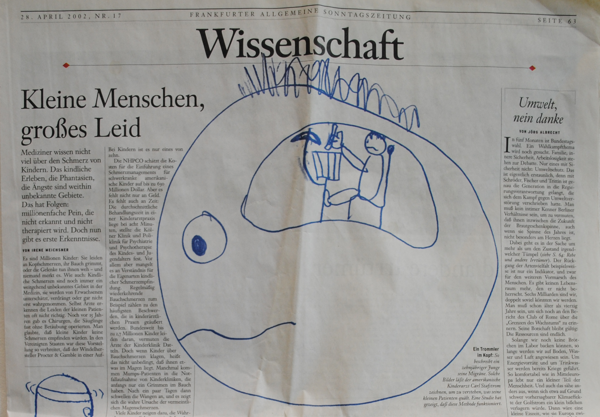

[Dieser Text ist im Rahmen des Bloggewitters “[Bloggen für Kinder”](https://scilogs.spektrum.de/bloggewitter/bloggen-fuer-kinder/) für etwa 8 bis 12 Jährige geschrieben. Weitere kurze Erläuterungen und eine Publikation zum Thema Schmerzen malen habe ich [hier](https://scilogs.spektrum.de/graue-substanz/kopfschmerzen-malen-fuer-erwachsene/) zusammengefasst.]

**Schmerzen malen**

Kinder lesen keine Zeitung. Du aber schon! Du liest gerade eine Internetzeitung über Wissenschaft. So eine Zeitung nennt man Wissenschaftsblog.

Wissenschaft ist, wenn man Dinge erklärt (z.B. warum gibt es Dinosaurier).

Du wirst vielleicht staunen: Erwachsene verstehen oft Wissenschaft nicht so gut. Du verstehst Wissenschaft aber sicher. Alle Kinder sind nämlich Wissenschaftler, denn Kinder wollen immer Dinge erklärt bekommen, Dinge verstehen und Dinge selber allein neu erklären.

Du sollst übrigens jetzt gar nicht lesen. Du sollst malen und mit deinem Bild etwas erklären! Ich sage dir nur noch eben kurz, was genau du malen sollst und warum.

Du sollst Schmerzen malen, Kopfschmerzen oder Bauchschmerzen oder andere Schmerzen.

Wenn deine Mutter und dein Vater mitlesen, denken sie sicher: Wie soll das denn gehen, Schmerzen malen?

Ich bin sicher, du weist ganz genau, wie das geht. Also erkläre ich Dir gar nichts weiter. Ist doch ganz einfach, oder vielleicht nicht? Male was dir einfällt. Falsche Bilder gibt es nicht.

Falsch wäre höchstens, wenn Erwachsene dir erklären, wie du Schmerzen malen sollst. Warum das falsch ist? Weil Du dann ja mit Deinem Bild erklärst, was ein Erwachsener denkt, was Schmerzen sind. Ich schrieb ja oben, dass Erwachsene nicht mehr so viel von Wissenschaft verstehen. Sie haben vergessen, dass man Dinge auch *selber allein neu* erklären muss.

Ich muss dir nur noch erklären, warum du deine Schmerzen malen sollst.

Mit Bildern erklären Kinder den Ärzten/innen und den erwachsenen Wissenschaftlern/innen, wie es sich genau anfühlt, wenn es weh tut. Das kann man oft besser malen als beschreiben. Du kannst Bilder malen und damit erschaffst du Wissen über Schmerzen. Du bist also ein Wissen-schaftler, weil Du mit Bildern eine Erklärung schaffst.

Manche Bilder kommen dann sogar in die Zeitung. Wenn du mir deine Bilder zuschickst, dann kommen diese Bilder hier in diesen Wissenschaftsblog. Versprochen!! (Deine Eltern werden sicher beim Zuschicken helfen, das dürfen sie.)

Also los, Schmerzen malen!

*Autoren: M. Dahlem (46 Jahre) und ein neunjähriger Junge.*  

Hier gib es [weitere Informationen für Erwachsene](https://scilogs.spektrum.de/graue-substanz/kopfschmerzen-malen-fuer-erwachsene/).
