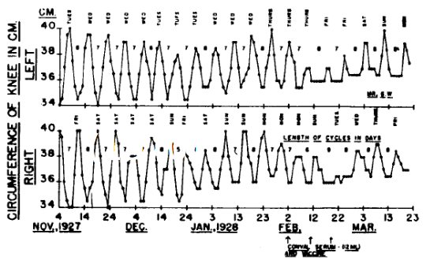

Krankheiten werden manchmal mit einem Adjektiv versehn. Eine *schwere* Krankheit, eine *unheilbare* Krankheit oder auch eine *häufige*Krankheit. So wird ein Bezug zur Verlaufsform genommen oder etwas über die Verbreitung gesagt. Andere Adjektive, wie *erbliche* Krankheit oder, seit Mitte der 1960er Jahre, *genetische* Krankheit, nehmen Bezug auf eine Ursache.

Was ist dann eine *dynamische* Krankheit?

Krankheiten als dynamische Krankheit anzusehen, lässt sich weit zurück verfolgen. Es finden sich in der Fachliteratur erste Ansätze zu „periodischen Krankheiten“. Es sind Vorläufer dessen, was wir heute dynamische Krankheiten nennen.1 Zum Beispiel weist der im Wochentakt periodisch schwellende Knieumfang bei Arthrose auf eine dynamische Krankheit hin.

Über Monate in mühsamer Handarbeit gemessener Knieumfang macht eine periodische Krankheit sichtbar.1

## Erklärung mit therapeutischen Nutzen

Der heute in der Fachwelt genutzte Begriff „dynamische Krankheit“ wurde im Jahr 1977 geprägt. Gezielt wurde ein neuer theoretischer Ansatz als Alternative zu dem der genetischen Krankheiten entwickelt. Das schien lohnend, weil sich damit Therapien spezifisch ableiten lassen sollten. Michael C. Mackey und Leon Glass definierten damals in der Zeitschrift Science mit einer wegweisenden Arbeit („*Oscillation and chaos in physiological control systems“,* dtsch.*:*Oszillation und Chaos in physiologischen Regelsystemen) dynamische Krankheiten als jene mit abrupt einsetzenden, oszillierenden Symptomverlauf.2

Das abrupte Einsetzen oszillierender Symptome einer Krankheit kann mit Hilfe der Chaostheorie mathematisch eindeutig klassifiziert werden. Hinter dieser Klassifikation verbirgt sich die Chance, die außer Kontrolle geratenen physiologischen Regelkreise gezielt zurück in einen normalen Bereich zu steuern. Der Begriff Dynamik ist hier zentral – worauf noch eingegangen wird –, deswegen wird dieses Forschungsfeld statt als „Chaostheorie“ heute mit „nichtlineare Dynamik“ bezeichnet. Klingt sicher weniger spektakulär, ist dafür jedoch treffender und offenbart besser dieses Forschungsfeld als Grundlage der dynamischen Krankheiten.

Deklariert man eine Krankheit als erbliche Krankheit, erscheint dies zumindest bei genauem Hinsehen aus zwei Gründen weniger attraktiv als das Konzept der dynamischen Krankheiten.

Erstens ist eine erbliche Ursache keine taugliche Erklärung. Erklärungen sind letztlich immer Theorien. Und im besten Fall sollen Theorien auch einen Nutzen bringen. Die genetische Ursache gibt bestenfalls einen Hinweise auf beteiligte physiologische Regelsysteme. Ein Mechanismus verbirgt sich nicht hinter dem Verweis auf eine genetische Krankheit. Er bleibt im Verborgenen. Zudem ist die Erbanlage eine statische Gegebenheit.3

Dynamik hingegen schaut auf den Mechanismus des außer Kontrolle geratenen physiologischen Regelsystems. Dynamik erhebt den Anspruch ihn zu erklären – und zudem bringt Dynamik *veränderliche* Stellschrauben ins Spiel.

Zweitens muss man die Pathologisierung der genetischen Vielfalt an sich hinterfragen. Da die Definition, was Krankheit ist, nie allein biologisch begründbar sondern immer auch soziale Konvention ist, scheint es mir sinnvoll, die genetische Vielfalt als Diversität ohne normative Wertung hinzunehmen und darüber nachzudenken, ob man den Begriff Krankheit erst auf der physiologischen Ebene anführt.

## “Dynamic disease” nicht “dynamical disease”

Mackey und Glass nannten diese Krankheiten zunächst „dynamic disease“ und nicht etwa „dynamical disease“. Dies wird von einigen als grammatikalisch inkorrekt angesehen – auch von Muttersprachlern und selbst Mackey und Glass sprachen später zumindest in bestimmten Fällen von der allgemeineren Formel der “dynamical disease”. Wohl auch, um nicht mehr letztlich nutzlose Diskussionen führen zu müssen.

Als Adjektiv müsste es „dynamical disease“ heißen. Gemeint ist jedoch was anderes. Es erinnert vielleicht sogar an Steve Jobs‘ „Think different“, was „Denke das Andere“ und nicht „denke anders“ bedeutet.

Dynamische Systeme („dynamical systems“) bezeichnen Systeme, die sich mit der Zeit ändernden. Von der Dynamik eines Systems zu reden, heißt mehr. Das Wort „dynamic“ soll den Mechanismus kennzeichnen. Man kennt einen erklärenden Mechanismus. Im Englischen steht das Substantiv „dynamics“ dabei immer im Plural und bezeichnet das Fachgebiet (das Verb steht dann im Singular).

So spricht man von „dynamic market“ oder von „dynamic person“ wenn man die Kraft als zentraler Einfluss der mechanistischen Eigendynamik betont. Und eben genauso von „dynamic disease“, wenn man *die* – aus therapeutischer Sicht – interessante mechanistische Ursache in Form physiologischer Regelkräfte der Krankheit kennt. Hier wird nicht dem Konzept der „Lebenskraft“ und damit den Vitalismus das Wort geredet, sondern genau das Gegenteil. Es wird der Anspruch einer [organischen Physik](https://scilogs.spektrum.de/graue-substanz/organische-physik/) erhoben, wie er vor 170 Jahren von Emil du Bois Reymond, Hermann von Helmholtz, Ernst Wilhelm Brücke und Carl Ludwig erstmals formuliert wurde.

Vermutet man die Ursache nur in der Eigendynamik, hat diese aber noch nicht mechanistisch beschreiben (also erklärt), wird manchmal einschränkend von „dynamical disease“ gesprochen. Oder wenn man Diskussion um die korrekte Sprache ganz vermeiden will.

## Weg von Beschreibung hin zur Erklärung

Die Physik nutzt den Begriff Dynamik für einen erklärenden Mechanismus. Die Geburt der Dynamik kennzeichnet einen Übergang. Es ist der Übergang wenn nicht mehr bloß beschrieben wird, was sich verändert, sondern erklärt wird, wie es funktioniert. Der klassische Fall ist natürlich der wissenschaftliche Wandel beim Übergang von der Kinetik zur Dynamik der Planetenbewegung. Isaac Newton hat ihn vollzogen. Seine Leistung gilt unbestritten als eine der größten wissenschaftlichen Leistungen überhaupt – in meinen Augen die größte.

Wenn wir als Physiker also in der medizinischen Fachliteratur von „dynamic diseases“ reden, geht es darum die Krankheit in ihrem Mechanismus zu verstehen und dieses Wissen auszunutzen, um neue therapeutische Ansätze zu schaffen.

Was brauchen wir, um die Dynamik von Krankheiten zu erforschen? Daten! Das lehrt uns das historische Beispiel. Newton hätte ohne die Kinetik der Keplerschen Gesetze seine dynamischen Gesetzte nicht finden können. Johannes Kepler hätte ohne die Daten von Tycho Brahe seine Gesetzte nicht aufstellen können.

Die medizinischen Sternbeobachtungen liefern uns heute mobile Gesundheitsdienste.  Brahes Beobachtungen waren mit Abstand die präzisesten. Genau das können mobile Gesundheitsdienste heute für Krankheiten liefern, die sich über Wochen, Monate und Jahre dynamisch ändern.

Nehmen wir das Beispiel von Hobart A. Reimann. Er durfte noch von November 1927 bis März des Folgejahres in mühsamer Handarbeit den Knieumfang seiner Patientin beidseitig mehrmals wöchentlich vermessen, um eine periodische Krankheit sichtbar zumachen (siehe Abbildung oben). Mobiler Gesundheitsdienste werden solche und weitere Daten im Vorbeigehen übermitteln.

Die digitale Agenda der Europäischen Kommission „[Mobile Gesundheitsversorgung: Potenzial der Mobile-Health-Dienste soll erschlossen werden](http://europa.eu/rapid/press-release_IP-14-394_de.htm)“  nennt einige Vorteile – und diese allein sind atemberaubend –, die Agenda verkennt aber noch (soweit ich es sah) den Wert dieser Daten für die Identifizierung dynamischer Krankheiten.

## Epilog

Reimann hat seine Patientin später geheiratet. Wer die Messkurve oben betrachtet, kann sich die Hintergründe denken. Datenschutzrichtlinien, die die Patienten-Privatsphäre schützen, sind in diesem Beitrag außen vorgelassen.

## Fußnoten und Literaturquellen

1 Reimann, Hobart A. „Periodic diseases.“ *The Lancet* 282.7311 (1963): 782. [Link](http://www.sciencedirect.com/science/article/pii/S0140673663905816) (Bezahlwand). Die in dieser Arbeit beschriebene periodische Arthrose wurde erstmal schon 1845 erwähnt.

2 Mackey, Michael C., and Leon Glass. „Oscillation and chaos in physiological control systems.“ Science 197.4300 (1977): 287-289. [Link](http://www.sciencemag.org/content/197/4300/287.long) (Bezahlwand).

3 Zumindest kann die DNA-Sequenz nicht verändert werden. Welche Faktoren die Aktivität eines Gens bestimmen und [Gentherapie](http://www.spektrum.de/lexikon/neurowissenschaft/gentherapie/4586)lasse ich außen vor.
