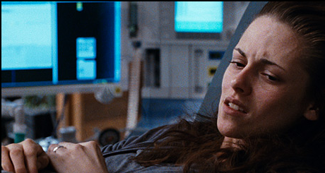
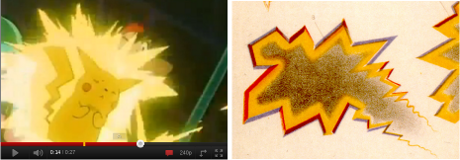

 Kontrastreiche Streifen- und Zickzackmuster können Migräne auslösen. Verkürzt gesagt, liegt dies an der Verschaltung der Nervenzellen in der Großhirnrinde, ein wenig genauer: an dem »funktionellen Aufbau« der Sehrinde, sie besteht aus spezialisierten, periodisch angeordneten Untereinheiten, die durch passende raumzeitliche Muster im Gesichtsfeld resonant angesprochen werden können. Das ist zumindest eine plausible These in guter Übereinstimmung mit den bekannten Daten aus psychophysikalischen Messungen und mathematischer Modellierung.

Epilepsie kann ebenso durch visuelle Reize ausgelöst werden. Die photosensible Epilepsie ist sogar eine recht bekannte Form dieser Erkrankung. Ich will in diesem Beitrag nicht detailiert auf Unterschiede in den visuellen Reizen eingehen, welche Migräne und welche Epilepsie auslösen. Nur soviel: Streifen- und Zickzackmuster werden bisher meist als Migräneauslöser genannt und farbige Lichtblitze, insbesondere die Farbe Rot in schnellen Intensitätswechseln, als Epilepsieauslöser, zumindest konnten diese Muster epileptogene Potentiale im EEG hervorrufen [1,2]. Wie jene raumzeitliche Muster mit der Migräne zusammenhängen, habe ich im [letzten Beitrag dieser Serie](https://scilogs.spektrum.de/blogs/blog/graue-substanz/2011-10-04/satte-spezialisten-ueberreizen-das-gehirn) erklärt.

Raumzeitliche Muster? Mit räumlichen Mustern meine ich schlicht ein Bild. Entsprechend ist ein raumzeitliches Muster eine Bildersequenz, also ein kurzer Filmausschnitt. So einfach sind Fachausdrücke oft. Doch sollte ich eben nicht nur schreiben: Epilepsie oder Migräne kann durch einen passenden *Film* ausgelöst werden. Denn die raumzeitlichen Muster sind wie durch eine perfekte Schablone erzeugte, genau passende Reize.

Wobei das mit dem Film gar nicht falsch wäre. Christian Reinboth (vom Blog [Frischer Wind](http://www.scienceblogs.de/frischer-wind/)) machte mich vor einigen Tagen darauf aufmerksam, dass aktuell über epileptische Anfälle berichtet wird, die durch eine besonders farbintensive Szene mit stroboskopischen Lichtwechsel ausgelöst wurden, während des Höhepunktes, der Geburt, im neuen Twilight Film „Breaking Dawn“, (dt. „Bis(s) zum Ende der Nacht“).

  
Die Geburt der Epilepsie aus dem Geiste des Bildes.

Regiseur Bill Condon versprach die Geburtsszene so graphisch und drastisch wie möglich zu machen. Es ist gelungen. Ich habe die Szene zwar nicht gesehen, denke aber die Farbe Rot wird eine wichtige Rolle gespielt haben.

> I think within the confines of a PG-13 rating, I think we’ve got something that’s pretty powerful.  
> (Bill Condon, Regisseur)

Die Altersfreigabe PG-13 (*Not recommended for a younger audience but not restricted*) entspricht etwa unserem FSK 12 (Freigegeben ab 12 Jahren). Dummerweise leiden auch Erwachsene an Epilepsie und Migräne. (Apropos Migräne, liest man z.B. in [Guardian](http://www.guardian.co.uk/film/2011/nov/25/twilight-breaking-dawn-causes-seizures) und [Huffpost](http://www.huffingtonpost.com/2011/11/25/breaking-dawn-seizures-tw_n_1112917.html) die Kommentare dazu, findet man auch gleich Hinweise auf Migräne. Eigentlich sind visuelle Auslöser nie ganz spezifisch nur einer dieser neurologischen Erkrankungen zuzuordnen und das verwundert mich nicht, zu ähnlich ist die Pathophysiologie1.)

Der bekannteste Epilepsie auslösende Filmausschnitt ist aus der 1997 ausgestrahlten und heute verbannten Folge [*Dennō Senshi Porigon*](http://de.wikipedia.org/wiki/Denn%C5%8D_Senshi_Porigon) (jap. でんのうせんしポリゴン, dt.: „Cyber-Soldat Porygon“) aus Pokémon. Über 600 Kinder kamen nach der ersten (und einzigen) Austrahlung ins Krankenhaus. Viele davon hatten bis dahin noch nie einen epileptischen Anfall.

Der Bildausschnitt aus dem Pokémon Film (links) ähnelt verblüffend einer Zeichnung der visuellen Migräne-Aura aus dem 19. Jahrhundert (rechts).

Sind die bekannten visuellen Migräne- und Epilepsie-Auslöser durch kulturelle Replikation nach bestimmten Gestaltgesetzen optimierte Lichtreize – ein bildliches Mem, wenn man so möchte, angepasst an den modularen Aufbau der Hirnrinde, für maximalen Effekt? Es ist keine Frage, Regisseure versuchen den ultimativen Adrenalin-Kick filmisch einzufangen. Die dabei oft genutzten blitzartigen Muster sind auffallend stereotyp. In einer Urform sind sie schon in Comics so zu finden aber eben bei weitem nicht mehr nur dort. Heute haben wir computergestützte Animationen davon.

Auch „Toy Story 3“ und das erst 3D Spektakel „Avatar“ wurden verdächtigt, aber 3D-Effekte allein scheinen nicht so kritisch zu sein [3] wie das Blitzen, Flickern und Zickzacken bestimmter Muster auf den Kinoleinwänden. Und auf unseren Bildschirmen. Smartphone, Notebook, eigentlich ist man heute doch nie mehr als 30cm von mindestens einem Bildschirm entfernt.

Wundern sollte es also wenig, dass, wohin man schaut, immer noch grellere und schneller Bildsequenzen unsere Aufmerksamkeit jagen und dabei – wahrscheinlich unbewußt, aber wer weiß ? – sich optimalen Reizmustern annähern und zu tückischen Migräne- und Epilepsie-Tiggern werden.

Man kann diese Entwicklung Reizüberflutung nach Dawkinsschen Prinzip nennen. Denn die Anpassung geschieht ja gerade weil immer wieder gewisse Gestaltelemente kopiert, variiert und nach einem  Kriterium selektiert werden: je greller desto besser. Was ist noch greller als das Attribut Epilepsie auslösend? Mehr geht nicht. Aber vielleicht gehe ich da zu weit. Jedenfalls will ich nicht gleich Heimtücke unterstellen und schon gar nicht den kulturellen Niedergang dazu diagnostizieren. Jede Zeit, jede Kultur hatte ihre visuellen Epilepsie- und Migräne-Trigger. Wir haben Pokémon, Vampirfilme und … Hip-Hop. Dazu später mehr.

**Bisher in dieser Serie:**

(0) Einführung: [Visuelle Trigger, Halluzinationen und Therapie](https://scilogs.spektrum.de/blogs/blog/graue-substanz/2011-10-01/visuelle-trigger-halluzinationen-und-therapie)

(1) [Satte Spezialisten überreizen das Gehirn](https://scilogs.spektrum.de/blogs/blog/graue-substanz/2011-10-04/satte-spezialisten-ueberreizen-das-gehirn)

(2)       *eben dieser*

Anstehend:

(3) [Hip-hop Neurocience Fusion](https://scilogs.spektrum.de/blogs/blog/graue-substanz/2011-12-06/wie-licht-migraene-ausloest-hip-hop-neuroscience-fusion)

**Fu****ß****note**

1 Hier meine ich vor allem die Art, wie Gehirnzellen depolarisieren bei epileptischer Aktivität und bei Spreading Depression als Ursache der Migräneaura [4]. Dieser Aspekt ist der westliche, wenn wir die visuellen Trigger verstehen wollen. Natürlich gibt es ansonsten viele Unterschiede in der Pathophysiologie.

**Literatur**

[1] Shozo, T: Chronomatic sensitive epilepsy: a variant of photosensitive epilepsy, *Annals of Neurology*, (1999) **45**,790-793

[2] Fisher RS, Harding G, Erba G, Barkley GL, Wilkins A; Epilepsy Foundation of America Working Group: Photic- and pattern-induced seizures: a review for the Epilepsy Foundation of America Working Group. *Epilepsia*. (2005) **46**,1426-1441.

[3] Prasad M, Arora M, Abu-Arafeh I, Harding G.:  3D movies and risk of seizures in patients with photosensitive epilepsy. *Seizure*. (2011) [im Druck](http://dx.doi.org/doi:10.1016/j.seizure.2011.08.012).

[4] Kager, H. , Wadman, W. J. and Somjen, G. G.: Simulated seizures and spreading depression in a neuron model incorporating interstitial space and ion concentrations, (2000) J. Neurophysiol. **84**, 495.

© 2011, Markus A. Dahlem
