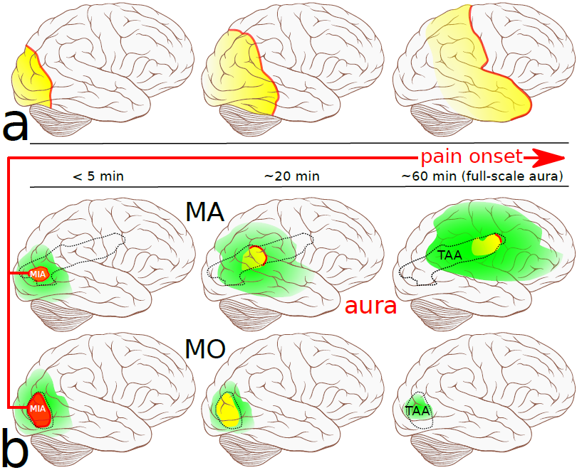
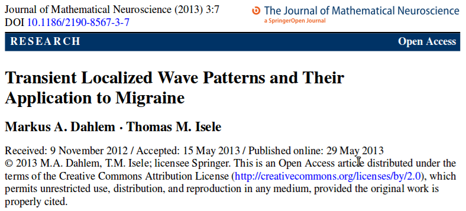

In einer [kürzlich veröffentlichten Arbeit](http://www.mathematical-neuroscience.com/content/3/1/7/abstract) untersuchen wir Muster der Übererregung des Nervensystems bei Migräne, Muster, die sich in der Großhirnrinde ausbilden und von denen [im letzten Beitrag schon die Rede war](https://scilogs.spektrum.de/graue-substanz/cortical-spreading-depression-migraene-letzte/). Diese Muster entstehen durch Diffusion geladener Teilchen (Ionen) im Zusammenspiel mit der Elektrophysiologie der Gehirnzellen, insbesondere mit exzessiven Entladungszuständen.

Die Diffusion macht diese Muster so langsam, dass sie nur schwer nachweisbar sind.

Betroffen sind klar begrenzte Gebiete der Großhirnrinde für einen ebenfalls begrenzten Zeitraum. Dies nennen wir ein Muster. Manchmal spricht man in der Physik auch von Struktur oder Strukturbildung, wobei eine sich selbst bildende Struktur in der Regel sehr lange stabil bleibt und nicht schnell wieder vergeht.

Migräne ist zwar eine chronische Erkrankung aber mit episodischer Manifestation und um diese geht es. Die episodische Übererregung am unmittelbaren Beginn einer Attacke vergeht ungefähr so schnell wieder, wie sie entstand. Alles spielt sich in unter einer Stunde ab, der Kopfschmerz bleibt etwas länger, bis zu 72 Stunden.

Betrachten wir also (vergängliche\*) Musterbildung, die Bildung und den Kollaps von raumzeitlichen Mustern, was ich mit [Big-Bang-und-Big-Crunch-Theorie der Migräne bezeichnet habe](https://scilogs.spektrum.de/graue-substanz/migraene-big-bang/).  

In [dieser Arbeit](http://www.mathematical-neuroscience.com/content/3/1/7/abstract) stellen wir die Hypothese auf, dass raumzeitliche Erregungsmuster individuell von Attacke zu Attacke verschieden sein können und Eigenschaften dieses Musters, wie z.B. seine Form, Größe, Lage relativ zu den Hirnwindungen und Dauer den Verlauf einer Migräneattacke bestimmen.

Als gesichert gilt, dass in Folge eines pathologischen Erregungsprozesses in der Großhirnrinde alle betroffenen Nervenzellen nahezu vollständig entladen werden und dies zu Beginn einer Migräneattacke als kurzzeitige (5-60min) Störung bemerkbar ist.

Meist ‚übersetzt‘ unser Gehirn diese Muster, die ja zu keinem äußeren Sinnesreiz gehören, in eine visuelle Halluzination. Es können jedoch auch völlig andersartige, teils wirklich grotesk seltsame sensorische oder kognitive Störungen von diesem endogenen neuronalen Aktivitätsmuster verursacht werden. Über fünfzig verschiedene Formen von Störungen [sind von uns aufgelistet worden](http://www.migraine-aura.com/content/e27891/e27265/e26585/index_en.html), angefangen von gestörter Wahrnehmung des Körperschematas über Sehstörungen, Synaesthesia, Sprach- und Sprechstörungen, Déjà vu, Störung der Zeitwahrnehmung und vielen, vielen, vielen anderen.

Der Spuk geht bis etwa eine Stunde; kurz darauf manchmal überlappend mit dieser sogenannten Auraphase beginnt der Kopfschmerz.

Unklar und [in der Fachwelt sehr umstritten](https://scilogs.spektrum.de/graue-substanz/cortical-spreading-depression-migraene-letzte/) ist bis heute, ob und wie der Kopfschmerz bei Migräne mit dieser Erregung zusammenhängt. Dabei wird das Erregungs*muster,* also seine Entstehung und seine Grenzen sowohl in Raum (Form) als auch in der Zeit (Dauer), bisher nicht als wichtiger Faktor beachtet.

Aufgrund unserer Studien denken wir, dass darin der Schlüssel zum Verständnis der Migräne liegen könnte. Liefern From, Größe, Lage und Dauer der individuellen Muster neue Erkenntnisse über den Verlauf einer Migräneattacke, insbesondere über dessen Schweregrad?

* Gibt es Muster, die nur Kopfschmerzen hervorrufen aber keine Aura ([Silent Aura](https://scilogs.spektrum.de/graue-substanz/unbemerkte-aura/))?
* Gibt es Muster, die nur die Aura hervorrufen aber keine Kopfschmerzen? (Denn seit Kästner wissen wir:  [Migräne sind Kopfschmerzen, auch wenn man gar keine hat](https://scilogs.spektrum.de/graue-substanz/migraene-sind-kopfschmerzen-auch-wenn-man-gar-keine-hat/).)
* Gibt es Muster, die die Aura und Kopfschmerzen hervorrufen? Wie bestimmt dieses Muster die Reihenfolge dieser Symptome?
* Gibt es Muster, die weder Aura noch Kopfschmerzen hervorrufen? Gibt es also eventuell solche Muster bei allen Menschen, nur die Muster bei Migränikern sind irgendwie anders?

Das alles sind Fragen, die ich heute aufgrund unserer mathematischen Modellierung nicht nur mit ja beantworten würde sondern worauf wir auch konkrete Antworten haben.

Wir müssten diese Muster nicht vorhersagen sondern würden längst die Antworten auf diese Fragen kennen, wären diese Muster nicht notorisch schwierig zu messen – und das obwohl oder gerade weil der Zustand im Muster zu den extremsten Zuständen gehört, in den eine Gehirnzelle geraten kann, [einem kurzzeitigen, unfreiwilligen Hungerstreik mit völliger Inaktivität.](https://scilogs.spektrum.de/graue-substanz/wenn-gehirnzellen-kein-brot-haben-sollen-sie-doch-kuchen-essen/) Die Veränderungen sind dabei sehr langsam. Zu langsam, um elektroenzephalographisch fassbar zu sein. Es sind nahezu hirnelektrische DC-(Gleichstrom)-Potenziale mit Frequenzen von vielleicht 0.05Hz. Im konventionellen EEG werden Frequenzen unter 0,5 Hz aus gutem Grund nicht aufgezeichnet, da sie kaum zu fassen sind wegen hoher Störsignale. Zum anderen sind es aus klinischer Sicht wiederum kurze episodische Zeitabschnitte, die auch noch spontan auftreten. Nur einige Minuten bis zu einer Stunde, da ist es schwer mit nichtinvasiver Bildgebung, wie der funktionellen Magnetresonanztomographie, diese einzufangen.

Diese  führte bisher dazu, dass dieses Muster, insbesondere seine Begrenzung, in Lehrbüchern, wissenschaftlichen Zeitschriften (z.B. [hier](http://www.nature.com/jcbfm/journal/v31/n1/fig_tab/jcbfm2010191f1.html)) und auch bei [Wikipedia](http://de.wikipedia.org/wiki/Streudepolarisierung) zu primitiv dargestellt ist. Man hat Beobachtungen einfach vom Tiermodell auf den Menschen übertragen.

Immer wird eine vom Hinterhauptpol des Großhirms sich ausbreitende, die Hirnrinde dann vollständig einhüllende Welle gezeigt (s. (a) unten in der Abbildung). Nur der Frontallappen wird ausgespart, wiederum ohne wirklich plausible Erklärung dafür.

Das ist mit Sicherheit ein viel zu einseitiger Verlauf und wahrscheinlich ist er in dieser Form sogar schlicht falsch dargestellt, denn das in den Zustand kurzzeitig rekrutierte Gebiet ist sehr groß, in der Tat viel zu groß, um im Einklang mit der Symptomatik der Migräne zu sein.

Tierexperimentell im Mausmodell oder beim Kaninchen sind durchaus ähnliche Formen beobachtet worden. Aber diese Gehirne sind eben kleiner. Muster skalieren nicht, denn der die Größe bestimmende Diffusionskoeffizient bleibt der selbe!

Die einfache Übertragung vom Tiermodell ist noch aus verschiedenen anderen Gründen fraglich, die wichtigsten davon sind neben der Hirngröße die Hirnwindungen und die veränderte Geometrie der neurovaskulären Kopplung.

(a) Erregunsmuster in der Großhirnrinde bei einer Migräneattacke mit Aura, wie es bis heute – wahrscheinlich falsch! – dargestellt wird. (b) Stärker begrenzte Ausbreitung als Wellenstück (Migräne mit Aura (MA)) oder kurzer (<5min) rein fokaler Herd ohne Ausbreitung (Migräne ohne Aura (MO)).

In den kommenden Jahren müssen wir klinische Studien entwickeln, um diese Muster genau zu beobachten. Dies ist durch unsere Vorhersagen durchaus leichter geworden, denn wir wissen nun wonach wir suchen müssen. Solche Studien werden nicht allein für Migräne sondern auch Schlaganfall und Epilepsie von enormer Bedeutung sein. Diese Muster gehören wahrscheinlich [mit weitem Abstand zu den wichtigsten pathophysiologischen Phänomenen unseres Gehirns](https://scilogs.spektrum.de/graue-substanz/cortical-spreading-depression-migraene-letzte/).

## Fußnote

\* Eine vorübergehende (*transient*) Nervenaktivität stellt besondere Herausforderungen sowohl an die klinische Beobachtbarkeit also auch an eine mathematische Analyse.
