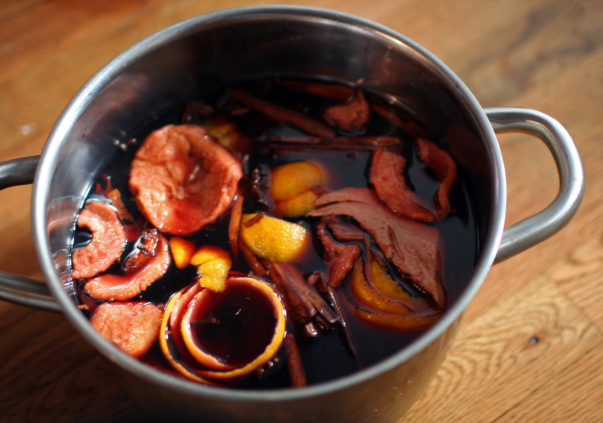

Düfte, Geschmäcker und Schmuck sorgen für den weihnachtlichen Gemütszustand. Sorgt der holzige Duft von Zimt auch für Migräne? Wie steht es mit einem orientalischen Mandelduft? Gerüche stehen bei vielen Betroffenen im Verdacht, Attacken auszulösen [1]. Auch Lebensmittel und selbst der Kunstschnee aus Dosen (gerade dieser!) kann gefährlich sein.

Weihnachten mit seiner Vielzahl typischer Einflüsse hat sicher noch mehr für Migräne zu bieten. Stress beispielsweise gehört so unbedingt zu Weihnachten wie zur Migräne. Wir schauen auf drei mögliche Auslösefaktoren: Glühwein, Lebkuchen und Kunstschnee und fragen anhand dieser Beispiele, was genau eine Migräneattacke provoziert. (Lebkuchen und Kunstschnee folgen mit eigenen Beiträgen.)

Wer einen anderen, typisch weihnachtlichen Einfluss im Verdacht hat, kann diesen gerne im Kommentarfeld nennen. Wir recherchieren dann gemeinsam.

## Löst Glühwein Migräne aus?

Vorab: äußere Einflüsse lösen meist nur im Einklang mit einem inneren Biorhythmus Attacken aus. Wir nennen diesen Rhythmus auch »*Migränezyklus*«. Nur wenn die Widerstandsfähigkeit herabgesetzt ist, was zu einer bestimmten Phase des Zyklus geschieht, gerät das Gehirn durch zusätzlich äußere Auslösefaktoren (schneller) über die Schwelle. Viele früheren Studien haben dieses Konzept nicht beachtet und kommen so zu teils scheinbar widersprüchlichen Ergebnissen.

### Alkohol

Zunächst muss man herausfinde, ob Alkohol Attacken auslöst. Denn es könnten auch die Begleitstoffe in alkoholischen Getränken sein. Eine Studie zeigte, dass 300 ml Rotwein aber nicht Wodka (reiner Alkohol) mit äquivalenten Alkoholgehalt Migräneattacken provozieren kann – und auch das nur bei einigen dafür empfindlichen Migränepatienten [2]. Eine andere Studie konnte gerade bei geringen Alkoholkonsum keine erhöhte Anzahl von Migräneattacken feststellen, jedoch durchaus, wenn Alkohol und Stress zusammen kamen [3] – der Weihnachtsmann lässt grüßen.

Viele reagieren gar nicht auf Alkohol empfindlich oder meinen das zumindest. Nur etwa ein Drittel der Migränikeerkrankten haben Alkohol im Verdacht, zumindest gelegentlich ihre Attacken auszulösen. Etwa 10% sehen im Alkohol einen zuverlässigen Auslöser [4].

### Begleitstoffe

Sehr viele Begleitstoffen stehen im Verdacht: Aromastoffe (Phenole), Konservierungsmittel (z.B. Sulfite), Gerbstoffe (Tannine) und insbesondere das Tyramin, ein biogenes Amin, das die selbe physiologische Wirkungen wie Neurotransmitter entfalten kann [5].

Tyramin mag potent sein, aber in der oben zitieren Rotwein vs. Vodka-Studie wurde eine Wein mit sehr niedrigen Tyramingehalt gewählt und dieser hat trotzdem die Attacken bei einigen ausgelöst.

Viele dieser Stoffe befinden sich sowieso in einigen Lebensmittel in viel höherer Konzentration als in alkoholischen Getränken. Sulfite sind in Lebensmitteln mit den E-Nummern E 220 bis E 228 gekennzeichnet. Auf andere Konservierungsstoffe kommen wir noch beim Lebkuchen zu sprechen. Sulfite kommen auch etwas höher dosiert im Weißwein vor. Natürlich gibt es auch Glühwein auf Weißweinbasis. Man kann ja mal vergleichen.

Ein Tipp: wer Glühwein selber macht, sollte so oder so einen Rotwein verwenden, der wenige Tannine hat. Vielleicht spart man dabei auch die Orangen und deren Schale. Viele haben diese im Verdacht und Studien gibt es natürlich auch dazu [6]. Aber auch hier käme es auf einen Versuch an.

## Wie wirkt der Glühwein – wenn er als Auslöser wirkt?

Alkohol wirkt euphorisierend. Begleitstoffe, vor allem das Tyramin, kann Leistungs- und Motivationsfördernd sein. Dahinter stehen unterschiedliche Botenstoffsysteme im Körper. Für die Experten: Dopamin und Noradrenalin. Gerade deren Zusammenwirken baut schneller Energiereserven ab [7,8]. So erhöht sich die Anfälligkeit für eine Migräneattacke. Deswegen ist auch die Tageszeit, zu der Glühwein getrunken wird, wichtig. Mittags zwischendurch beim Shoppen ist gefährlicher, da man all seine Energiereserven noch braucht, als abends. Allerdings beginnen viele Attacken auch in der Nacht.

## Schützt Glühwein vielleicht auch?

Glühwein enthält oft auch Ingwer. Ingwer gilt in der indischen und graeco-arabischen Medizin als Mittel gegen Migräne. Es gibt eine veröffentlichte Studien aus dem Iran, die Ingwer mit der Wirkung von Triptanen vergleicht [9]. Durch die antioxidative Wirkung des Ingwer soll es den Organismus vor sehr reaktiven, chemischen Verbindungen mit Sauerstoff schützen. Man nennt dies »oxidativem Stress«. Ein ganz aktueller Übersichtsartikel sieht im »oxidativem Stress« das verbindende Element aller Auslösefaktoren einer Migräneattacke [10]. Beim Kunstschnee aus Dosen wird uns dann noch der »nitrosative Stress« aufgrund reaktiver Stickstoffverbindungen begegnen. Stickstoffverbindungen spielen in meinen Augen bei Migräne eine zentralere Rolle.

Auch zeigen einige Studien, dass Menschen, die regelmäßig Alkohol konsumieren, seltener an Migräne leiden [8]. Erklärt wird dies mit veränderten Alkoholkonsum bei Migräneerkrankte und nicht etwa damit, dass Alkohol eine prophylaktische Wirkung hat. Richtig ist jedoch auch, dass gerade Rotwein ein gesundheitsfördernder Wohlfühlfaktor zugeschrieben wird. Darum geht es bei Weihnachten ja auch.

## Literatur

[1] Sjöstrand, C., Savic, I., Laudon-Meyer, E., Hillert, L., Lodin, K., & Waldenlind, E. (2010). Migraine and olfactory stimuli. Current pain and headache reports, 14(3), 244-251. ([Link](http://link.springer.com/article/10.1007%2Fs11916-010-0109-7))  & Stankewitz, A., & May, A. (2011). Increased limbic and brainstem activity during migraine attacks following olfactory stimulation. Neurology, 77(5), 476-482. ([Link](http://www.ncbi.nlm.nih.gov/pubmed/21775739))

[2] Littlewood, J., Glover, V., Davies, P. T. G., Gibb, C., Sandler, M., & Rose, F. C. (1988). Red wine as a cause of migraine. The Lancet, 331(8585), 558-559. (Link)

[3] Nicolodi, M., & Sicuteri, F. (1998). Wine and migraine: compatibility or incompatibility? *Drugs under experimental and clinical research*, *25*(2-3), 147-153. ([Link](http://europepmc.org/abstract/med/10370878))

[4] Panconesi, A. (2008). Alcohol and migraine: trigger factor, consumption, mechanisms. A review. The journal of headache and pain, 9(1), 19-27.

[5] Dueland, A. N. (2015). Headache and Alcohol. Headache: The Journal of Head and Face Pain, 55(7), 1045-1049.

[6] Eagle, K. (2012). Toxicological effects of red wine, orange juice, and other dietary SULT1A inhibitors via excess catecholamines. Food and Chemical Toxicology, 50(6), 2243-2249.

[7] Rasmussen, B. K. (1993). Migraine and tension-type headache in a general population: precipitating factors, female hormones, sleep pattern and relation to lifestyle. Pain, 53(1), 65-72.

[8] Le, H., Tfelt-Hansen, P., Skytthe, A., Kyvik, K. O., & Olesen, J. (2011). Association between migraine, lifestyle and socioeconomic factors: a population-based cross-sectional study. The journal of headache and pain, 12(2), 157-172.

[9] Maghbooli, M., Golipour, F., Moghimi Esfandabadi, A., & Yousefi, M. (2014). Comparison between the efficacy of ginger and sumatriptan in the ablative treatment of the common migraine. Phytotherapy Research, 28(3), 412-415.

[10] Borkum, J. M. (2015). Migraine Triggers and Oxidative Stress: A Narrative Review and Synthesis. Headache: The Journal of Head and Face Pain. (Link, frei einsehbar)

## Beitragsbilder:

„Advent wreath 4“ von SolLuna – Eigenes Werk. Lizenziert unter CC BY-SA 3.0 über Wikimedia Commons – https://commons.wikimedia.org/wiki/File:Advent\_wreath\_4.jpg#/media/File:Advent\_wreath\_4.jpg

„Glögg kastrull“ by Mr.choppers – Eget arbejde. Licensed under CC BY-SA 3.0 via Wikimedia Commons – https://commons.wikimedia.org/wiki/File:Gl%C3%B6gg\_kastrull.JPG#/media/File:Gl%C3%B6gg\_kastrull.JPG

