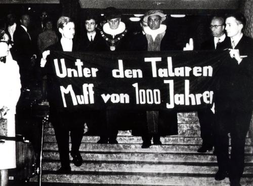

> Befristeter Vertrag, halbe Stelle, wenig Geld, hohe Lehrverpflichtung und vor allem kaum Aussicht auf Karriere: Der sogenannte wissenschaftliche Nachwuchs bleibt oft im akademischen System stecken. Zwischen Doktortitel und den raren Professorenstellen tut sich ein weites Feld prekärer Beschäftigungsverhältnisse auf. Aus Liebe zu ihrem Fach nehmen viele Wissenschaftler das in Kauf. Gefährdet das deutsche System die Qualität der Wissenschaft? Warum lassen sich so viele Akademiker das gefallen?

In der Sendung „Notizbuch“ wird heute auf Bayern2 einmal mehr das Thema aufgegriffen.

Hier geht es zum **[Live-stream](http://www.br.de/radio/bayern2/index.html)** und hier zum **[Blog](http://blog.br-online.de/notizblog/2012/04/19/lohnt-sich-karriere-an-der-uni-noch.html)** der Sendung.

Ich habe mit dem Redaktuer, Tobias Henkenhaf, kurz im Vorfeld gesprochen und lenke gerne nochmal die Aufmerksamkeit auf diese Sendung.

Gefallen hat mir seine Formulierung in der Ankündigung: „sogenannter“ wissenschaftlicher Nachwuchs, denn allein der Begriff [„Nachwuchs“ verrät den Systemfehler](https://scilogs.spektrum.de/blogs/blog/graue-substanz/2010-06-24/karrieremodelle-in-der-wissenschaft), worauf ich schon vor knapp 2 Jahren an dieser Stelle hinwies. Heute ist das Thema in aller Munde – wieder mal. Denn eigentlich wird seit den 1970er Jahren versucht, mehr Diversifikation und Transparenz in die wissenschaftlichen Karrierewege der deutschen Hochschullandschaft zu bringen. Bisher Vergebens. Es [mieft 45 Jahre weiter unter den Talaren](http://www.planet-wissen.de/alltag_gesundheit/lernen/universitaeten/img/intro_uni_revolte_g.jpg).

  
Protest über längst überholte universitäre Traditionen (1967).

Es ist kein Gesetz und nicht die klamme finanzielle Lage, die die Universitäten heute daran hindert, Fachgebiete weiter aufzuteilen und einen Teil der Beschäftigten im Mittelbau zu Dozenten im Oberbau aufzuwerten – mit Rechten in Lehre und Forschung, die Pflichten einer solchen Position nimmt dieser Teil ohnehin längst wahr. Es ist der Muff, der es verhindert.

Aktuelle Informationen über den Weitergang der Diskussion in Deutschland bekommen Interessierte in der facebook-Gruppe [25% akademische Juniorpositionen](http://www.facebook.com/akademischeJuniorposition) (seit Feb. 2011) und auf google+ [25% akademische Juniorposition](https://plus.google.com/u/0/105372939966022141725/posts). Eine statische Website mit den zusammnegefassten Forderungen ist [hier](http://sites.google.com/site/25paju/manifest).

Bitte teilen!
