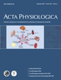

 In einem Editorial der Zeitschrift  *Acta Physiologica* wurde Anfang des Jahres darauf verwiesen, dass für Physiologie minimaler Wissensstandard und Lernziele im Rahmen des Bologna-Prozesses in Europa harmonisiert werden müssen [1].

*Acta Physiologica*ist die offizielle Zeitschrift der *Federation of European Physiological Societies (FEPS).* Mitglieder einer Task Force für Bildung der FEPS sollen nun diese Standards und Ziele als Richtlinie für das Curriculum in Physiologie definieren.

**Organe neu organisiert**

Zunächst wurde festgesetzt, dass sich diese Richtlinie an den Hauptorgansystemen orientieren soll. Elf solcher Systeme wurden identifiziert (s. Anhang). Wer genau hinschaut, wird festgestellen, dass in dieser neuen – im wahrsten Sinne des Wortes – Organisation das *integumentary system* (die Haut als Organsystem) nicht genannt wird. Luc Snoeckx, Leiter der Task Force schrieb mir auch warum, aber das ist gar nicht der wesentliche Punkt. Der Punkt ist, dass Wissensstandard und Lernziele gestrafft werden.

Durch die Harmonisierung steht, einerseits durchaus verständlich, die Humanphysiologie und die ärztliche Ausbildung mehr denn je im Vordergrund. Andererseits kommt jetzt vielleicht die wissenschaftliche Ausbildung zu kurz?

Das Problem wird in einer Stellungnahme zur Lehre in der Physiologie auf der [Website](http://www.physiologische-gesellschaft.de/index.php?target=politics) der Deutschen Physiologischen Gesellschaft ersichtlich:

> *Die Deutsche Physiologische Gesellschaft versteht die Physiologie als eine medizinische Grundlagenwissenschaft und das Lehrfach Physiologie folglich als eine wesentliche Basis der ärztlich orientierten Ausbildung. […]* *Diese Wissensvermittlung gelingt hierbei umso erfolgreicher, je klarer die Bezüge zur späteren ärztlichen Tätigkeit aufgezeigt werden. Gleichzeitig müssen [Ärzte] im Umgang mit wissenschaftlicher Methodik ausgebildet werden, um […] neue therapeutische und diagnostische Verfahren kompetent einschätzen und einsetzen zu können.*

Im zweiten Absatz wird dann die wissenschaftliche Ausbildung deutlich angesprochen.

> *Im Hinblick auf die angesprochenen Ziele einer praxisorientierten Ausbildung einerseits und einer Vermittlung wissenschaftlicher Methodik andererseits unterstützt die DPG Klinik-orientierte Lehre. […] Gleichzeitig muss sie von einer systematischen wissenschaftlichen physiologischen Ausbildung flankiert sein, die sich nicht ausschließlich an Fallstudien orientiert. […]*

Ich stimme dieser Stellungnahme voll zu. Physiologie als medizinische Grundlagenwissenschaft muss sich im Rahmen des Medizinstudiums an der ärztlichen Ausbildung orientierten. Woran denn auch sonst? Und durch den Bologna-Prozesses wird es sicher weitere, spezifische Zuschneidungen im Sinne dieser Ausrichtung geben.

Jedoch kann dann der Studiengang Medizin weder den hohen Anforderungen der Physiologie als Grundlagenwissenschaft gerecht werden, noch scheint es mir sinnvoll, Physiologen, die später vielleicht in der Pharmaindustrie arbeiten, durch diesen bei weiten teuersten Studiengang zu schleusen.

**Nobelpreis für Papyrologie**

Wie kann es also sein, dass wir dank Bologna heute so gut wie alles in Deutschland als Masterstudiengang studieren können, nur nicht Physiologie? Warum gibt es keinen Masterstudiengang Physiologie? Also einen Studiengang, der die systematisch wissenschaftliche Ausbildung in Physiologie in den Vordergrund stellt?

Wir können einen Nobelpreis für Physiologie gewinnen (*oder* Medizin, da steht berechtigt ein "oder"). Studieren aber können wir nur Papyrologie, Pferdewissenschaften  oder ProWater, nur um mal meine Highlights der Rubrik "P" zu nennen.

   
 *Auf [studieren.de](http://studieren.de/index.php?id=master&tx_assearchengine_pi1[page]=78) werden 3114 Masterstudiengänge gelistet. Physiologie sucht man vergeblich.*

Wer Arzt werden will ist heute sicher gut in seinem Studium mit dem Fach Physiologie abgedeckt. Er wird auch Physik und Biochemie lernen, ohne dass jemand auf die Idee käme, diese Studiengänge außerhalb des Medizinstudiums nicht anzubieten.

Ich vermag gar nicht abzuschätzen wieviele der 3114 Masterstudiengänge aus der Biologie entstanden sind. Es sind viele. Aber Zoophysiologie befindet sich auch nicht darunter. Und mit Verlaub, Zoophysiologie ist kaum die nichtärztliche Physiologie, für die ich hier eine Lanze breche. Mir geht es sehr wohl um Humanphysiologie als Grundlagenwissenschaft.

Wenn wir also im Rahmen des Bologna-Prozess unsere Haut opfern, dann laßt uns auf der anderen Seite wenigstens mehr gewinnen als die Pferdewissenschaften.

Eröffnet einen Masterstudiengang Physiologie!

**Anhang:**

Die 11 Körpersysteme aus [1]:

 * the central and peripheral nervous system,
* skeletal muscle system,
* respiratory system,
* blood and circulatory system,
* water and salt homeostasis system,
* urinary system,
* endocrine system,
* reproductive system,
* gastrointestinal system,
* metabolism, and
* thermoregulation.

Luc Snoeckx, Leiter der Task Force schrieb mir folgende Erklärung warum unsere Haut dem Bologna Prozesses geopfert wurde, und desweiteren ob Hauptkörpersysteme (major body systems) auch Organsysteme (organ systems) sind:

> Indeed, we did not consider the integumentum as a separate "organ" but preferred to make it part of the ‚functional‘ systems Nervous system and Thermoregulation. It is a choice, and I agree that it is defendable to put all the functions of the skin under one denominator.  
>  Your second remark is also correct if you consider the organs as anatomical organs, which we did not. We preferred the functional organs, and as such the approach of metabolism, homeostasis, and thermoregulation can be considered as "functional", more than organs, which is agreed upon.

**Literatur**

[1] Luc Snoeckx, Minimum standard and learning outcomes in physiology required by the Bologna process: the Federation of European Physiological Societies end-terms of physiology in a medical curriculum, *Acta Physiologica*, **200**:1-2, 2010.
