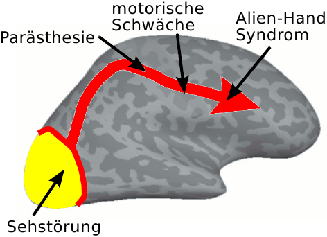
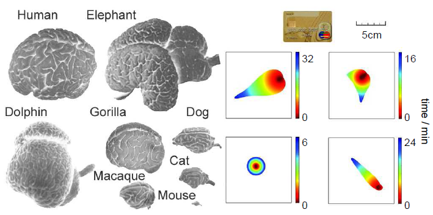

**Unser Wissen über Migräne können wir in Hypothesen fassen, die sich mathematisch formulieren lassen****. Ein beispielhafter Ansatz aus der Systemmedizin.\*** 

[Ein](https://scilogs.spektrum.de/graue-substanz/migraene-big-bang/), [zwei](https://scilogs.spektrum.de/graue-substanz/cortical-spreading-depression-migraene-letzte/), [drei](https://scilogs.spektrum.de/graue-substanz/kurzzeitige-muster-auf-der-grosshirnrinde/), [vier](https://scilogs.spektrum.de/graue-substanz/vielfalt-trotz-einheit-fehlfunktionen-des-gehirns/) Beiträge handelten zuletzt davon, was unser Gehirn unter der geschlossen Schädeldecke treibt, wenn wir gerade methodisch (EEG, fMRT, …) nicht hingucken können. Die Rede ist von einer extrem langsamen Ausbreitung zweidimensionaler Aktivitätsmuster auf der Großhirnrinde, die zu kurzzeitigen (5-60min) sensorischen und kognitiven Fehlfunktionen führen.

*Offensichtlich* wissen von dieser Aktivität nur Betroffene vom inneren Hörensagen, einem Zeugen, dessen Beweiswert Migräniker meist selbst kritisch gegenüberstehen. Ohne objektivierenden Befund [sprechen viele lieber nicht davon](https://scilogs.spektrum.de/graue-substanz/darueber-spricht-man-nicht/). Der Vorwurf, das alles klingt fabriziert, z.B. ein Bericht über anfängliche Sehtstörungen, dann ein Ameisenlauf über Schulter und Hand (Parästhesie) gefolgt von einer motorischen Schwäche und am Ende Verlust willentlicher Kontrolle über eine Hand (Alien-Hand-Syndrom), führt schnell zur Angst vor einer Stigmatisierung.

Modifiziert aus Vincent, M. B., and N. Hadjikhani. „Migraine aura and related phenomena: beyond scotomata and scintillations.“ Cephalalgia 27.12 (2007): 1368-1377.

Es wäre also allein der Stigmatisierung wegen dringend geboten, von der Ursachenforschung zu Schweigen, diese pathologische Aktivität auch objektiv nachzuweisen. Aber wie?

Die Schädeldecke öffnen? Bei malignen Schlaganfall wird dies gemacht und man fand prompt ähnliche Muster, wie wir sie im Model vorhersagen.1  Nichtinvasiv – auch wenn man bei der Angst mancher vor ihr auch Invasivität vermuten könnte – bietet sich die strenge Logik der Mathematik an, um das Zeugnis vom innere Hörensagen einer Migräneattacke richterlich, d.h. wissenschaftlich zu überprüfen.

Worin liegt aber der Beweiswert einer mathematischen Modellierung? Anders gefragt, was weiß denn schon die Mathematik von Migräne?

Zunächst hilft der Vergleich zum Tiermodell. Vorab: Ein zentraler Aspekt der mathematischen Modellierung im Rahmen der Systemmedizin wird in diesem Beitrag nur am Rande berührt, nämlich dass wir mit ihrer Hilfe von der molekularen Ebene zur physiologischen Ebene vordringen. In dem Hypothesen der Genetik in dynamische Prozesse integriert werden, erhalten wir Vorhersagen über den zeitlichen und räumlichen Ablauf einer Krankheit auf der Ebene des betroffenen Organs. Die Analogie zum Tiermodell trifft zwar auch hier zu, doch die Art der Integration ist eine andere.

## Modelle füllen Lücken

Modelle können Lücken temporär füllen, die aufgrund messmethodischer Grenzen bisher mit empirischen Wissen nicht gefüllt werden können.

Es gibt in der Medizin Tiermodelle und – mathematische Modelle. Letztere sind nicht neu, für [Cortical Spreading Depression](https://scilogs.spektrum.de/graue-substanz/cortical-spreading-depression-migraene-letzte/) wurden sie erstmals von Hodgkin, Huxley und Grafstein Anfang der 1960er Jahre aufgestellt, im Computermodell wurden Aktivitätsmuster von Reshodko und Bureš 1975 erstmals simuliert.

Allgemein versucht man Eigenschaften der Muster der Hirnaktivität beim Menschen sowohl aus Tier- wie auch aus mathematischen Modellen abzuleiten, d.h. diese vorherzusagen. Daraus erhalten wir, so die Hoffnung, konkrete Hinweise, wie wir diese Muster vielleicht doch noch beim Menschen über zugängliche Signale indirekt beobachten können.

Wie aber kommt man an ein mathematisches Modell?

Die Lage beim Tiermodell scheint klar. [Man versucht bei Tieren ähnliche Muster zu erzeugen und dann diese stellvertretend zu untersuchen.](http://www.ncbi.nlm.nih.gov/pubmed/23907418) Denn dass die Muster nicht beobachtet werden können, liegt an der ethischen Hürde – ein limitierender Aspekt jeder Methode – die wir bei Tieren niedriger ansetzen.

Also zur Frage: was weiß die Mathematik über Migräne?

## Systemmedizin oder: Hypothesen so stellen, dass sie sich mathematisch formulieren lassen und Daten systematisch integrieren können

Das Muster der Aktivität auf der Großhirnrinde ist in der Tat so einfach, dass wir es mit unserem heutigen Wissen im Computermodell nachbilden können. Das ist nicht selbstverständlich, im Gegenteil es sollte erstaunen, denn die Wahrnehmung dieser zweidimensionalen Muster auf unserer Hirnrinde ist [uneinheitlich und vielfältig, kaum vermutet man dahinter ein und dasselbe und auch noch ein relativ einfache neuronale Korrelat](https://scilogs.spektrum.de/graue-substanz/vielfalt-trotz-einheit-fehlfunktionen-des-gehirns/). Die Vielfalt liegt jedoch gar nicht am Muster sondern in der funktionellen Spezialisierung der Großhirnrinde (s. Abbildung oben).

Um Eigenschaften dieses neuronalen Korrelats der sensorischen und kognitiven Fehlfunktionen bei Migräne, also Eigenschaften möglicher Ausbreitungsmuster in der Großhirnrinde, vorherzusagen, beschreiben wir die Elektrophysiologie in der Großhirnrinde als eine Reihe ineinandergreifender Reaktionen zusammen mit der Diffusion dort.

Mit anderen Worten, die beiden, bisher noch in Worte gefassten, elementaren Prinzipien des angenommen Musterbildungsprozesses sind Reaktion und Diffusion.2Am Anfang steht diese Hypothese.

Diese Hypothese gilt es in eine mathematische Gleichung zu übersetzen. Dazu nahmen wir ([s. wegen Referenz hier](https://scilogs.spektrum.de/graue-substanz/kurzzeitige-muster-auf-der-grosshirnrinde/)) eine kanonische Form, d.h. eine standardisierte Reaktionsdiffusionsgleichung ([siehe hier bzgl. eines biophysikalischen Models](https://scilogs.spektrum.de/graue-substanz/wenn-gehirnzellen-kein-brot-haben-sollen-sie-doch-kuchen-essen/), das sich auch eignet genetische Daten zu integrieren; daran arbeiten wir zur Zeit, um vom Genotyp zum Phänotyp der Migräne mit Hilfe eines Models zu kommen). Zusammen mit der Wahl der Parameter dieser Gleichung nennt man das – ein wenig unscheinbar dafür, dass es der eigentlich schwierige Schritt ist – die *mathematische Modellierung*.

Die mathematische Modellierung ist der interdisziplinäre Schritt. Er schlägt die Brücke von der molekularen Ebene zur Physiologie bis hin zum Organ als System, was heute zum Begriff der *Systemmedizin* führt – aber letztlich nicht so neu ist.

Der Unterschied zu dem letzten Jahrhundert (mit den Arbeiten zu Cortical Spreading Depression von Hodgkin, Huxley, Graftstein, Bureš, Tuckwell, Miura uvw.) ist allenfalls, dass man die mathematische Modellierung damals links liegen lassen konnte, wenn man denn wollte, während die mathematische Modellierung heute im Angesicht der Datenmenge aus den [„omics“-Fächern](http://de.wikipedia.org/wiki/-omik) (Genomic, Protenomic, Connectomics, …) notwendiger Bestandteil wird ([vgl. hier](http://www.nature.com/focus/systemsbiologyuserguide/podcast/index.html)). Abgesehen davon, dass man Tiermodelle ersetzen kann.

## Schritte von der Hypothese zum Ergebnis

Eigentlich gibt es zwei Teilaspekte bei der mathematischen Modellierung. Der erste Teilaspekt ist die Hypothese so zu stellen, dass sie sich mathematisch formulieren lässt. Ist erst einmal die mathematische Modellierung gut fundiert, nimmt man erfahrungsgemäß aus dieser oder jener Schublade ein Kalkül, um das nun formulierte Problem zu lösen. Das wiederum klingt schwierig, ist aber in der Regel, wenn nicht sogar einfach, so doch meist Handwerk, zumal wenn es numerisch unterstützte Lösungsverfahren sind.

Vorab wissen wir nicht unbedingt, welche Strukturen infolge des Zusammenspiels der beiden vorgegebenen Elemente Reaktion und Diffusion sich raumzeitlich auf der gekrümmten Hirnoberfläche ausbilden. Aus Erfahrung hat man allerdings schon ein gewisses Gespür. Trotzdem müssen wir insgesamt drei Schritte iterativ von der Hypothese zu einem Ergebnis bringen: (i) ein bestimmter Mechanismus wird, noch in Worte gefasst, als Hypothese genommen, (ii) diese Hypothese muss (und kann) mathematisch formuliert werden und (iii) das Modell wird im Computer oder seltener auch analytisch evtl. mit Näherungsverfahren gelöst.

Erst die resultierenden Simulation am Ende dieser Schritte liefert das eigentliche Ergebnis. Vielleicht zunächst nur ein Zwischenergebnis, das dazu führt, die Hypothese anzupassen, bis alles in sich konsistent ist. Erst dann sind Vorhersagen möglich und sie müssen zwingend erfolgen. Denn eine rein konsistente Beschreibung bekannter Daten ist genau genommen wertlos.

Natürlich kann eine Vorhersage auch sein, dass die bisherige Interpretation gewisser Daten falsch ist. Insofern darf man es mit der Konsistenz nicht übertreiben. Das ist wiederum der zweite, gleichfalls schwierige Teilaspekt der mathematischen Modellierung. Während der erste Teilaspekt  die mathematische (Weit)Sicht voraussetzt, das Wissen darüber was sich wortwörtlich *formulieren* lässt, muss man für den zweiten Teilaspekt genau die Schwachstellen der Daten und ihrer Interpretation kennen, also die klinische und/oder experimentelle Sicht einnehmen.

Weil bisher die Curricula der klassischen Studiengänge der Naturwissenschaften diese interdisziplinäre Sicht nicht berücksichtigen, rechtfertigt das in meinen Augen die breite [Einführung der Computational Neuroscience in Deutschland in den letzen 12 Jahren](http://www.nncn.de/ueberuns) als eigenständige Disziplin. Zur Zeit sehen wir eine vom BMBF koordinierte Bewegung hin zur Systemmedizin, was diesen Ansatz auf eine breitere Basis stellt.

## Was wir fanden

In unserer neuen Arbeit (siehe auch die [ein](https://scilogs.spektrum.de/graue-substanz/migraene-big-bang/), [zwei](https://scilogs.spektrum.de/graue-substanz/cortical-spreading-depression-migraene-letzte/), [drei](https://scilogs.spektrum.de/graue-substanz/kurzzeitige-muster-auf-der-grosshirnrinde/), [vier](https://scilogs.spektrum.de/graue-substanz/vielfalt-trotz-einheit-fehlfunktionen-des-gehirns/) Beiträge zuvor) sind die sich ausbildenden Muster in der Großhirnrinde das Ergebnis aus der mathematischen Modellierung.

Diese Muster beschreiben das typische raumzeitliche Verhalten des hypothetischen Mechanismus. Wir sind recht sicher, dass dieses Ergebnis plausibel ist, denn in einer Studie† vorab haben wir ähnliche Muster beobachtet, die der bisherigen Lehrmeinung noch widersprechen, das heißt sie widersprechen der *Interpretation* bisheriger Daten aus den bildgebenden Verfahren. Zumindest stellen wir diese in einem Punkt in Frage (s. Abbildung).

(a) Erregunsmuster in der Großhirnrinde bei einer Migräneattacke mit Aura, wie es bis heute – wahrscheinlich falsch! – dargestellt wird. (b) Stärker begrenzte Ausbreitung als Wellenstück (Migräne mit Aura (MA)) oder kurzer (<5min) rein fokaler Herd ohne Ausbreitung (Migräne ohne Aura (MO)).

## 

## Welche Muster sagen Modelle voraus?

Entscheidend sind letztlich allein die konkreten Vorhersagen aufgrund der mathematischen Modellierung. Diese betreffen in unserem Fall verschieden schwere Verlaufsfomen einer Migräneattacke.

Zunächst zu den Ergebnissen. Die Muster, die wir durch die Computersimulation fanden, sind große, räumlich korrelierte Schwankungen (Fluktuationen) in den zellulären Ionenkonzentrationen. Es ist jedoch keine „einhüllende“ Ausbreitung, die von ihrem Ausgangsort startend, eine Hemisphäre der Hirnrinde komplett überschreitet. Es ist also keine radial sich ausbreitende Kreiswelle, wie wenn man einen Stein ins Wasser wirft (allerdings mit nur einem Wellenhügel, ich sollte lieber von Puls statt Welle reden). Eine „einhüllende“ Ausbreitung, wird allerdings z.Z. noch – in unseren Augen falsch – in allen Lehrbüchern der Migräne gezeigt und [auf Wikipedia](http://de.wikipedia.org/wiki/Streudepolarisierung).

Diese stark räumlich begrenzten Fluktuationen aus unseren Simulationen laufen nur in eine Richtung. Das ist durchaus ungewöhnlich. Es sind Störungen des Ionenmilieus, die extrem langsam nur abklingen und sich währenddessen zumindest in eine räumliche Richtung ausbreiten können. Besser sollte man sagen, sie können in eine räumliche Richtung auslaufen, denn „breiter“ wird die anfängliche Störung an sich nicht.

Die Größe der Muster spielt eine entscheidende Rolle und viele Tiermodelle scheiden allein deswegen aus, weil die Tiere zu kleine Gehirne haben. Size matters.

Diese Muster unterliegen einem Phänomen, das man kritische Verlangsamung nennt (*critical slowing down*). Die Existenz dieses Phänomen ist Teil des vorgeschlagenen Mechanismus (i).

Das heißt konkret, wir designten das Modell, wir wählten die wenigen freien Parameter der kanonischen Reaktionsdiffusionsgleichung so, dass es zu einem critical slowing down kommen muss. Damit haben wir auch festgelegt, dass die Simulationen immer im „gesunden“ Zustand enden, also die Dauer einer Migräneaura begrenzt ist.

Unbekannt waren allein die genauen Formen der Muster und die Verteilung der (endlichen) Dauer innerhalb einer Stichprobe (*sample*). Diese Größen werden durch diese Wahl der Gleichung, ihrer Parameter und Wahl der Stichprobe bestimmt.

Wir gehen nun davon aus, dass die Cluster der vorgefundenen, verschiedenen Muster einer Übererregung der Hirnrinde den Unterformen einer Migräneattacke entsprechen. Das liefert uns konkrete Vorhersagen für nichtinvasive Bildgebungsstudien und muss belegt – oder falsifiziert – werden.

## Fußnoten

\*Systemmedizin verstehe ich als Anwendung der Systembiologie auf die Medizin. Ziel ist es, ausgehend von einem reduktionistischen Ansatz, das ganze am Ende wieder zu seinem System mit Hilfe der Mathematik und Daten getrieben zusammenzusetzen.

†MAD and N. Hadjikhani: Migraine aura: retracting particle-like waves in weakly susceptible cortex:  *PLoS ONE* **4**, e5007 (2009) [open access](http://www.plosone.org/article/info%3Adoi%2F10.1371%2Fjournal.pone.0005007)

1 [Bei 20 Menschen wurde die Schädeldecke entfernt und Hirnaktivität gemessen](http://www.ncbi.nlm.nih.gov/pubmed/23446683), das steht allerdings nicht im direkten Zusammenhang mit Migräne.

2 Welche Mechanismen haben wir ausgeschlossen? Zum Beispiel nichtlokale räumliche Kopplungen, neuronale Feldtheorien. In der Tat ist in dem mathematischen Migränemodell eine globale inhibitorische Rückkopplung, die man aber als schnell diffundieren Inhibitor auch verstehen kann. An dieser Stelle vereinfache ich also.
