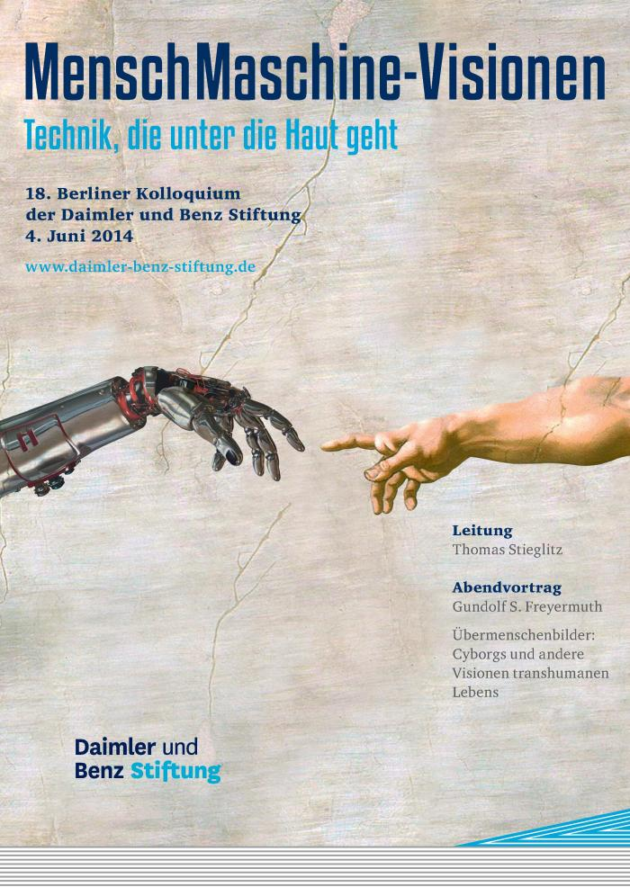

Ich bin morgen auf dem 18. Berliner Kolloquium der Daimler und Benz Stiftung.

Laut eigener Darstellung auf der [Website](https://www.daimler-benz-stiftung.de/cms/veranstaltungen/berliner-kolloquium.html) treffen sich dort „Experten aus Wissenschaft, Wirtschaft und Politik […] einmal pro Jahr in der Hauptstadt für einen ganzen Tag […]. Die Themenkomplexe werden von der Stiftung vorgegeben. Sie reichen von aktuellen Fragestellungen der Mensch-Maschine-Schnittstelle, der Molekularmedizin, der Neuro- und Kulturwissenschaften über die Psychologie, Ökologie, Urbanistik und Informatik bis hin zu Kommunikations- und Managemententwicklungen.“

Das Kolloquium morgen steh unter dem Motto: „MenschMaschine-Visionen – Technik, die unter die Haut geht”. Ich werde hier im Blog noch meine Gedanken dazu äußern, sofern es mein Blogthema und meine Forschung direkt berührt.
