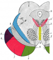
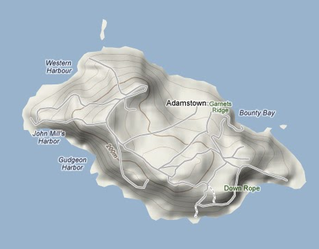
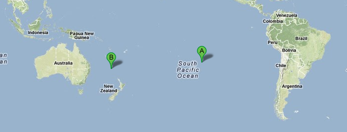
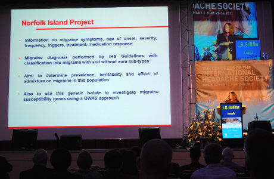

Neues Migräne-Gene entschlüsselt, lautet es kürzlich in einer [Studie](http://www.nature.com/ng/journal/v44/n7/full/ng.2307.html) [publiziert](http://www.nature.com/ng/journal/v44/n7/full/ng.2307.html) [in *Nature Genetics*](http://www.nature.com/ng/journal/v44/n7/full/ng.2307.html). Der berüchtigte Kapitän William Bligh half hier nicht mit.

Mittlerweile sind einige genetische Risikofaktoren bekannt ([s.a. hier](https://scilogs.spektrum.de/blogs/blog/graue-substanz/2010-10-01/genetik-der-migraene)), die ihre Träger für eine Migräneerkrankung anfälliger machen. In der Zusammenfassung zu der aktuellen Veröffentlichung liest man

> Of particular importance are the methylenetetrahydrofolate reductase (MTHFR) gene and the role it plays in migraine with aura.

Wichtig sei also Methylentetrahydrofolat-Reduktase (MTHFR). Das ist ein Enzym, das beim einigen Stoffwechselprozessen eine Rolle spielt. Es ist ein langer Weg, um von diesen Stoffwechselprozessen zu den pathologischen Konsequenzen für das Gehirn zu kommen. Das ist das Problem. Viel hat man nicht verstanden, wenn man 5 Buchstaben an den Pranger stellt.

Doch allein schon um auf diese und andere genetische Risikofaktoren zukommen, müssen aufwendige Wege gegangen werden, z.B. Studien mit 2731 Migränepatienten und weiteren 10747 Probanden als Kontrollgruppen, so dass am Ende 65 Forscher aus 13 Ländern beteiligt sind.

**Es begann mit der Meuterei auf der Bounty**

Der bisher kurioseste Weg in der genetischen Forschung zur Migräne wurde letzten Monat veröffentlicht. Nicht die Zahlen machen in spektakulär, es ist die Länge des Weges, die Zeit, die Migräniker zurückverfolgt werden konnten.

  
[Eine der Pitcairninseln (goolge maps)](http://goo.gl/maps/lV2e)

Der Weg beginnt mit der Meuterei auf der Bounty (1787). Er führt weiter über die Gründer der Pitcairninseln im Pazifischen Ozean und dessen heutige Nachkommen, die einen ungewöhnlichen Stammbaum bekamen und weiter zu einem wissenschaftlichen Labor der Griffith University in Australien und endet in den Raphe-Kernen im Hirnstamm.

Noch heute nämlich sind die Einwohner der Norfolkinsel, die u.a. von den Pitcairninseln 1856 übersiedelt wurden, überwiegend Nachfahren der Meuterer der Bounty und ihrer polynesischen Frauen. Sowohl genetische als auch ökologische Vielfalt sind reduziert, was [Lyn Griffiths](http://www.griffith.edu.au/health/griffith-health/staff/professor-lyn-griffiths) wohl auf ihre Idee brachte.

  
[(A) Pitcairninseln (B) Norfolkinsel (google maps)](http://goo.gl/maps/MNDQ)

Griffiths hat die genetischen Beziehungen auf der Insel durch genealogische Daten der ursprünglichen Gründer zurückverfolgt. Wegen der hohen Inzidenz von Migränikern, versprach das ein guter Ansatz zu sein, so beschrieb Griffiths schon vor einem Jahr die Vorteile in Berlin.

Jetzt sind diese Resultate publiziert.1 Bringt man die gefundenen Punktmutationen mit dem Neurotransmitter in Verbindung, deuten die Ergebnisse auf eine Störung des serotonergen Systems hin.  Serotonin ist ein Neurotransmitter, der die Schmerzwahrnehmung beeinflusst.

Serotonerge Gehirnzellen findet man hauptsächlich im Hirnstamm im Bereich der Pons. Genauer noch: in den Raphe-Kernen, die mit der Theorie des Migräne-Generator in Verbindung gebracht werden. Allerdings projizieren diese Gehirnzellen in alle Teile des Gehirns, was als Indiz gedeutet wird, dass dieser Neurotransmitter eher eine modulierende als spezifische Rolle spielt. Dass also Serotonin bei ganz unterschiedlichen neuronalen Prozessen zusammen mit anderen Neurotransmittern agiert. Neben Schmerzwahrnehmung werden oft Schlaf-Wach-Rhythmus sowie das Ess- und Sexualverhalten genannt. In der Studie wird jedoch darauf hingewiesen, das diese genetische Verbindung spezifisch für den  Stammbaum der Norfolkinsel sein kann. So oder so, manchmal kommt der Lohn des Meuterns verspätet.

**Literatur**

1Cox HC, Lea RA, Bellis C, Carless M, Dyer TD, Curran J, Charlesworth J, Macgregor S, Nyholt D, Chasman D, Ridker PM, Schürks M, Blangero J, Griffiths LR. [A genome-wide analysis of ‚Bounty‘ descendants implicates several novel variants in migraine susceptibility](http://www.nature.com/ng/journal/v44/n7/full/ng.2307.html). *Neurogenetics.* 2012 Jun 8.

**Bildquellen**

[Raphe-Kerne: Wikipedia.](http://de.wikipedia.org/w/index.php?title=Datei:Gray710.png&filetimestamp=20070123194904)

Karten: Google Maps

Vortrag Griffith: eigene Aufnahme.

© 2012, Markus A. Dahlem
