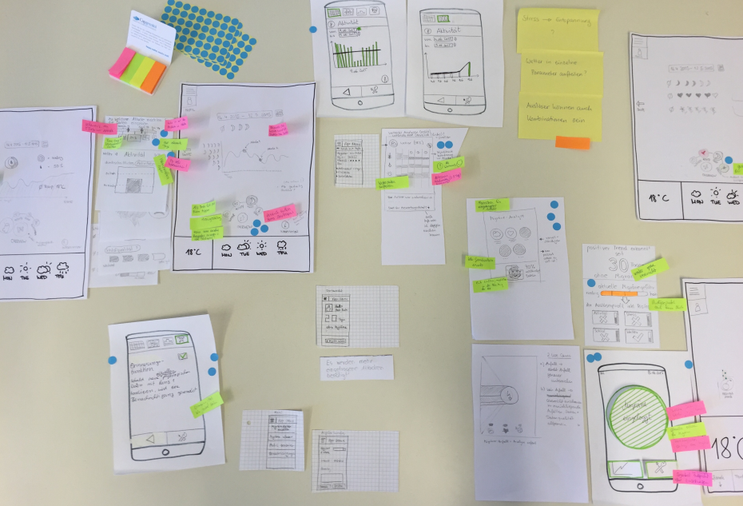
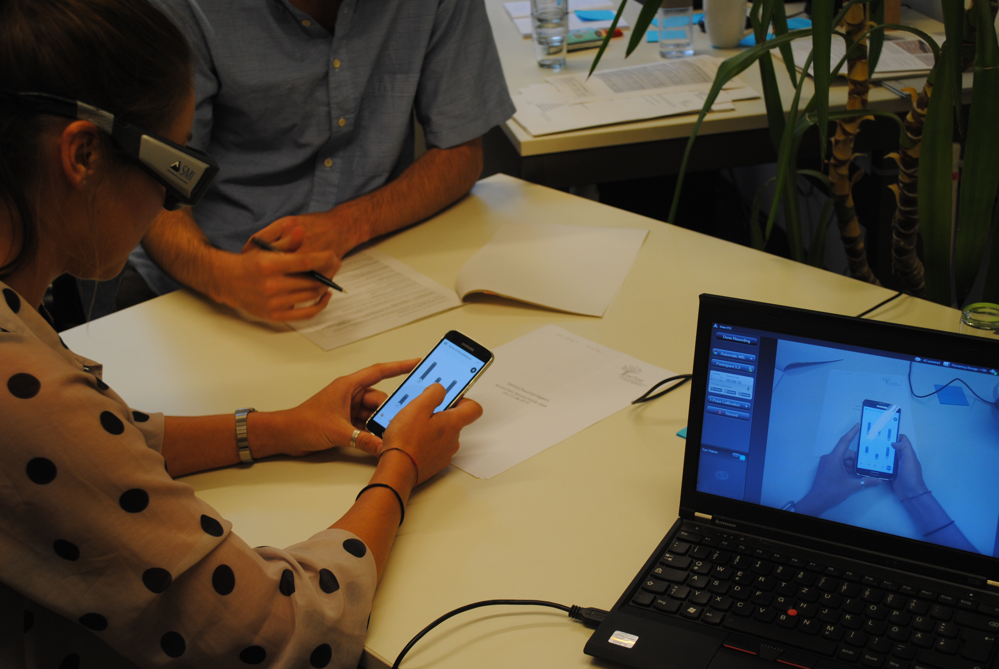

Ein intuitives Bedienkonzept einer Gesundheits-App zu erstellen ist eine Wissenschaft für sich – im übertragenen und im praktischen Sinn.

Auch Studierende kommen mit diesem Thema in Berührung. Sie konzipieren, entwickeln und testen einen klickbaren Prototypen für eine Migräne-App. (Durchführung in der AG Kognitionspsychologie & Kognitive Ergonomie des Instituts für Psychologie und Arbeitswissenschaft an der TU Berlin.)

Mehr zu dem wissenschaftlichen Hintergrund unten. Vorab zu den Teilnahmebedingungen.

Wer bei aktuellen Tests mitmachen möchte, muss ein Android-Smartphone besitzen. Die Studie wird an der Technischen Universität Berlin von [Usetree](http://www.usetree.de/) durchgeführt, dem Berliner Kompetenzzentrum für Usability Maßnahmen.

Zwischen dem 23. November und 8. Dezember nutzt man die App ähnlich wie andere mobile Gesundheitsservices. Diese erfreuen sich zunehmend großer Beliebtheit. So hat man die ein oder andere App vielleicht schon auf dem Smartphone. Bei der Migräne-App geht es zunächst um ein digitales Tagebuch. Anders als die klassische Variante auf Papier ist das praktische dabei natürlich, dass man die App jederzeit und an jedem Ort nutzen kann.

Zwei Termine stehen bei dem Test allerdings (relativ) fest: Am 23. oder 24. November muss man ca. eine Stunde Zeit aufbringen für Anweisungen und die Installation von zwei neuen Apps. Zum Ende der Feldstudie, am 8. Dezember, ist ein Workshop in Berlin geplant. Die Termin wird unter den Teilnehmern noch genau abgestimmt. Bei Interesse bitte eine Email an kontakt *(at)* m-sense.de.

## Was bisher geschah

Das Forschungsprojekt „[M-sense](http://www.m-sense.de/)“ wird seit Mitte des Jahres mit einem EXIST-Gründerstipendium unterstützt. Dies wird vom Bundesministerium für Wirtschaft und Energie vergeben. Wie der Name „M-sense“ schon in sich trägt, geht es darum, einen (Wahrnehmungs)sinn für die Migräne zu entwickeln.

Mit dem EXIST-Gründerstipendium wird M-sense eine Ausgründung der Humboldt Universität zu Berlin. Doch auch Studierende der Technischen Universität Berlin sind beteiligt. So haben beispielsweise zwei Studentengruppen im Sommersemester als Projektarbeit verschiedene Bedienkonzepte einer Migräne-App entwickelt (Bild oben). Dies geschah im Rahmen der Vorlesung „Kognitionspsychologische Vertiefung: Intuitive Bedienkonzepte“. Aus dem noch relativ unbekannte Masterstudiengang Human Factors stammen auch zwei Mitgründer von [M-sense](http://www.m-sense.de/).

„Das zentrale Ziel des Masterstudiengang Human Factors besteht […] im Erwerb von wissenschaftlichen Erkenntnissen und Kompetenzen, die zu einem besseren Verständnis und einer Optimierung der Interaktion zwischen Mensch und Technik beitragen. […] Dieses Wissen bildet das Fundament für eine menschzentrierte Technikgestaltung […]“

(Zitiert von der [TU Website](https://www.studienberatung.tu-berlin.de/menu/studiengaenge/faecher_master/human_factors/))

Usability-Test in Verbindung mit Eye Tracking.

Wir entwickeln in den kommenden Jahren M-sense weit über die Tagebuch-Funktionen hinaus. Die App soll nicht allein der Erfassung und Dokumentation der Erkrankung Migräne dienen. Im nächsten Schritt sollen Vitalparameter Trends erkennen und den Arzt bei der Auswahl einer personalisierten Therapieform unterstützen. Mit anderen Worten M-sense wird ein Medizinprodukt. Deswegen muss die Gebrauchstauglichkeit entsprechend den regulatorischen Anforderungen sehr sorgfältig nachgewiesen werden. Wer für die aktuelle Feldstudie keine Zeit hat, langfristig jedoch an solchen Tests interessiert ist, kann sich auch melden.
