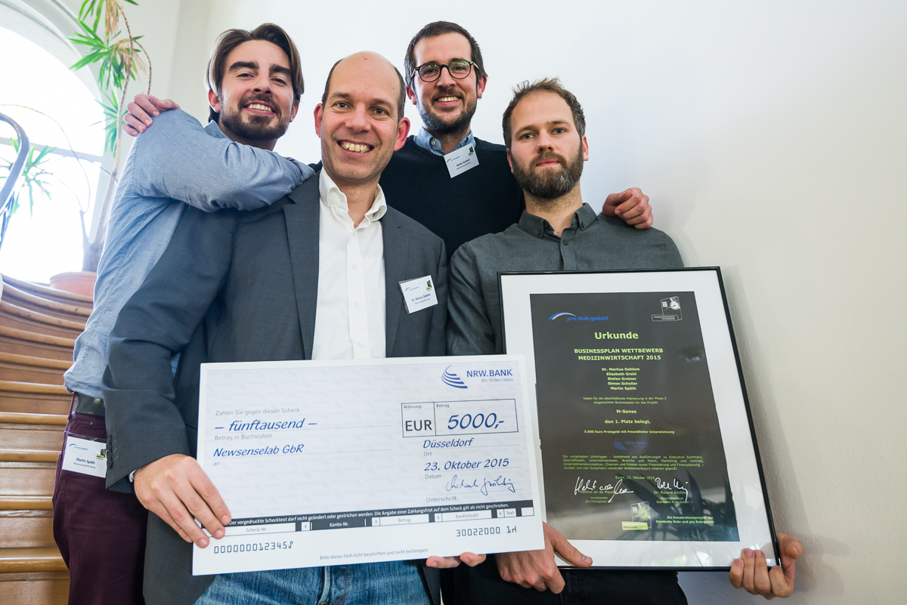

Die Migräne-App [M-sense](http://www.m-sense.de/) hat gerade in Mühlheim an der Ruhr den ersten Preis bei Deutschlands größten Businessplan Wettbewerb für Medizinwirtschaft gewonnen. M-Sense ist ein Forschungsprodukt der Humboldt Universität zu Berlin, an dem ich auch beteiligt bin.

Als Forschungsprojekt der Humboldt Universität zu Berlin wird M-sense seit Juni 2015 mit einem EXIST-Gründerstipendium vom Förderprogramm des Bundesministeriums für Wirtschaft und Energie gefördert.

**Am 8. November stellen wir beim [Falling Walls Venture-Wettbewerb](http://www.falling-walls.com/venture/start-up-nomination) zusammen mit vielen anderen wissenschaftsbasierten Neugründungen aus der ganzen Welt unsere Unternehmensidee ausführlicher vor. Dann werde ich auch hier im Blog nochmal davon berichten.**
