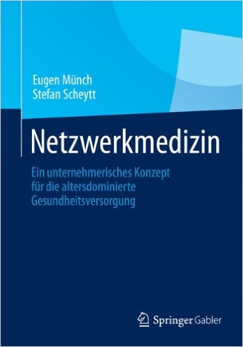
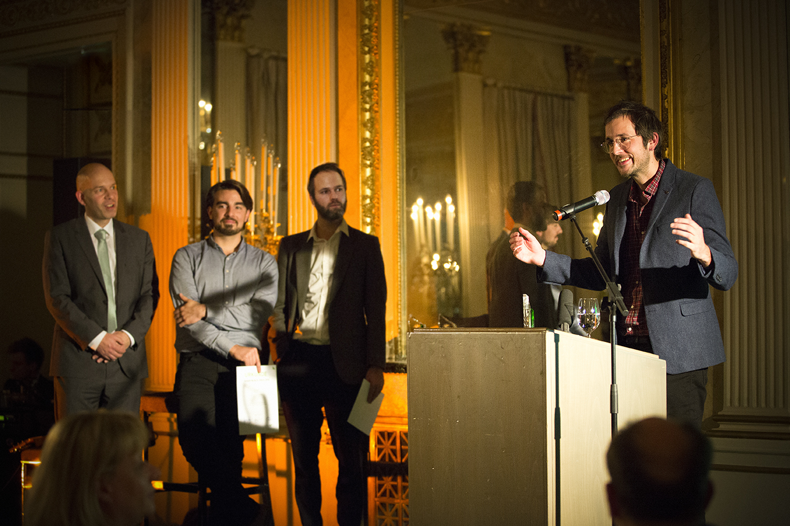

Im Gesundheitssystem gibt es von vielem zu wenig und von wenigem zu viel. Zum Beispiel befinden sich Spezialkliniken oft nur in Ballungsgebieten. Oder die Gesprächszeit beim Hausarzt ist zu kurz. Hinter beiden Beispielen steht der ökonomische Druck. Gleichzeitig werden Ressourcen auch verschwendet. Viele Migränepatienten erhalten eine teure bildgebende Zusatzdiagnostik, was ohne weitere Warnzeichen nicht gerechtfertigt ist. Die Missachtung der Leitlinien muss nicht an der Unkenntnis von Ärzten liegen. Vielmehr können auch andere Gründe vorliegen, beispielsweise möchte vielleicht ein Arzt die unbegründete Angst seines Patienten vor einem Tumor ausräumen bevor sich diese Angst verselbstständigt.

Einen Ausgleich zwischen Ressourcenknappheit und Ressourcenverschwendung soll die Digitalisierung des Gesundheitssystems schaffen. Digitalisierung kann unter anderem deswegen etwas an den knappen Ressourcen verändern, weil sie Bereiche leichter vernetzt. Eugen Münch nennt das Netzwerkmedizin – vereinfacht erklärt. Carolin Auschra hat in ihrem Blog MEDICAL ALLEE [Vernetzungsideen im Gesundheitswesen](http://www.medical-allee.com/think-camp/) weiter ausgeführt.

## Warum einen Preis für Netzwerkmedizin?

Netzwerkmedizin, Eugen Münch & Stefan Scheytt

Die Netzwerkmedizin ist für Münch heute wichtiger denn je. Klar wurden medizinische Leistungen in den letzten 40 Jahren enorm gesteigert und sie wurden dabei auch effizienter. Dies reicht aber bei weitem nicht aus. Es besteht nach Münch „eine Diskrepanz zwischen dem gewaltigen Veränderungsdruck im Gesundheitswesen einerseits und der tatsächlichen Veränderungsbereitschaft andererseits“, so schreibt er es in seinem Buch “Netzwerkmedizin” und sieht dabei diese Diskrepanz verschuldet durch „ein eklatantes Versagen der meinungsbildenden Eliten”. Diese Eliten verweigern sich „der Verantwortung aus Angst und aus Besitzstandsdenken.“ Also musste ein Preis her, der neue Konzepte der Vernetzung anregt und fördert: der Eugen Münch-Preis. Von dem heißt es auf der Website der gleichnamigen Stiftung:

> „Den Zugang zu medizinischer Versorgung für alle Menschen auch in Zukunft erhalten – ohne Rationierung von Leistungen. Das ist das Ziel der Stiftung Münch. Damit das gelingen kann, sind praxisnahe neue Denkansätze, innovative Konzepte und mutige Ideen erforderlich. Die Stiftung Münch möchte die Erarbeitung dieser Konzepte und Ideen unterstützen und die Umsetzung der besten Konzepte fördern.“

## Wieso ist M-sense Netzwerkmedizin?

Nun gibt es viele digitale Gesundheitsangebote, darunter zahllose Apps – auch einige für Kopfschmerzen und Migräne. Was macht unsere Migräne- und Kopfschmerz-App M-sense anders, so dass sie am 23. November als Gewinner des Eugen Münch-Preises 2016 gekürt wurde? Wieso ist M-sense Netzwerkmedizin?

Mit M-sense wird eine digitale Selbsttherapie angeboten, die das spezialärztliche Wissen in der Breite der niedergelassenen Ärzte verankern soll.

Natürlich geht es nicht ohne die Ärzte und Therapeuten. Zumindest nicht immer. M-sense kann jedoch selbstständig die Auswertung von Kopfschmerztagebüchern vornehmen. Allein der Eintrag einer einzigen Kopfschmerzattacke in einem leitlinientreuen Kopfschmerztagebuch kann auf über 4 Millionen verschiedenen Arten gemacht werden. M-sense analysiert diese Kopfschmerzdaten und unterscheidet von den 30 unterschiedlichen Arten der Migräne und 14 Arten der Kopfschmerzen vom Spannungstyp bis zu 17 verschiedene Diagnosen. Damit sich Ärzte auf diese Vordiagnose verlassen können, ist M-sense als Medizinprodukt zugelassen.

Durch solch einen Ansatz wird eine knappe Ressource (das spezialärztliche Wissen) zugänglicher und eine andere knappe Ressource (die Zeit der Ärzte in der Niederlassung) optimal genutzt.

Und natürlich geht es ebenso wenig ohne die Betroffenen selbst. Regelmäßige Aktualisierungen von M-sense arbeiten das Feedback der Nutzer systematisch ein, um die App optimal auf die Bedürfnisse der Nutzer abzustimmen. Das geht nicht immer so schnell, wie man es sich vielleicht wünscht. Denn wir müssen gleichzeitig die Qualität als Medizinprodukt sichern.

## EXIST-Gründerstipendium für innovative technologieorientierte Gründungsvorhaben

Gehen wir nochmal einen Schritt zurück: M-sense kommt aus der universitären Forschung. Die Ressourcenknappheit im Gesundheitssystem stand zunächst nicht im Vordergrund unserer Entwicklungsidee. Wir bauten darauf auf, dass in den letzten Jahren von uns und auch vielen klinischen Kollegen neue wissenschaftliche Erkenntnisse über Migräne gewonnen wurden. Insbesondere haben wir mit Computermodellen nachvollzogen, was im Gehirn bei Migräne passiert und entwickelten Algorithmen der computergestützten Diagnose, Prognose und Therapie. Ein EXIST-Gründerstipendium unterstützte uns dann, ein technologieorientiertes Gründungsvorhaben zu verwirklichen. Daraus entstand M-sense, eine App, [die am internationalen Kopfschmerztag am 5. September dieses Jahres online ging](https://scilogs.spektrum.de/graue-substanz/smart-gegen-migraene-mit-einer-app/).

Fast drei Monate später steht für uns der Eugen Münch-Preis nun für einen Übergang. Nämlich den Übergang von der universitären Forschung in die angewandte Forschung – von industrieller Forschung will ich bei einem Startup noch nicht sprechen. Der Preis steht für diesen Übergang, denn er kam diese Woche zusammen mit einem vielleicht noch wichtigeren Meilenstein.

## Forschungsergebnisse unternehmerisch umsetzen

Um M-sense weiter mit Fachkreisen und Betroffenen zu entwickeln, stiegen nun mit [dem High-Tech Gründerfonds](http://high-tech-gruenderfonds.de/de/der-high-tech-gruenderfonds-think-health-ventures-und-flyinghealth-investieren-in-m-sense-die-zertifizierte-medizin-app-gegen-migraene-und-kopfschmerz/) (HTGF), der Risikokapital für junge Technologie-Unternehmen bereitstellt, die vielversprechende Forschungsergebnisse unternehmerisch umsetzen, sowie mit [Think.Health Ventures](http://www.think-health.de/) zwei  Partner in unser Unternehmen ein. Auch die Erstinvestor [FLYING HEALTH](https://flyinghealth.com/) und ein weiterer privater Business Angel unterstützen uns bereits seit Jahresbeginn und investieren erneut.

https://twitter.com/HTGF/status/802080961185873920

## Ein Blick auf die nächsten Monate und Jahre

Seit den erst drei Monaten, in denen wir mit M-sense öffentlich gegangen sind, wurden bereits tausende Migräne- und Kopfschmerzattacken dokumentiert, vordiagnostiziert und deren Auslöser analysiert. In den nächsten drei Monaten stehen weitere wichtige Entwicklungsschritte an. Bald wird es Therapiemethoden in der App geben. Einen Behandlungspfad entwickeln wir gerade zusammen mit verschiedenen Spezialkliniken. 

Je länger Betroffene M-sense nutzen, desto genauer kann M-sense den Krankheitsverlauf auswerten. Künftig wollen wir durch unser aus der Forschung kommendes technisches Know-how ein Maß entwickeln, das das Risiko einer Kopfschmerzattacke tagesaktuell schätzt. Über diese Forschung wurde hier im Blog vielfach im Rahmen der Kipppunkttheorie der Migräne schon berichtet. Darauf basierend bietet M-sense dann eine individuell abgestimmte Therapie automatisiert-geleitet an, d.h. M-sense kann im vorgegebenen Rahmen auch ohne Therapeut oder Arzt situationsabhängig unterstützen und so in die Therapie unmittelbar eingreifen. Für uns ist das Netzwerkmedizin praktisch umgesetzt und konsequent zu Ende geführt. Der Eugen Münch-Preis ermutigt uns, diesen Weg weiter zu gehen.

Das prämierte Team: (von links nach rechts) Markus Dahlem, Martin Späth, Simon Scholler, Stefan Greiner.
