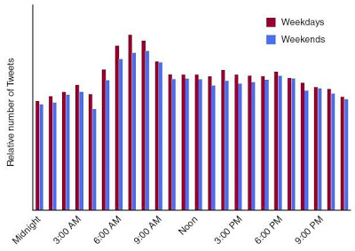

Migräne wird häufiger Werktags in Tweets erwähnt als an einem Tag am Wochenende und erreicht um sieben Uhr morgens ein Maximum. So die zusammenfassende Aussage aus einer Veröffentlichung in der Zeitschrift [Cephalalgia](http://cep.sagepub.com/content/early/2012/11/07/0333102412465207), wie ich sie bei [Neuroskeptic](http://neuroskeptic.blogspot.com/) las. Da ich die Originalarbeit nicht selber las, kann ich methodische Schwächen nicht abschätzen, der Wert der Aussagen scheint mir aber eher gering.

Weitere Untersuchungen wurden mit Google trends gemacht. Das volle Program der digitalen Welt. Das allein ist schon nett, denn Information sollte schnell und offen Verfügbar sein (was die eigentlich erfolgte Forschungsarbeit *nicht* ist).

Motiviert wurde die aktuelle Forschungsarbeit durch eine Blogbeitrag. Auch das scheint mir erwähnenstwert. Der Beitrag stammt von Neuroskeptic zur Analyse von Twitter-Daten (mit der viel interessanteren Schlussfolgerung das [Bier vor Schnaps](http://neuroskeptic.blogspot.co.uk/2012/08/on-twitter-its-beer-before-liquor.html) getrunken wird). Neuroskeptik schrieb nun heute, drei Tage nach Erscheinen des Migräne-Tweet-Artikels, auch darüber eben jenen aktuellen Beitrag, [@gedankenstuecke](https://twitter.com/gedankenstuecke) (Bastian Greshake von [Bierologie](https://scilogs.spektrum.de/wblogs/blog/bierologie)) wiederum twitterte das vor 45 Minuten, ich RT und nun kurz selbst gebloggt.

Ich nutze noch ebenso geschwind die Gelegenheit mich zurück zu melden. Die Graue Substanz ist — unbemerkt — im letzten Monat drei Jahre alt geworden (auch das darf mal getweetet werden). Der Oktober war jedoch leider auch der erste Monat seit drei Jahren ohne einen Beitrag! Da ich sonst im Schnitt gut einmal pro Woche etwas schreibe, war dies schon auffällig.

Ich habe auch im Oktober durchaus einiges geschrieben, drüben auf [Gray Matters](http://www.scilogs.com/gray-matters/), z.B. über den aktuellen Nobelpreis für Chemie, der im Oktober vergeben wurde. Dieser war für Studien zu G-Protein-gekoppelten Rezeptoren. [Ich schrieb natürlich über Migräne und diese Rezeptoren](http://www.scilogs.com/gray-matters/like-a-receptor/), noch am Tag der Vergabe. Dieser Rezeptor (GPCR abgekürzt)  wird bei Migräne von einem pro-inflammatorischen Neuropeptid (abgekürzt CGRP) aktiviert, die Forschung daran wurde aber wegen GCRP (Good Clinical Research Practice) gestoppt. So kann ich es für die deutschen Leser\*innen zumindest zusammenfassen.
