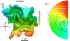
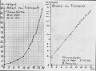
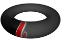

Viele kennen das Blog sicher noch nicht so lang, die wenigsten wohl seit Beginn. Einige ältere gesetztere Beiträge will ich deswegen nochmal hervorheben indem ich zunächst, wie beim Speed-Dating, jeden mit wenigen Zeilen selbst zu Wort kommen lassen und anschließend stichwortartig sein Thema umreisse.

Das ist aber nicht alles. Sie können einen Beitrag anschließend näher kennen lernen! Ja, selbstverständlich auch indem Sie ihn vollständig lesen und ggf. daraufhin neue Fragen stellen und kommentieren (das gilt für alle und sollte vorab geschehen). Jetzt kommts: Am Ende wird zusätzlich dann eine Wahl getroffen – das ist nun mal das Ziel beim Speed-Dating – und es wird eine Fortsetzung eines der fünf Beiträge geben, den Sie gewählt haben.

Los geht’s. 

**1.**

---

**[Geist einer Sattel-Knoten-Verzweigung](https://scilogs.spektrum.de/blogs/blog/graue-substanz/2009-11-02/geist-einer-sattel-knoten-verzweigung)**   
 *2. November 2009, 646 Wörter, 3 Bilder, 2136 Klicks*

>  … Theoretische Physik und klinische Neurologie, zwei scheinbar unabhängige Arbeitsgebiete, treffen sich im Konzept der dynamischen Krankheiten. Dies ist ein Begriff, der vor über 30 Jahren bewusst als Gegenpol zu dem der genetischen Krankheiten entwickelt wurde. …

Mein Eröffungsbeitrag, ein Bericht von einer Konferenz in dem, wie der Titel schon ankündigt, die Sprache der Chaostheorie zu Wort kommt. Gewagt. Gelungen? [Nachfragen](https://scilogs.spektrum.de/blogs/blog/graue-substanz/2009-11-02/geist-einer-sattel-knoten-verzweigung#comments)! (bisher 10 Kommentare)

---

**2.**

---

**[Ich sehe was, was du nicht siehst](https://scilogs.spektrum.de/blogs/blog/graue-substanz/2009-12-01/migraenewellen)**   
  *1. Dezember 2009, 1125 Wörter, 2 Bilder, 1 Video,* *3216 Klicks*

>  … Wellen im gekrümmten Raum. Das klingt nach Einstein und der Gravitation, nach Relativitätstheorie also. Es ist aber auch Neurologie, denn unsere Hirn hat Windungen, die Menschen in Form visueller Halluzinationen bei Migräne im wahrsten Sinne des Wortes *sehen* können, weil eine Welle durch ihre gekrümmte Sehhrinde läuft. …

Über einen meiner Artikel in der Zeitschrift PLoS ONE, der gerade auch in "Bild der Wissenschaft" ausführlich besprochen wurde (noch bis 15. 8. 2011 im Handel käuflich zu erwerben, außer Konkurrenz lesenswert). Alles klar? Nein? [Nachfragen](https://scilogs.spektrum.de/blogs/blog/graue-substanz/2009-12-01/migraenewellen#comments)! (bisher 6 Kommentare)

---

**3.**

---

**[Bernhard Hassenstein – Geist im Tee](https://scilogs.spektrum.de/blogs/blog/graue-substanz/2010-05-31/bernhard-hassenstein)**  
  *31. Mai 2010, 708 Wörter, 1 Gedicht (+1172 Wörter), 2 Bilder,* *1682 Klick*

>  … Ihm [Hassenstein] verdanken wir nicht nur so schöne Worte wie Tragling, Spangenglobus und, weniger schön, Höchstwertdurchlassmodell. Hassenstein schrieb auch ein unterhaltsames Essay inklusive Gedicht über seine Migräne zum 70. Geburtstag des Verlegers Klaus Piper. Das war 1981. Hassenstein, geboren 1922, litt seit seiner Kindheit an Migräne mit neurologischen Symptomen, der Migräneaura. …

Ein Gedicht über Migräne von einem der Pioniere der Kypernetik. (Für die Wissenschaftspuristen zeige ich auch bisher unveröffentliche (!) Meßdaten.) Wenn es nicht reimt: [Nachfragen](https://scilogs.spektrum.de/blogs/blog/graue-substanz/2010-05-31/bernhard-hassenstein#comments)! (bisher 1 Kommentar, fast jungfräulich also, wobei dieser Kommentar u.a. diesen Satz enthält "*Manche Frauen beschreiben ihren Orgasmus wie eine feurig-heisse Welle*". Soso.)

---

**4.**

---

**[Das Gehirn ist ein Torus](https://scilogs.spektrum.de/blogs/blog/graue-substanz/2010-08-23/das-gehirn-ist-ein-torus)**   
  *23. August 2010, 809 Wörter, 4 Bilder, 1 Video,* *2114 Klicks*

> … Wie mache ich als theoretischer Physiker Migräneforschung?
>
> 
>
> Nun zum Beispiel in dem ich folgende Annahme mache: Das Gehirn ist ein Torus. Also dass Ausschnitte der Großhirnrinde idealisierterweise die Form einer Teilfläche  eines Torus (Schwimmreifen) haben. …

Hier wird es mal auf die Spitze getrieben: wie macht ein Physiker nun konkret Migräneforschung an einem Beispiel (Der Artikel für eine Fachzeitschrift wird gerade geschrieben, ein Blick in die Zukunft also). Vor den Untiefen der Mathematik hilft kein Schwimmreifen, sondern: [Nachfragen](https://scilogs.spektrum.de/blogs/blog/graue-substanz/2010-08-23/das-gehirn-ist-ein-torus#comments)! (bisher 7 Kommentare)

---

**5.**

---

**[Unbemerkte Aura](https://scilogs.spektrum.de/blogs/blog/graue-substanz/2010-08-30/unbemerkte-aura)**   
 *30. August 2010, Wörter 950, 5 Bilder,* *2963 Klicks*

> … Wenn wir über die Symptome sprechen, gehen wir allerdings das Problem vom falschen Ende an. Wir müssen die Krankheitsursache betrachten. Die Aura wird von der *spreading depression* verursacht, ein nicht minder unglücklich gewählter Begriff, den ich daher als SD abkürze.  …

Aura klingt esoterisch ist es aber nicht. Mmmh, was macht denn da der Käfer? Kann man nachlesen. Alles ander: [Nachfragen](https://scilogs.spektrum.de/blogs/blog/graue-substanz/2010-08-30/unbemerkte-aura#comments)! (bisher 12 Kommentare, viel nachgefragt muss nichts heißen. Aber das wissen Sie sicher.)

---

Nach dem Speed-Dating können Sie nun entscheiden, welchen Beitrag Sie nochmal nächer kennen lernen möchten. Dazu wird zunächst abgestimmt. Das Thema des Gewinners wird dann nochmal neu aufgelegt.

|  |  |
| --- | --- |
| **Blogbeitrag-Speed-Dating** | |
|  | 1. Geist einer Sattel-Knoten-Verzweigung |
|  | 2. Ich sehe was, was du nicht siehst |
|  | 3. Bernhard Hassenstein – Geist im Tee |
|  | 4. Das Gehirn ist ein Torus |
|  | 5. Unbemerkte Aura |
|  | |
| pollcode.com free polls | |

Darf auch ich mir was wünschen? Das wären dann mehr Kommentare gerade auch von denjenigen, die bisher vielleicht noch dachten, dies sei ja ein Wissenschaftsblog, da sollten Laien nicht nachfragen. Doch sollten sie. Frei nach dem Motto einer der großen Speed-Dating-Anbieter: Wer einsam bleibt und nichts versteht ist selber Schuld!
