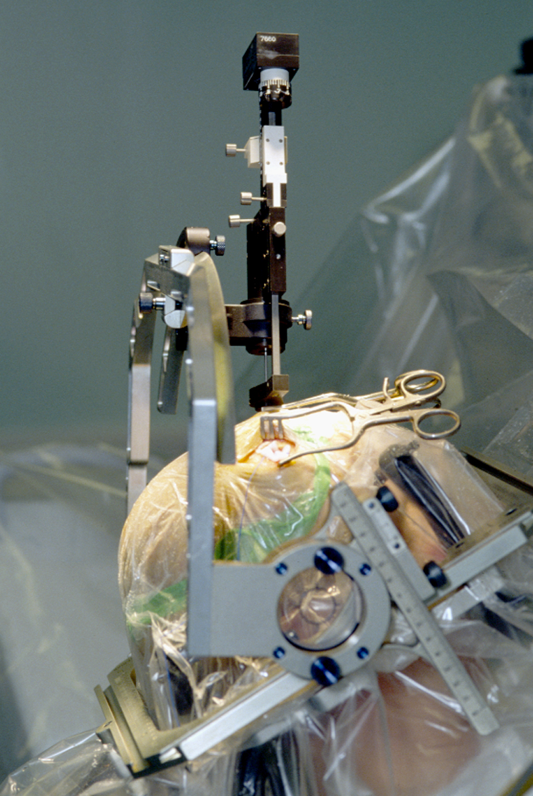
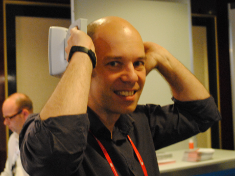

Neulich war ich also auf diesem Workshop "Computational Neuroscience and the Dynamics of Disease States", über den ich schon [im letzten Beitrag schrieb und erst mal klärte was Computational Neuroscience (CN) ist](https://scilogs.spektrum.de/blogs/blog/graue-substanz/2011-09-01/gesunde-kranke-neue). Es geht jetzt um Computermodelle und Krankheiten des Gehirns. Es geht aber auch um die Wettervorhersage und wie man ein Flugzeug landet.

Die Erforschung der Hirnerkrankungen stellt einen eigenständigen Zweig, in meinen Augen einen leider noch unterrepräsentierten Bereich, innerhalb der CN-Gemeinschaft da. Die Erkrankungen des Gehirns könnte man nun sogar noch in [psychiatrische und neurologische Erkrankungen](https://scilogs.spektrum.de/blogs/blog/graue-substanz/2011-08-25/psychisch-oder-psychiatrisch) unterteilen. Darauf werde ich später noch mal einen Blick richten.1 Auf dem oben erwähnten Workshop standen nicht ohne Grund nur neurologische Erkrankungen im Fokus: mit Epilepsie und Parkinson-Krankheit klar im Zentrum, Migräne war durch mich vertreten, also zusammen drei neurologische Erkrankungen.

Um die Idee des Workshops zu veranschaulichen, zitiere ich aus einem Artikel mit dem Titel "*Towards model-based control of Parkinson’s disease*" (Schiff, 2010). Er stammt von einem Teilnehmer und meinem Kooperationspartner bei einem BMBF/NSF/NIH geförderten [CRCNS-Projekt](http://www.bmbf.de/foerderungen/16506.php) (dazu später mehr). Der Artikel bietet einen gut verständlichen Überblick über die Parkinson-Krankheit und den Sinn von Computermodellen bei dieser. Doch die Einleitung ist zunächst allgemein gefasst:

> This morning, you awoke to a not unreasonable weather forecast. The most recent aeroplane you flew on may well have autolanded by a control system without pilot intervention. Both of these seemingly disparate activities are examples of the revolution created by modern control theory to observe (weather) and control (airframes) complex systems. In both of these cases, a computational model, embodying our *a priori* knowledge of the system at hand, was the key to the success.
>
> It seems incredible that the tremendous body of skill and knowledge of model-based control engineering has had so little impact on modern medicine. Dynamical diseases are diseases characterized by the operation of a biological control system in a region of physiological parameters that produces pathological behaviour (Mackey & Glass 1977). Dynamical diseases of the brain are those where the symptoms are created by abnormal patterns of activity within neuronal networks (Milton & Jung 2003). The timing is now propitious to propose fusing control theory with neural stimulation for the treatment of dynamical brain disease.
>
> [An diesem Morgen erwachten Sie mit einer nicht unangemessenen Wettervorhersage. Es kann gut sein, dass das letzte Flugzeug, mit dem Sie flogen, durch eine automatische Steuerung ohne Eingreifen des Piloten landete. Beide dieser scheinbar ganz verschiedenen Tätigkeiten sind Beispiele für die Revolution, die es durch moderne Kontrolltechnik erlaubt,  komplexe Systeme zu beobachten (Wetter) und zu steuern (Flugzeuge). In beiden Fällen war ein Computermodell, das unsere *a priori* Wissen über das jeweilige System verkörpert, der Schlüssel zum Erfolg.
>
> Es scheint unglaublich, dass die enorme Menge an Können und Wissen der modell-basierten Steuerungstechnik so wenig Einfluss auf die moderne Medizin hatte. Dynamische Krankheiten sind Krankheiten, bei denen die biologische Regulierung in einem Bereich physiologischer Parametern betrieben wird, der pathologisches Verhalten hervorruft (Mackey & Glass 1977). Dynamische Krankheiten des Gehirns sind solche, bei denen die Symptome durch abnormale Muster der Aktivität in neuronalen Netzwerken erzeugt werden (Milton & Jung 2003). Die Zeit ist jetzt gekommen um vorzuschlagen, dass die Steuerungsstechnik nun mit neuronaler Stimulation zur Behandlung dynamischer Erkrankung des Gehirns fusioniert. (Übersetzung M.A.D.)]

Die Übersetzung ist vielleicht etwas holprig, da dieser Artikel zum einen sehr eloquent formuliert ist, zum anderen aber auch wegen der feinen Nuancen der Wortbedeutungen. "Rechnermodell" hätte ich fast lieber als "Computermodell" geschrieben, da es hier mehr um das mathematische Modell als um ein Gerät geht, wenn von "computer model" die Rede ist.

Noch schwieriger ist die Übersetzung des Begriffs "control" / "control theory", der mit "modern", "engineering" und "biological"  kombiniert wurde. Das habe ich einmal zu  "moderne Kontrolltechnik" gemacht, so wie wir es in unserem neuen [Sonderforschungsbereich 910](https://scilogs.spektrum.de/blogs/blog/graue-substanz/2010-11-17/kontrolle-der-la-ola-im-hirn) zu dieser Thematik halten. Das "control" der Ingenieure wurde zu Steuerungstechnik als Teilgebiet der Automatisierungstechnik, das der Biologen aber zur Regulierung, was in den Teilbereich der Physiologie fällt.

Es geht also um eine Fusion dieser unterschiedlichen Welten.

Auf [Epilepsie und Migräne werde ich im nächsten Beitrag genauer eingehen](https://scilogs.spektrum.de/blogs/blog/graue-substanz/2011-09-12/kipp-punkte-im-gehirnklima). Beide haben Gemeinsamkeiten auf zellulärer Ebene, im Krankheitsverlauf und in den Fragen, die wir mit den jeweiligen Computermodell beantworten wollen.

Zum Abschluss will ich zwei Beispiel zeigen. Moderne Kontrolltechnik ist bei der Parkinson-Krankheit für die Hirnschrittmacher dringend nötig, will man tiefe Hirnstimulation intelligent betreiben und nicht nur im Hirn herum brutzeln. Obwohl auch das schon erstaunlich gut funktioniert und Tremor und andere Symptome oft gut unterdrückt werden können. Doch laufen allein die Batterien so schnell leer und auch kognitive Nebenwirkungen können durch moderne Kontrolltechnik optimiert werden, so die Hoffnung (Schiff, 2010).

Bei der [nicht-medikamentösen Behandlung von Kopfschmerzen](https://scilogs.spektrum.de/blogs/blog/graue-substanz/2010-11-12/blitzableiter-fuer-hirngewitter) ist mein Beispiel die transkranielle Magnetstimulation, kurz TMS. Obwohl auch Vagusnervstimulatoren und andere Neurostimulatoren hier heiß gehandelt werden.

Wieder: Ohne moderne Kontrolltechnik, die die Stimulationsprotokolle dieser Geräte (s. oben) bestimmt, sind diese Geräte vergleichbar einem Holzhammer, mit dessen Stil man den Nagel in die Wand schlägt, in Unkenntnis, dass es einen Hammerkopf gibt, der auch noch besser aus Stahl wäre.

Die Zeit ist jetzt gekommen Kontrollstrategien als alternative Therapien zu erforschen, mit dem Ziel Migräneanfälle zu beenden. Migräne Ctrl-Alt-Del.

**Fußnote**

Zum Titel: "Ctrl-Alt-Del", auf deutschen Tastaturen "Strg-Alt-Entf", auch Klammergriff genannt, bezeichnet eine Tastenkombination die ein fehlgeschlagenes Computerprogramm radikal beendet.

1 Mein [erster Blogbeitrag auf den SciLogs](https://scilogs.spektrum.de/blogs/blog/graue-substanz/2009-11-02/geist-einer-sattel-knoten-verzweigung) war über ein ähnliches Symposium, organisiert vom *National Institute of Mental Health* (ein US-amerikanisches Forschungszentrum für psychische Störungen), wo folglich auch psychische Erkrankungen eine große Rolle spielten. Ob neurologisch oder psychisch ist bei weitem nicht nur ein kleiner wohl aber ein subtiler Unterschied wenn es um Modelle geht. Ein Unterschied der, sobald mathematische Gleichungen aufgeschrieben werden sollen, viel klarer zu Tage tritt, dann nämlich wird konkret, was wir auf physiologischer Ebene über die Erkrankung wissen oder eben noch nicht wissen.

**Literatur**

Mackey M. C., Glass L. Oscillation and chaos in physiological control systems. *Science*. 1977; **197**:287–289 ([doi:10.1126/science.267326](http://dx.doi.org/doi:10.1126/science.267326))

Milton J., Jung P., eds Epilepsy as a dynamical disease. Berlin, Germany: Springer; 2003.

Schiff S. J., Towards model-based control of Parkinson’s disease. *Philos Transact A Math Phys Eng Sci**.* 2010; **368**:2269-308. Review. ([doi:10.1098/rsta.2010.0050](http://dx.crossref.org/10.1098%2Frsta.2010.0050))

**Bildquelle**

 Stereotaxiegerät zur Platzierung einer Stimulationselektrode aus [Wikidedia](http://de.wikipedia.org/wiki/Tiefe_Hirnstimulation), [GNU-Lizenz für freie Dokumentation](http://en.wikipedia.org/wiki/de:GNU-Lizenz_f%C3%BCr_freie_Dokumentation "w:de:GNU-Lizenz für freie Dokumentation"),
