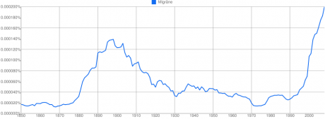
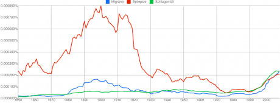
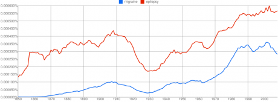
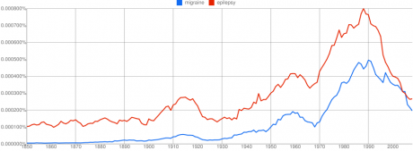
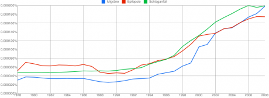
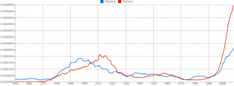

Mit dem [Google Ngram Viewer](http://ngrams.googlelabs.com/) kann die Häufigkeit von Wörtern sowie Wortketten in einem Korpus (ein Auszug aus GoogleBooks) ermittelt werden. Der Häufigkeitsverlauf wird dann über die Jahre angezeigt, wobei der Zeitraum bis ins 16te Jahrhundert zurückreicht, wenn man denn soweit zurück suchen möchte. Die ermittelte Worthäufigkeit wird normiert indem durch die Gesamtwortzahl des entsprechenden Jahres geteilt wird.

Das erste Wort, das ich im Ngram Viewer eingab, war natürlich "Migräne".

  
 *Ein Klick in dieses und folgende Diagramme führt direkt zur entsprechenden Suchanfrage in größer Darstellung und mit vielen weitere Suchmöglichkeiten.*

Oben sehen wir die Worthäufigkeit für "Migräne" von 1850 bis 2008. Das erste was mich erstaunte war das lokale Maximum um 1900. Zu diesem Zeitpunkt erhalten wir einen Wert von 0.00014%. Dieser Wert fällt bis 1930 ab auf 0.00004%, dies halbiert sich sogar noch um 1970 auf ein Minimum bei 0.00002% und das vorangegangene Maximum wird erst wieder um 2000 erreicht und steigt seitdem stetig zu neuen Höhen um den Wert 0.0002% auf.

Mein [Blogthema](http://www.brainlogs.de/blogs/blog/graue-substanz/migrane) liegt also im Trend. Was aber sagen uns diese Zahlen?  Die erhaltenen Worthäufigkeiten sollte man kritisch sehen. Einige Probleme wurden z.B. im Blog [Schplock](http://schplock.wordpress.com/) von Kristin Kopf  [beschrieben](http://schplock.wordpress.com/2010/12/20/ngram/). Und doch ist ein erster Blick auf diese Daten interessant.

Die Worthäufigkeit reflektiert sicher nicht die Krankheitshäufigkeit (Prävalenz), weder über die Jahre noch relativ zu anderen Krankheiten. Vergleichen wir Migräne (blau) zum Beispiel mit Epilepsie (rot) und Schlaganfall (grün).

  
 *"Migräne" (blau), "Epilepsie" (rot) und "Schlaganfall" (grün) von 1850 bis 2008.*

Die Prävalenz in Deutschland liegt laut 2005 veröffentlichten Daten [1] für Migräne bei 7 122 928 Erkrankungen, für Epilepsie bei 494 931 und für Schlaganfall bei 199 900.  "Schlaganfall" aber eben auch "Migräne" kommen als Wörter dagegen viel seltener vor als "Epilepsie".

 Auffällig ist sofort das gleiche lokale Maximum auch in der relativen Worthäufigkeit von "Epilepsie" zwischen 1870 und 1930. "Schlaganfall" kommt dagegen nicht gehäuft in diesem Zeitraum vor. Allerdings wird dieses Wort wiederum nur kurzzeitig in dem Zeitraum um das lokale Maximum um 1900 von "Migräne" übertoffen. Diese Verschiebungen der Relationen scheinen interessant. Doch sind es nur einzelne Jahrespeaks die "Migräne" kurzzeitig noch oben bringen, wenn wir uns diese Daten ohne die Mittellung über ein Zeitfenster von ±4 Jahren in diesem Zeitraum [ansehen](http://ngrams.googlelabs.com/graph?content=Migr%C3%A4ne%2CSchlaganfall&year_start=1870&year_end=1950&corpus=8&smoothing=0). Dies könnte vielleicht auf einzelne, wenige Publikationen in den Jahren 1894, 1899 und 1903 [hindeuten](http://ngrams.googlelabs.com/graph?content=Migr%C3%A4ne%2CSchlaganfall&year_start=1890&year_end=1909&corpus=8&smoothing=0). Zum Beispiel die [Allgemeine Diagnostik der Nervenkrankheiten](http://books.google.com/books?id=6_JeVDddOXIC&q=Migr%C3%A4ne&dq=Migr%C3%A4ne&hl=en&ei=jp4bTa-jKoTIswaxn4TXDA&sa=X&oi=book_result&ct=result&resnum=4&ved=0CDIQ6AEwAw) von Paul Julius Möbius aus dem Jahr 1894.

Die Worthäufigkeit von "Epilepsie" übertrifft die von "Migräne" um 1900 sogar um mehr als vierfache. Das ist eine klare Differenz. Die Prävalenz von Epilepsie ist im Gegensatz dazu um mehr als 14 mal geringer als die von Migräne (ich übernehme hier die Zahlen aus dem Jahr 2004, da eine Zeitabhängigkeit in der eigentlichen Prävalenz nicht zu erwarten ist, wohl aber in der Diagnosehäufigkeit).

**Vergleich "Migräne" mit "migraine"**

Vergleichen wir diese Daten mit einem englischen Korpus fällt auf, dass es zwar auch ein lokales Maximum gibt. Nun aber eher um 10 Jahre verschoben, also um 1910. Das ist aber nicht der wesentliche Unterschied.

Der Trend vom Zeitraum 1850 bis heute ist gekennzeichnet durch ein fast stetiges Anwachsen der Worthäufigkeiten für "migraine" (blau) und "epilepsy" (rot). Nur ein kurzer Einbruch von 1915 bis 1930 ist zu verzeichnen. Ab 1930 steigen dann die Worthäufigkeiten und saturieren erst ab Mitte der 1980er Jahre. Für "migraine" liegt der aktuelle Wert bei 0.0003% , also um 50% höher als der aktuelle Wert für "Migräne" von 2008, welcher allerdings bisher nicht absehbar saturiert.

  
 *"migraine" (blau) und "epilepsy" (rot) von 1850 bis 2008.*

Dieser Trend im englischen Korpus findet sich ähnlich in dem Unterkorpus *English Fiction*.

  
 *Wie oben nur im Unterkorpus* English Fiction*.*

Dort fällt jedoch sofort in Auge, dass ab 1990 die Worthäufigkeiten für "migraine" und "epilepsy" geradezu rapide wieder absinken.

Warum wird in der englischsprachigen Belletristik Migräne und Epilepsie als Thema, und sei es nur als Randerscheinung, in den letzen 20 Jahren plötzlich gemieden? Oder anders gefragt, warum wurde diese Themen um 1990 so populär? Diese Fragen müssen erst einmal offen bleiben.

Zumindest können wir aber vielleicht davon ausgehen, dass es als Gegentrend einen weiteren Anstieg der Worthäufigkeiten für "migraine" und "epilepsy" im Bereich *non-fiction* gibt, in der Sach- und Fachliteratur also, so dass nur im Schnitt die Werte ab Mitte der 1980er Jahre saturieren.

**Krankheitskosten**

Eine vielleicht nicht gerade naheliegende dafür aber interessante weil falsche Annahme ist, dass die Worthäufigkeit die Bedeutung für die Gesellschaft widerspiegelt. Nun ist die Bedeutung einer Krankheit für eine Gesellschaft kaum zu messen. Stattdessen können aber leichter Gesamtkosten einer Krankheit ermittelt werden, die neben der Prävalenz zumindest indirekt ein Maß für die Bedeutung sind.

Migräne, Schlaganfall und Epilepsie wählte ich, weil diese die Hitliste bezüglich der Kosten neurologischer Krankheiten anführen. Und zwar genau in dieser Reihenfolge\*. Die jährlichen Kosten für Migräne in Deutschland belaufen sich auf 6.1€ Milliarden, dicht gefolgt von Schlaganfall mit Gesamtkosten von 5.9€ Milliarden und mit etwas mehr Abstand von Epilepsie mit 3.8€ Milliarden [1]. Die vielleicht zunächst überraschend hohen Kosten sind überwiegend indirekte Kosten durch Arbeitsausfall.

Andere [Quellen](http://migraene.msd.de/wissenswertes_ueber_migraene/wirt_1800.html) nennen zwar geringer Kosten, z.B. von 3.7€ Milliarden Euro für Migräne. Letztlich ist aber sowieso nur die Größenordnung entscheidend. Bei Studien, die alle neurologischen Krankheiten erfassen [1], können wir zumindest die Reihenfolge als verlässlich voraussetzen. Zumal nicht unerwähnt bleiben sollte, dass in [1] für Epilepsie und Schlaganfall direkte aber nicht-medizinische Kosten, z.B. für Fürsorge, Transport, Wohnumfeldverbesserung und weiteres einkalkuliert wurden, für Migräne diese aber nicht einbezogen wurden.

Die Krankheitskosten variieren sicher stark über lange Zeiträume. Sowohl Behandlungskosten als auch Arbeitsausfall waren um 1900 geringer als heute. Die erwähnten Kosten stammen aus dem Jahr 2004 und so lohnt nur ein Blick auf die Worthäufigkeit in einem Zeitraum um dieses Datum als Vergleich. Ich gehe allerdings zurück bis 1978 um den Trend in den letzten 30 Jahren zu erfassen.

  
 *"Migräne" (blau), "Epilepsie" (rot) und "Schlaganfall" (grün) von 1978 bis 2008.*

Für die Worthäufigkeiten im Deutschen bietet Google leider noch keine Möglichkeit zwischen Belletristik und Sachliteratur zu differenzieren. Wie dem auch sei, die Worthäufigkeiten aller drei Krankheiten steigen ab 1990 deutlich gemeinsam an.  Bei diesen Anstieg scheint Migräne sich langsam den Rang zu erkämpfen, der dieser Volkskrankheit laut Prävalenz und Krankheitskosten in der öffentlichen Aufmerksamkeit zusteht.

**Link**

Diesen Beitrag einfach verlinken:

<http://goo.gl/lE1A6>

**Dank**

Mein Dank an den  Sprachwissenschaftler [Anatol Stefanowitsch](http://www.wissenslogs.de/wblogs/blog/sprachlog/content/about) über dessen Nachbarblog [Sprachlog](http://www.wissenslogs.de/wblogs/blog/sprachlog/) ich durch den Beitrag [Anglizismus des Jahres: Jury und Modalitäten](http://www.wissenslogs.de/wblogs/blog/sprachlog/sprachgebrauch/2010-12-28/anglizismus-des-jahres-jury-und-modalit-ten) auf das neue Google-Spielzeug aufmerksam wurde.

**Fussnote**

\*Demenz führt die Liste der Kosten neurologischer Krankheiten mit jährlich 11.6€ Milliarden in Deutschland an. Allerdings ist nicht klar wie diese Kosten in Bezug zu den erhöhten Kosten gesetzt werden müssen, die in einer älter werdenen Gesellschaft ohne Erkrankungen entstehen [2]. Trotzdem auch hier der Vergleich in den Worthäufigkeiten.

   
 *"Migräne" (blau), "Demenz" (rot) von 1978 bis 2008.*

***Literatur***

*[1] Andlin-Sobocki P, Jönsson B, Wittchen HU, Olesen J. Cost of disorders of the brain in Europe. *Eur J Neurol**.*,  **12**:1-27 (2005)*

*[2] Jönsson L, Berr C., Cost of dementia in Europe. *Eur J Neurol.*, **12**:50-53 (2005)*
