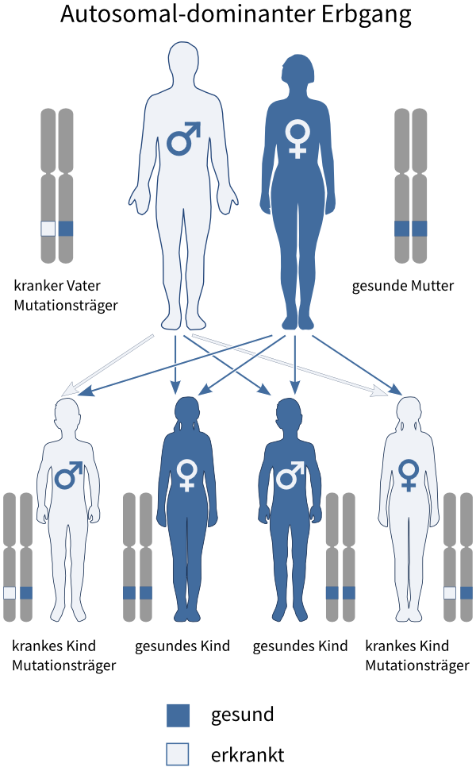

So wird Migräne *nicht* vererbt.

Die meisten Menschen verstehen unter einer genetischen Krankheit eine Krankheit, die man wie die eigene Blutgruppe nach den mendelschen Regeln vererbt bekommt und ein Leben lang behält. Es gibt eine sehr seltene Unterform der Migräne, die sogenannte »familiäre hemiplegische Migräne« (FHM). Sie ist so eine genetische Krankheit. FHM wird genau wie die Blutgruppe A und B unabhängig vom Geschlecht vererbt und für die Nachkommen besteht ein Risiko von 50%, das gleiche Merkmal zu erben (s. Abb. »Autosomal-dominanter Erbgang«).

Doch unter der seltenen Unterform »familiäre hemiplegische Migräne« leiden nur etwa 0,01% der Bevölkerung. Unter der Hauptform der Migräne leiden hingegen 12%. Von 1000 Migräneerkrankten leiden also 999 unter der Hauptform. Im Folgenden wird deswegen von dieser Hauptform die Rede sein.

# Erworbene Merkmale können über Generationen vererbt werden

Bei der Migräne spielt Vererbung eine Rolle. Das haben Studien gezeigt. Migräne tritt in Familien gehäuft auf. Nur: warum ist das so?

Zum einem fand man in den letzten fünfzehn Jahren durch sehr aufwendige Untersuchungen (sogenannte »genomweite Assoziationsstudien«) Hinweise, die man »polygenetisch« deutet. Das heißt, ein erhöhtes Risiko besteht wahrscheinlich dann, wenn eine Kombination mehrerer Gene zur Ausbildung der Krankheit beitragen können. Allerdings spricht einiges dafür, dass eine bestimmte Genom-Sequenz, die nur wenige Menschen in sich tragen, weder notwendig noch hinreichend ist. Zusätzlich oder auch allein können Umweltveränderungen und fehlangepasstes Verhalten Migräne verursachen.

Spricht nicht doch die Häufung der Migräne in Familien für die zentrale Bedeutung der biologischen Grundausstattung, die man bei Geburt mitbekommt? Schon. Allerdings wissen wir heute, dass selbst erworbene Merkmale über mehrer Generationen vererbt werden können. Gleichzeitig ist klar, dass man solch eine Anlage nicht notwendigerweise ein Leben lang behält. Denn erworbene Merkmale vererben sich nicht über die Genom-Sequenz, sondern über die Steuerung, wie ein Gen nutzbar gemacht wird. Diese vererbten Gen-Schalter nennt man »epigenetische Gen-Regulation«.

Inwieweit Gen-Schalter eine wichtige Rolle bei der Migräne spielen, ist zwar noch völlig unklar. Doch wird die Vererbung einer durch Umweltveränderungen und Verhalten erworbenen Krankheit vor allem bei zwei Einflüssen zur Zeit heiß diskutiert: Hunger und Stress. Das sind auch zwei zentrale Auslöser der Migräneattacken. Sicher: Mehr als einen Anfangsverdacht begründet das nicht. Allerdings lohnt für Betroffene in jedem Fall der Blick auf diese Gen-Schalter. Denn Gen-Schalter lassen sich im Gegensatz zur Genom-Sequenz durch einen therapeutischen Ansatz manipulieren. Beispielsweise haben viele die Erfahrung gemacht, dass sich die Häufigkeit oder zumindest die Schwere der Attacken reduzieren lassen, wenn regelmäßige Mahlzeiten eingehalten werden und der Stress besser bewältigt wird.

# Sollwerte regulieren Stressgene

Somit steht außer Frage, dass Gene eine Rolle spielen. Doch es sind Gene, die jeder Mensch in sich trägt. Umweltveränderungen und Verhalten haben einen Zugriff auf unser Erbgut und können Gene an und aus schalten. Dies gilt insbesondere für sogenannte »Stressgene«, die bei Migräne eine große Rolle spielen.

Je nach situativen Einflüssen wird die Aktivität der Gene geregelt. So hält sich der Körper trotz wechselnder Situationen, von stressigen zu entspannenden, in einem körperlich-mentalen Gleichgewicht. Aus diesem Gleichgewicht wird man immer mal wieder herausgebracht. Anhaltender Stress führt zu einer Überbelastung, so dass Toleranzgrenzen bestimmter physiologischer Richtwerte überschritten werden. Wobei Stress über unterschiedliche Wege langfristig einwirken kann.

Stress entsteht nämlich durch ganz verschiedene Reize. Nicht nur am Arbeitsplatz. Auch Hunger bedeutet zum Beispiel Stress für den Körper. Oder zu wenig Schlaf. Folgt auf Stress körperliche Aktivität, kann dies sich positiv auswirken. Manche Umweltbedigungen kann man hingegen nicht beeinflussen, wie drastische Wetterumschwünge bei einem abziehenden Hochdruckgebiet und herannahenden Tief. Für den Körper können auch Medikamente und die Schmerzattacke selbst Stress bedeuten, so dass ein Teufelskreis entsteht.

Eine stressbedingte Überbelastung übersteuert die Aktivität von Genen auf sogenannten »Stressachsen«. Diese »Stressachsen« sind Teil eines Umwelt-genetischen Regelkreises. Das Organ, das individuelle Erfahrungen in ein genetisches Reaktionsmuster übersetzt, nennen wir Gehirn. Über die Sinneseindrücke gelangen Signale ins Zwischenhirn und weiter entlang auf den zwei »Stressachsen« zur Nebennierenrinde und in den ganzen Körper, insbesondere zum Herzen und in den Darm. Die erste Achse verläuft über eine Hormondrüse, die »Hypophyse«, auch Hirnanhangsdrüse genannt. Die zweite Achse läuft über den Hirnstamm zum »Vagusnerv«, der dann durch den ganzen Körper vagabundiert – daher der Name.

Migräne ist demnach eine Gehirnkrankheit, eine organische Krankheit oder auch eine dynamische Krankheit, je nach dem, welche Betonung man auf die oben beschriebenen Vorgänge legen möchte – aber Migräne ist keine genetische Krankheit. Denn die wirklich zentralen Gene, die eine Schlüsselrolle spielen, trägt jeder Mensch in vollkommen identischer Form in sich. Die polygenetischen Merkmale spielen bisher höchstens eine Nebenrolle. Es sind die individuell verstellten Sollwerte in einem physiologischen Regelkreis, die das Migränegehirn auszeichnen und es gilt diese wieder in den Normbereich zurückzuführen.

# 

# Weiterführende Literatur

Noble, D. (2013). Physiology is rocking the foundations of evolutionary biology. Experimental physiology, 98(8), 1235-1243. ([Link](http://onlinelibrary.wiley.com/doi/10.1113/expphysiol.2012.071134/full), Artikel frei einsehbar)

Barrès, R., Osler, M. E., Yan, J., Rune, A., Fritz, T., Caidahl, K., … & Zierath, J. R. (2009). Non-CpG methylation of the PGC-1α promoter through DNMT3B controls mitochondrial density. *Cell metabolism*, *10*(3), 189-198. ([Link](http://www.sciencedirect.com/science/article/pii/S1550413109002290), , Artikel frei einsehbar)

Gluckman, P. D., Hanson, M. A., & Beedle, A. S. (2007). Non‐genomic transgenerational inheritance of disease risk. Bioessays, 29(2), 145-154. ([Link](http://onlinelibrary.wiley.com/doi/10.1002/bies.20522/abstract))

Kaati, G., Bygren, L. O., Pembrey, M., & Sjöström, M. (2007). Transgenerational response to nutrition, early life circumstances and longevity. European Journal of Human Genetics, 15(7), 784-790. ([Link](http://www.nature.com/ejhg/journal/v15/n7/full/5201832a.html), Artikel frei einsehbar)

Borsook, D., Maleki, N., Becerra, L., & McEwen, B. (2012). Understanding migraine through the lens of maladaptive stress responses: a model disease of allostatic load. Neuron, 73(2), 219-234. ([Link](http://www.sciencedirect.com/science/article/pii/S0896627312000256), Artikel frei einsehbar)

Nachtrag

Ayata, C. (2016). Migraine: Treasure hunt in a minefield — exploring migraine with GWAS. *Nature Reviews Neurology*, *12*(9), 496-498. [Link](//www.nature.com/articles/nrneurol.2016.118)
