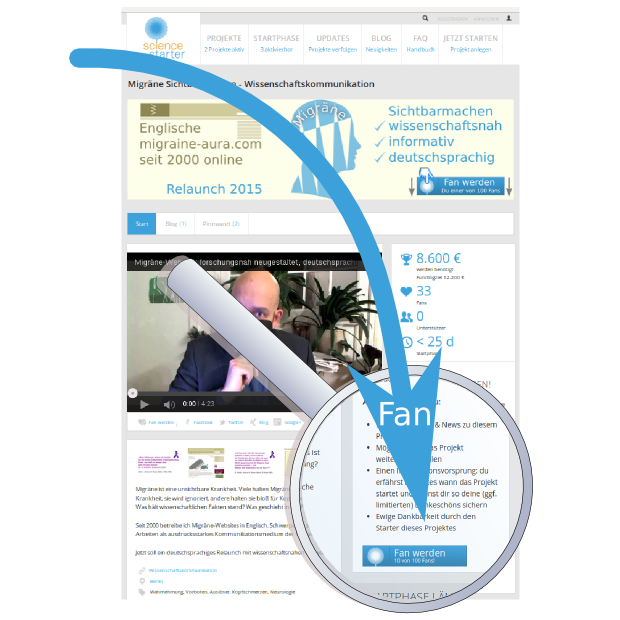

Bitte unterstützen und Fan werden! Klick.

Nach über 15 Jahren Erfahrung mit einer populären und sehr großen Website in englischer Sprache und den über 80 Blogbeiträgen zur Migräneforschung hier auf SciLogs ist es an der Zeit. Ich möchte diese beiden Quellen auswerten und daraus eine neue Informationsarchitektur ableiten für eine neue, forschungsnahe Migräne-Website.

Dazu brauche ich Eure Unterstützung. Zwei Minuten. Ein Schritt. Heute.

[Hier entlang](https://www.sciencestarter.de/migraene-website).

