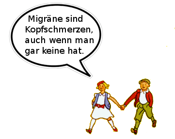

**Migräne ist eine Krankheit, Kopfschmerz ein Symptom. Manche Menschen leiden unter Migräne ohne Kopfschmerzen.**

> Nach dem Mittagessen kriegte Frau Direktor Pogge ihre Migräne. Migräne sind Kopfschmerzen, auch wenn man gar keine hat.

So beschrieb Erich Kästner 1931 in seinem Kinderbuch *Pünktchen und Anton* eine Volkskrankheit, unter der nach heutigen Schätzungen bis zu ein Fünftel der Bevölkerung leidet.

Migräne ohne Kopfschmerzen, so widersprüchlich das zunächst klingen mag, kann nach der Klassifikation der Internationalen Kopfschmerzgesellschaft (IHS International Headche Society) sogar tatsächlich als eine gesonderte Variante dieser Krankheit diagnostiziert werden. [Diese Form trägt die Bezeichnung IHS 1.2.3.](http://ihs-classification.org/de/02_klassifikation/02_teil1/01.02.03_migraine.html)

Kästner ging es allerdings weniger um diagnostische Spitzfindigkeiten als um die Charakterisierung von Pünktchens Mutter als feine Dame der Gesellschaft, die sich um das Wohl von Kindern aus aller Welt sorgt, dabei aber ihre eigene Tochter vergisst. Migräne wurde damals – und heute leider zum Teil immer noch – bestenfalls abgetan als Hysterie, eher aber noch als Hypochondrie oder gar als Drückebergertum.

Dabei ist Migräne eine Volkskrankheit die eine ausgeprägte Beeinträchtigung mit sich bringt, die „bei weitem den Grad von gesellschaftlich als gravierend anerkannten Erkrankungen“ überschreitet [1]. Kopfschmerz ist dabei nur ein mögliches Symptom einer Migäneattacke.

Vielleicht leiden auch Sie unter Migräne und merken es nur nicht? Morgen mehr dazu.

**Nachtrag zum 2. April.**

Manchmal ist der Scherz, dass man gar keinen macht. So im Fall der Migräne, die landläufig schlicht ein *Kopfschmerz* ist, jedoch als Krankheit auch diagnostiziert werden kann, wenn man keinen hat.

Ich habe nun oben einen [Link gesetzt](http://ihs-classification.org/de/02_klassifikation/02_teil1/01.02.03_migraine.html) zu der offiziellen IHS-Klassifikation. Es wäre noch viel zu sagen, gerade zu den gravierend ausgeprägten Beeinträchtigungen, die auch die anderen Symptome einer Migräne mit sich bringen. Teilweise ist das in den Kommentaren angeklungen. Ich habe auch in der provokativ anmutenden Frage: *Vielleicht leiden auch Sie unter Migräne und merken es nur nicht?* genau dies ansprechen wollen. Es ist wichtig über dieses auch aufzuklären. Dies kann ich am besten in den Worten der Betroffenen. Nachfolgend stehen Zuschriften als Reaktion auf die [Migräne-Website](http://www.migraine-aura.org/de/) von Dr. med. Klaus Podoll (UK Aachen) und mir.

> „Seit gut einem Jahr leide ich an der Mirgräne-Aura ohne anschließenden Kopfschmerz, aber Sehstörungen Wortfindungsstörung und schlechtes hören. Ich wurde gründlich untersucht mit CT usw. und die Diagnose war Mirgräne ohne Kopfschmerz. Ich freue mich sehr Ihre Internetseite gefunden zu haben, weil es schön ist, die Beschwerden die man selbst hat, auch von anderen Betroffen geschildert zu sehen. Ehrlich gesagt stand ich der Diagnose etwas skeptisch gegenüber − weil: Migräne ohne Kopfschmerz nur mit Aura??!!“  
> (E. Schmidt, Email an Markus Dahlem, 18 Oktober 2002)

> „Endlich habe ich mal eine Seite gefunden, die mir wirklich weiterhilft. Ich leider seit ca. 2 Jahren an, tja wenn ich das wüßte wäre ich schlauer, aber nach diversen Informationen auf Eurer HP [Homepage] scheint es Migräne mit Aura zu sein.“  
> (Rosa, Email an Markus Dahlem, 15. Oktober 2003)

> „Ich darf die Gelegenheit nutzen, zu sagen, daß www.migraene-aura.de [NEU: [www.migraine-aura.org/de](http://www.migraine-aura.org/de/)] mit Abstand die beste Website zum Thema ist. Manchmal der einzige Trost, wenn ich mal wieder von einer Aura geplagt werde und die Welt unterzugehen scheint. Weiterhin viel Erfolg.“  
> (Jürgen Morweiser, Email an Markus Dahlem, 19 April 2004)

> „Zuerst mal ein riesiges Lob für die informative Internetseite. Ich hab, ähnlich wie die anderen Leserbriefe, noch niemanden gefunden, der an der gleichen Symptomatik leidet, und da kommt man dann eben doch ins Grüblen und Zweifeln. Die Symptome, die hier dargestellt sind, decken sich ziemlich genau mit meinen.“ „Vielleicht könnten Sie noch anfügen, daß mir die Kopfschmerzen und Übelkeit egal sind, aber die Aura einfach Angst macht, weil man überhaupt keinen Einfluß darauf nehmen kann. Ich hatte übrigens die erste Migräne mit Aura mit ca. 12 Jahren.“  
> (Y. R., Email an Markus Dahlem, 19. und 21. August 2005)

Die Hervorhebungen durch Fettdruck stammen von mir. Sie sollen den Augenmerk auf die Symptome neben den Kopfschmerz lenken. In den Kommentaren hier ist weiterer Platz für Diskussion. Viel Platz und ich freue mich über jeden Beitrag.

Alle die den Beitrag zunächst für einen Aprilscherz hielten und auch alle, die erst später diesen Beitrag gelesen haben, die bitte ich einmal nachzudenken, warum Migräne dieses Image anhaftet.

Nachgetragen sei auch, dass der Beitrag oben aus einem Artikel von mir in der Zeitschift „*Psychologie Heute*“ stammt aus dem Jahr 2002 [2]. In meiner aktuellen Forschung beschäftige ich mich mit Modellen, die die verschiedenen diagnostischen Formen der Migräne unter einer einheitlichen Theorie vereinigen sollen. Dazu im Laufe der Zeit mehr an dieser Stelle.

**Literatur**

[1] Hartmut Göbel,  Die Kopfschmerzen: Ursachen, Mechanismen, Diagnostik und Therapie in der Praxis, Springer.

[2] Markus Dahlem, In Hirngewittern. Psychologie Heute. August 2002, Seite 54-55
