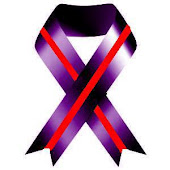
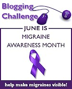
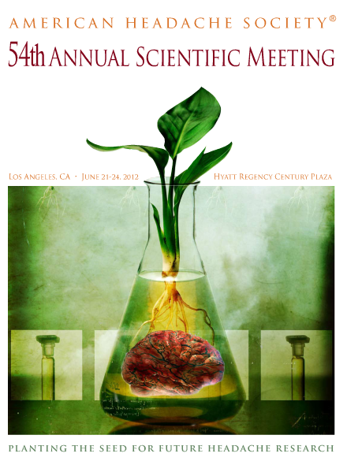

„Dies ist ein großarties Motto, da eines der größten Probleme für diejenigen, die unter Migräne und anderen Kopfschmerzen leiden, die Mythen und Missverständnisse sowie die Stigmatisierung sind, die sie umgeben“, [schreibt Teri Robert in ihrem Blog](http://www.fightingheadachedisorders.com/2012/05/migraine-awareness-month-blogging-challenge.html). „Und eine der besten Möglichkeiten, um Mythen und Stigma zu zerschmettern, ist diese unsichtbaren Erkrankungen sichtbar zu machen“, fährt Teri fort und ruft im Juni die *Blogging Challenge* aus mit 30 Themen, eins für jeden Tag.

Wer keinen Blog hat allerdings trotzdem zu dem *migraine awareness month* auch in Deutschland beitragen möchte, wer in einer besonderen Form das öffentliche Bewusstsein für Migräne schärfen will, wer auch nur Solidarität und Unterstützung kundtun möchte, der kann gerne das zunächst hier in den Kommentaren machen. Wenn es längere Beiträge geben sollte, werde ich diese in einem gesonderten Beitrag nochmal öffentlich weiter sichtbar machen.

Anregungen finden sich [in der langen List in Teris Blog](http://www.fightingheadachedisorders.com/2012/05/migraine-awareness-month-blogging-challenge.html).

Außerdem findet im diesen Monat die jährliche Tagung der American Headache Society statt. Das Motto dort: *Planting the Seed for Future Headache Research* – auf deutsch: Setzte den Keim für zukünftige Kopfschmerzforschung. Für mich ein Motto im doppelten Sinn, denn den Keim muss ich nun neu setzen, zumindest hoffe ich, bald unter besseren Arbeitsbedingungen weiter forschen zu dürfen. Von der Tagung werde ich noch berichten. 

