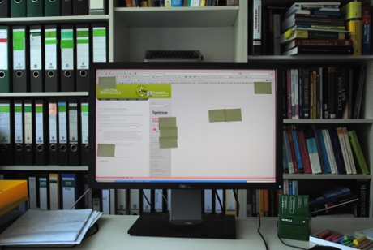
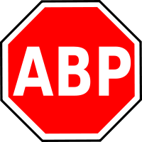

Ich höre immer wieder Anekdoten, wie Menschen, die unter Migräne leiden, mögliche Triggerfaktoren umgehen. Der eine vermeidet das China-Restaurant um die Ecke (Glutamat!), die andere entsorgt die neu gekaufte Jalousie sofort wieder (Streifenmuster!) und und und. In einer neuen Serie *„Migräneprophylaxe – post it“* rufe ich die Betroffenen auf: veröffentlicht dies! Gerne will ich hier im Blog kurze Beiträge schreiben, in denen ich dann – soweit bekannt – auch den neurowissenschaftlichen Hintergrund der Strategie erkläre.\*

**Heute:** „Post-it“, die kleinen gelben Klebezettel. Man findet Sie überall, auch und besonders gerne am Bildschirmrand. Aber auf dem Bildschirm?  Nein, keine virtuellen Zettel sondern so etwas:

Zu dem letzten Beitrag [über ein Musikvideo bei YouTube, das durch ständige Lichtblitze und flackerndes Licht ein klassischer Migräneauslöser ist und das auch passend „*Migraine*“ heißt](http://www.brainlogs.de/blogs/blog/graue-substanz/2011-05-06/ein-aktuelles-musikvideo-migraine-im-vergleich), bekam ich diesen Kommentar.

> *… bei mir kann eine Aura* [Migränesymtom, Anmerkung M.A.D.] *allein durch sich rhythmisch bewegende Icons ausgelöst werden. Darum beppen bei mir auf der Mattscheibe gern gelbe Zettel, um das Bewegungsmuster auszuschalten. – Die alten PC-Bildschirme hatten auch den Effekt, je nach Hertz Rate. Fein, dass es mittlerweile Flachbildschirme gibt, die eine andere Technik benutzen. So geht es mir schon besser.*

Ich bat um ein Foto, denn ich hatte schon von vielen Tricks zur Migräneprophylaxe gehört, von den Klebezetteln bisher aber noch nicht. Das Foto soll noch kommen, es muss zunächst noch gemacht werden und zwar weitgehend anonymisiert. Wohl niemand will seinen Arbeitsplatz gerne hier zeigen. Ürigens, glauben Sie mir, nicht nur Migräniker finden flackernde Icons doof.  Wenn Sie also selbst so etwas bei der Kollegin sehen, ich würde die Migränediagnose nicht stellen. Migräneprophylaxe oder nicht, es geht sogar noch leichter als mit Klebezettlen. Aber zunächst zum neurowissenschaftlichen Hintergrund.

**Hintergrund:** Es ist bekannt und gehört zu den möglichen diagnostischen Kriterien einer Migräneerkrankung, dass Menschen, die unter Migräne leiden, besonders Licht- und Lärmempfindlich sind. Visuelle Trigger können sowohl flackerndes Licht sein, als auch Streifenmuster, d.h zeitlich bzw. räumlich sich abrupt ändernde Lichtverhältnisse [1].  Dies war schon Thema in den beiden vorangegangen Beiträgen [über das Musikvideo](http://www.brainlogs.de/blogs/blog/graue-substanz/2011-05-06/ein-aktuelles-musikvideo-migraine-im-vergleich) und [mein Video bei YouTube](http://www.brainlogs.de/blogs/blog/graue-substanz/2011-05-04/youtube-sperrt-mein-migraene-video).

Kurz erklärt: unsere Gehirnzellen in den frühen sensorischen Großhirnarealen sind spezialisierte Detektoren für etwas, was ich als elementare Bausteine der Wahrnehmung bezeichne. Zum Beispiel Kanten, also abrupte Änderungen der Beleuchtung entlang gerader Linien, werden von Kantendetektoren detektiert. Diese elementaren Bausteine der Wahrnehmung nennt man auch rezeptive Felder. Gehirnzellen mit entsprechenden rezeptiven Feldern werden durch sich abrupt ändernde Lichtverhältnisse in Raum und Zeit besonders intensiv aktiviert und können so zur neuronalen Übererregung beitragen.

**Mein Rat:** [Werbeblocker](http://de.wikipedia.org/wiki/Werbeblocker). Die meisten flackernden Bilder sind in den kleinen (und manchmal nicht so kleinen) Werbeflächen. Es gibt Programme, die Werbung auf einer Webseite ausblenden. Es gibt sie als Erweiterung für alle Browser, einer der bekanntesten Werbeblocker ist *Adblock Plus*. Gerne können hier in den Kommentaren Hinweise zu anderen guten Werbeblockern gegeben werden. Oft hilft auch das Ausschalten von JavaScript, dann funktionieren aber vielleicht auch nützliche Anwendungen nicht mehr. Bei anderen flackernden Bildern, wie die oben beschriebenen Icons, die immer einen festen Platz auf dem Bildschirm haben, kann in der Tat ein kleiner gelber Klebezettel Wunder wirken und die einfachste Abhilfe schaffen.

**Literatur**

[1] [Harle DE, Shepherd AJ, Evans BJ. Visual stimuli are common triggers of migraine and are associated with pattern glare. Headache. 2006 Oct;46(9):1431-40.](http://onlinelibrary.wiley.com/doi/10.1111/j.1526-4610.2006.00585.x/abstract;jsessionid=604552E6A0B2F462B7B00D0F70C7B068.d02t01)

**Fußnote**

\*Ich werde *keine* Zusendungen berücksichtigen können, die in irgendeiner Form die Einnahme von Medikamenten beschreibt oder anderweitig neue Migränetheorien mit Hilfe dieser Serie unter die Leute bringen wollen. Aber Vermeidungsstrategie, die einen klaren neurowissenschaftlichen Hintergrund haben, erkläre ich gerne. Es ist sicher gut, mir zunächst in den Kommentaren oder per Email (dahlem(at)physik.tu-berlin.de) einen Hinweis auf die eigenen Vermeidungsstrategie zu geben. Ich kann mich dann zurückmelden, ob ich eine neurowissenschaftliche Erklärung habe und die Veröffentlichung in meinem Blog für sinnvoll halte. Hinweis: Ich habe keine medizinische Ausbildung und weder darf noch will ich medizinischen Ratschläge veröffentlichen, insbesondere kann ich auch keine Hinweise zu Medikamenten geben.

**Link**

Kurze URL zu diesem Beitrg:

<http://goo.gl/hyT9v>
