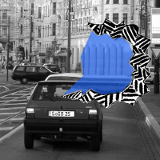

It’s not the vertigo, at least not only vertigo, or the medication that can interfere with your ability to drive. You can also experience visual disturbances during a migraine attack and, unlike with vertigo or medication, you may not even know about some of these disturbances, in particular that you may be partially blind for quite some time.

Consider the two kinds of neurological symptoms. Positive neurological symptom often appear as visual hallucinations in form of geometric figures or an exaggeration of normal function. On the contrary, the partial or complete loss of function is a negative neurological symptoms.

The two images below, which will explain these neurological symptoms in a migraine attack by example, are the same. The affected area of these two different kinds of neurological symptoms within the visual field are just highlighted in different colors. Shaded in red is the area in the visual field with a positive symptom, shaded in blue is the area with a negative neurological symptom. Take a close look at this illustration, please spare some time to explore the scene. Describe what you see, before reading further. If you don’t understand the negative symptoms, don’t worry. Tell me instead how many cars do you see?

The negative symptom, a huge blind area in the visual field, is often is not recognized. It is filled-in with some consistent patterns (it’s not blue, but I think you got that). The assessment of negative symptoms is very difficult for the untrained.

Compare the upper image with the normal view of the scene in the image below. You could not see several cars in front of you. Without the positive symptom as a rather obvious warning symptom, you can get in trouble—without even knowing before something actually happens.

To make matters worse, blind areas in your visual field may even occur in isolation, without the easy-to-recognize positive symptoms (the zigzags) surrounding them, in which case the visual migraine aura may stay completely unrecognized. From worse to worst: the phase in migraine with neurological symptoms, the so-called migraine aura, usually starts 20 to 40 minutes before the headache.

Therefore, it is important to raising awareness of problems in the recognition of negative symptoms of migraine.

Migraine attack? Even if it is supposedly only just about to begin, don’t drive!

(In case you wonder about flying an air plane instead. Here is the [Guide for Aviation Medical Examiners](http://www.faa.gov/about/office_org/headquarters_offices/avs/offices/aam/ame/guide/special_iss/all_classes/migraine/) from the U.S. Department of Transportation Federal Aviation Administration, in brief, no, you can’t fly an airplane at all if you suffer from migraine with aura.)  
  
The article and the images are licensed under a [Creative Commons Attribution-NonCommercial-NoDerivs 3.0 Unported License](http://creativecommons.org/licenses/by-nc-nd/3.0/). If you need larger images, [contact](https://sites.google.com/site/markusadahlem/home/contact "contact") me.

Illustration are modified from my paper:

Dahlem MA, Chronicle EP. [A computational perspective on migraine aura.](http://dx.doi.org/10.1016/j.pneurobio.2004.10.003) *Prog Neurobiol.* **74**,351-361 (2004).
