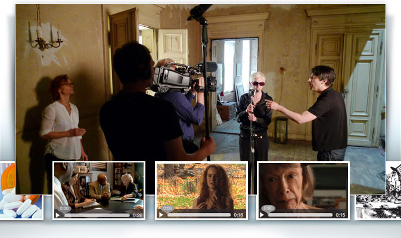
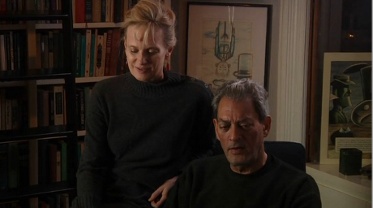

Im März bekam ich eine Email von Susanna Styron, eine Dokumentarfilmerin aus den USA. Wir sollten uns im Juni, auf dem 15. Kongress der Internationalen Kopfschmerzgesellschaft in Berlin treffen und über ein Migräne-Projekt sprechen. Leider haben wir uns verpasst, ich war mit der Organisation eines Symposiums beschäftigt und Susanna hatte sich dann auch nicht mehr gemeldet. Seitdem wartete ich gespannt auf dieses Projekt, denn es schien mir einzigartig. Ich wusste, dass ein paar Bekannte von mir beteiligt sind und auch einige Menschen, die ich bisher nur durch ihr künstlerisches Werk kannte – und mehr als schätze.

Vor einer Stunde kam endlich diese Email:

Dear Friend,

Why Migraine? [Visit the site](http://www.themigraineproject.com), click on the clips, [find out more](http://www.themigraineproject.com/%23section1) about this prevalent disease and how our film can make an impact. Please also consider [making a donation](http://www.themigraineproject.com/%23section5), no matter how small. Independent films about important subjects get made with the support of friends like you.

Our previous award-winning film „9/12: From Chaos to Community“ was voted Best Documentary of the year by Video Librarian magazine. Its trailer has received over 2 million hits on YouTube. It has been broadcast internationally, is used by the Belgian Red Cross (among others) as a crucial educational tool throughout the European Union, and now resides in the libraries of hundreds of universities and communities across the United States. 9/12 has made a difference in many lives. And that’s what we expect [The Migraine Project](http://www.themigraineproject.com) to do.

Please don’t hesitate to share this with everyone you know!

Thanks for your support,

Susanna Styron and Jacki Ochs

Ich freue mich, nun auf dieses Projekt, diesen Film „*in the making*“ aufmerksam machen zu können. Ohne weitere Worte: ein Klick auf das Bild, und man gelangt zur Website und zum Trailer (leider nur in Englisch verfügbar):

  
Siri Hustvedt und Paul Auster über das Familienleben mit dem dritten Schatten: Migräne.

Dieses Projekt, dieser Film wird Ihrer Sicht, was Migräne ist, verändern – es sei den, Sie leiden selbst unter Migräne und wissen um diese Krankheit und ihre Symptome. Aber vielleicht selbst dann.
