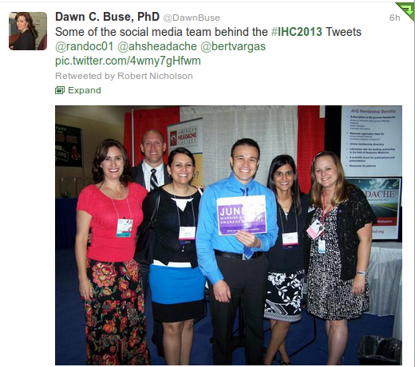
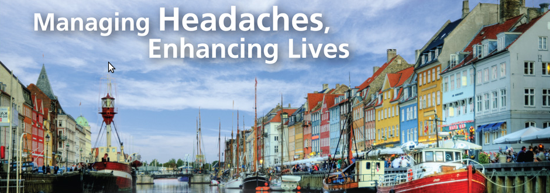

On my way back to Germany with my flight being delayed, I have some time to write about the International Headache Congress that I’ve visited here in Boston.

We had many good talks, some about still unpublished data, so I’d rather not write about these research topics here—and my flight is anyway not that much delayed.

But one thing is quite remarkable, the hashtags #IHC2013 and #migraine were trending on Twitter for three days.

On the last IHC2011 in Berlin, there were hardly any tweets (as far as I remember only from [@ahsheadache](https://twitter.com/ahsheadache) and [@daviddodick](https://twitter.com/daviddodick)). This time, some people behind [@ahsheadache](https://twitter.com/ahsheadache) (see picture above) tweeted also individually, [@bertvargas](https://twitter.com/bertvargas), [@randoc01](https://twitter.com/randoc01), [@mrobbinsmd](https://twitter.com/mrobbinsmd), [@rashmihalker](https://twitter.com/rashmihalker), and many more joined. Maybe most notably [@petergoadsby](https://twitter.com/petergoadsby), [@AllanPurdy](https://twitter.com/AllanPurdy), [@eloder (Elizabeth Loder)](https://twitter.com/eloder), [@DawnBuse](https://twitter.com/DawnBuse), [@dr\_j\_pavlovic](https://twitter.com/dr_j_pavlovic) and [@TobiasKurth](https://twitter.com/TobiasKurth) are the ones that I can truly recommend to follow on Twitter (including the aforementioned), if you have an interest in migraine research. (Sorry, if I forgot somebody …).

Hope to see many of you on the next [EHMTIC2014](http://ehmtic2014.com/ "EHMTIC2014")—too long a hashtag, though—in Copenhagen.

