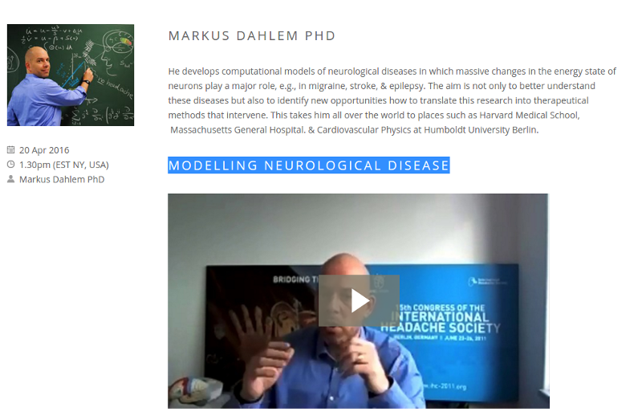

Anfang des Jahres wurde ich gefragt, ob ich mit einem Online-Interview zu einer Video-Serie beitragen möchte, die nun als »Migraine World Summit« im Internet verfügbar ist. Ich schaute kurz in die Liste der Mitwirkenden, sah viele meiner vor allem US-amerikanischen Kollegen und sagte gerne zu. Später erst erfuhr ich, dass die Videos leider nur für eine sehr begrenzte Zeit offen verfügbar stehen. Danach wird das Angebot kostenpflichtig. Ich selbst erhalte keine Vergütung hierfür. Letztlich ist das natürlich auch nicht anders als beispielsweise bei dem noch 2016 erscheinenden, internationalen Lehrbuch der Migräne. Auch dort schrieb ich einen Beitrag über die Bedeutung der Computermodelle für die aktuelle Migräneforschung, ohne dass für den Beitrag ein Honorar floss.

Bei einem Online-Angebot wäre es mir natürlich schon lieber gewesen, das der Beitrag für immer offen verfügbar steht. Nun gut. Ein Podcast deckt sich zumindest teilweise mit dem Video. Er ist offen und zudem auch auf deutsch [hier nachhörbar](http://codinghistory.com/podcast/code11/).

Diese kurze Einleitung zu meinem Beitrag schrieb Carl Cincinnato, der Veranstalter des »Migraine World Summit«:

> *He develops computational models of neurological diseases in which massive changes in the energy state of neurons play a major role, e.g., in migraine, stroke, & epilepsy. The aim is not only to better understand these diseases but also to identify new opportunities how to translate this research into therapeutical methods that intervene. This takes him all over the world to places such as Harvard Medical School, Massachusetts General Hospital. & Cardiovascular Physics at Humboldt University Berlin.*

[Und nun weiter zum Video.](https://www.migraineworldsummit.com/markus-dahlem/)

