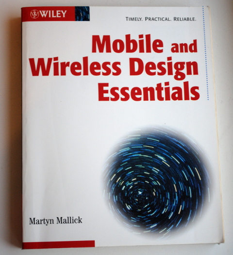
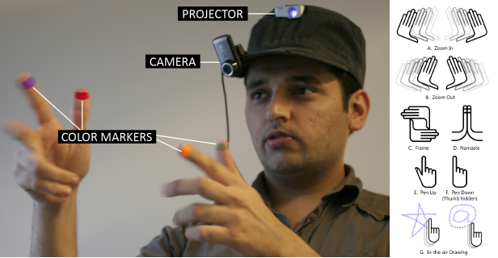

There can be no doubt, mobile healthcare (mHealth) will change medicine in general and migraine in particular. But how?

Ten years ago, I thought about this for the first time. Together with others, we wrote a business plan for a startup company whose main product should have been an—well, today, I would call it an “app”. Back then, I may have used the words “smart client application”. The product was a mobile electronic headache diary combined with a method to quantify different visual field defects during migraine with aura. I programmed this e-diary and my “app” had something that would still be a novelty today: two different kinds of movies created by [computer simulations of visual migraine aura](https://www.youtube.com/watch?v=GFvuC9dxY9I). The aim was to decide which is closer to the hallucinatory percept, similar to the idea to present tones for evaluating the loudness of tinnitus.

In fact, there was already two years earlier a [first clinical study with an electronic diary](http://www.neurology.org/content/60/6/935.short) looking not into the aura phase but at premonitory symptoms in migraine using an handheld, the [Philips Nino](http://en.wikipedia.org/wiki/Philips_Nino) running Microsoft Windows CE operating system.

Back then, Apple’s tablet computer was called Newton, their first iPhone was still two years into the future. Today, it strikes me a bit funny to read in a book, which I bought at that time, that one advantage of mHealth could be having “easy-to-read prescriptions”. Anyway, “the availability of up-to-date, accurate, patient information at the fingertips” certainly is a proper metaphor for mHealth even today. The following are the only two paragraphs on healthcare in the whole book:

Mobile and Wireless Design Essentials by Martyn Mallick.

> **Healthcare Applications**
>
> Medical professionals … can realize many benefits from smart client applications, in particular, the availability of up-to-date, accurate, patient information at their fingertips. With this information, medical practitioners can diagnose conditions more effectively and accurately.
>
> A prime example is prescription writing. In the United States, close to 3 billion prescriptions are written annually … Managing this data is an arduous task. By automating this process with a smart client application, doctors can deliver accurate, easy-to-read prescriptions that meet the requirements of the patient’s insurance plan. This is just one example where persistent data within a mobile application increases productivity and reduces errors. Many other medical processes can be automated in a similar fashion.

Clearly, our mHealth startup venture was not really driven by the emerging technologies. I may have seen in big strokes the use of mobile applications in healthcare due to this clinical migraine study and this book, among other sources, but I truly did not thought of mobile healthcare as being the next big thing as people see it today.

In 2005, two other factors played a big role for me. For one thing, the year before, I got an individual research grant (Sachbeihilfe) from the German Research Foundation (DFG) to explore visual field defects in migraine. When I obtained first results, I was keen on translating our findings into a diagnostic tool. Another important factor was that economic teaching was great at my university, that is, at the [Interaktionszentrum Entrepreneurship](http://interaktionszentrum.de/iaz/en/Interaktionszentrum.html). They offered a structured approach so that I—a physicist being employed at a department of neurology with my ideas and high motivation—could team up with other students from economics. However, as you already got from my words above (the “product should have been” an app), we did not did pursue this further in 2005. It was arguably too early.

Let’s fast forward four years. I changed in 2007 from the department of neurology to the department of theoretical physics and from Magdeburg to Berlin. Two big steps but my research focus stayed with migraine. Only now, my interest was on fusing control theory with neural stimulation. In 2009, I organized a workshop at the 18th Annual Computational Neuroscience Meeting in Berlin on “[Modeling Migraine: From Nonlinear Dynamics to Clinical Neurology](https://sites.google.com/site/modelingmigraine/)”.

At this workshop, I grabbed out my “old” ideas of mobile healthcare combined with my new research. We, that is, about 15 migraine experts and 15 computational neuroscientists, had a moderated discussion [on real-time recording of visual symptoms in migraine with aura and closing the feedback loop with headset glasses](https://sites.google.com/site/modelingmigraine/neural-control-and-new-therapeutic-approaches).

I showed these pictures:

From: Mistry, Maes, and Chang. „WUW-wear Ur world: a wearable gestural interface.“ CHI’09 extended abstracts on Human factors in computing systems. ACM, 2009.

Well, I think it is fair to say that I was looked at with bewilderment from both sides, the migraine experts and computational neuroscientists alike. Google Glass was only later announced for April 2012 (and it flopped anyway).

In 2009, I read about the ‚[SixthSense](http://www.pranavmistry.com/projects/sixthsense/)‚, a wearable gestural interface that augments the physical world around us with digital information and lets us use natural hand gestures to interact with that information. I felt that this will be an important extension to any headache diary that also could play movies of virtual visual hallucinations.

Maybe it is not surprising that also this idea landed in the recycle bin. Today, I still think about these issues, even more than ever and closer to the original study from 2003 on premonitory symptoms. In fact, we are now about to start a university spin-off later this year and I will blog more about it then.
