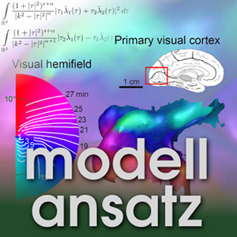
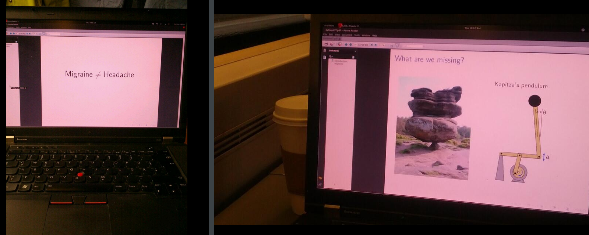

Gudrun Thäter und Sebastian Ritterbusch (KIT, Institut für Angewandte und Numerische Mathematik IV) haben mich eingeladen und zusammen reden wir über Modellbildung im Gehirn und wie man die Migräne auf eine Formel bringt. [Dies als Podcast](http://modellansatz.de/migraene) und andere wirklich spannende Beiträge zur angewandten Mathematik kann man auch über iTunes, Die Hörsuppe oder podcast.de abbonieren. Hier geht es zur Website von [Modellansatz](http://modellansatz.de).

Auf der Zugfahrt nach Karlsruhe noch schnell die Migräneformel „Migraine ≠ Headache“ aufgestellt.
