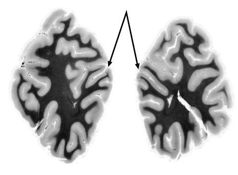

The pattern of the highly folded surface of the brain is a prominent features of the human brain. It looks a bit like a walnut. This surface is named cerebral cortex. (And it is gray matter, hence the blog name by the way—who would have guessed.)

Primarily, folding of a surface permits a larger surface area to fit inside a limited space, the skull that is. However, folding does more than that. It usually provides the additional surface area not everywhere in equal amounts.

So a really interesting questions is: where do we want to have more brain?

Everywhere, of course. Well, bad news, our skulls are rather small and folding does only so much. We must decide.

In new manuscript, I just put on the [ArXiv](http://arxiv.org/abs/1210.8415), we consider the visual cortex and we ask this question: where do we get more brain for visual processing. Not so much where do we *need* it, but where do we *get* it from the folding pattern of this area.

The visual cortex is the part of the brain that processes visual information. To be precise, we looked at the primary visual cortex. This is a credit card-size large area at the rear pole of your brain. It is split in two parts, half a credit card-size area left, the other half in the right hemisphere. We focus on this part, a single half either side. We chose this area because not only is its anatomy very well studied but also its neural functions are known well.

Let me make it very simple. Image for the moment you have to buy a camera. The newest gimmick from one particular camera is that it has not only the usual megapixel resolution but also some gigapixels! These gigapixels are still rather expensive, so they are not everywhere but limited to a stripe within its field of view. (Yes, *giga* would refer to the total number, but you know, these marketing experts overruled the development and just named theses pixels that are arranged in even larger density than in a megapixel camera gigapixels.)

Where would you want to have them? Which part of the images you take is usually the most important one?

Lets make it even more simple and lets go back to living beings and the eye instead of a camera. Assume you live in an open habitat. All the interesting things happen along the horizon (at least if you don’t have to fear predators from the sky). Fair enough, the retina of some dogs, which used to live in open habitats, give us an answer to the question. They have an area of highest acuity that is not just a single point in the centre of the field of view, but an elongated „streak“ running horizontally across the retina. This stripe corresponds to an elevated neuronal density in the retina, the visual streak, which facilitates better resolution.

Yes I know, we started off taking about the cortex not the retina. Humans don’t have a retinal visual streak (ok, they do, but only a very mild one).

What we found now in this new study, based on a rather simple mathematical model, is the following. The curvature of the human primary visual cortex serves a similar purpose as the visual streak in dogs.

How this? May I get back to my example with the camera? If I were to sell you the human visual cortex like a camera, my marketing campaign would go like this: Don’t look this other types which have this fancy gigapixel stripe. This is nothing but a lazy, fragile, and constricted hardware solution. In our system, we have also much better acuity on the horizon, but it is achieved by a software solution. Such a solution is much more flexible for it can serve several functions, functions we especially need to process information from the horizon. So we humans just gave these old megapixels from the horizon of the visual field more cortical processing power.

This study provides only some first ideas by linking cortical functions to the gross sulcal and gyral morphology. The theme from structure to function and back is a central theme in biology. But to my knowledge, nobody has yet asked why our brains look like a walnut from a functional point of view.

**Further reading**

[Markus A. Dahlem & Jan Tusch, *Predicted selective increase of cortical magnification due to cortical folding*, arXiv:1210.8415 [q-bio.NC]](http://arxiv.org/abs/1210.8415)
