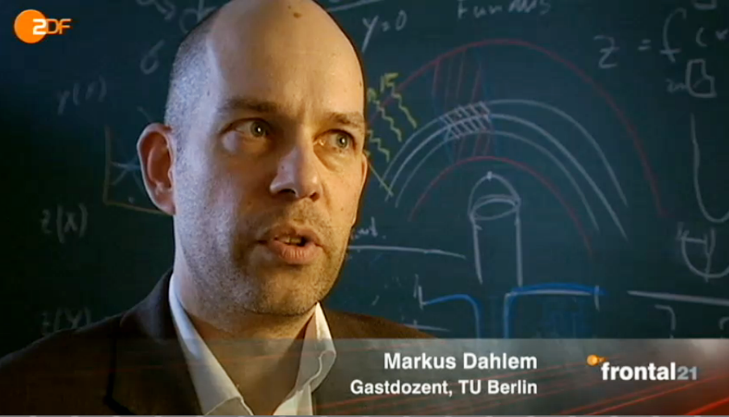

Nachdem die Presse ([hier](http://www.spektrum.de/alias/forschungspolitik/jung-exzellent-und-frustriert/1135897), [hier](http://www.spiegel.de/fotostrecke/fotostrecke-79347-2.html) und [hier](http://www.zdf.de/ZDFmediathek/hauptnavigation/startseite/#/beitrag/video/1605028/Lehrknechte-und-Betteldozenten)) auch meine Arbeitssituation aufgegriffen hat, die ich Ende November 2011 im Blog („[Die Umgehung der Zwölf-Jahres-Regelung](https://scilogs.spektrum.de/blogs/blog/graue-substanz/2011-11-23/die-umgehung-der-12-jahres-regelung)„) offen legte, will ich den Kernpunkt zusammenfassen.

Für heute (9.30 Uhr) lud der Ausschuss für Bildung, Forschung und Technikfolgenabschätzung Sachverständige für ein zweistündiges Gespräch, dass live und nachträglich in der [Mediathek des Deutschen Bundestages](http://www.bundestag.de/dokumente/textarchiv/2012/38321422_kw13_pa_bildung_forschung/index.html) nur durch Anwesenheit verfolgt werden kann (Dank an [@A\_Schillhaneck](https://twitter.com/#%21/A_Schillhaneck/status/184906541445545985)). Solche Sitzungen leben auch von Beispielen, damit die Öffentlichkeit konkret nachvollziehen kann, wie es aussieht in der Bildungsrepublik.

Als langjähriger Mitarbeiter einer Universität, wurde mir eine Gastdozentur als Ersatz für eine bereits rechtlich verbindlich zugesagte BAT 1a (heute E15) angeboten. Die Gastdozentur ist eigentlich gedacht, um externe Gäste neu an die Universität für 1-2 Semster zu holen. Die Universitätsleitung hatte sich dagegen verpflichtet mich für 9 Semester weiterlaufend einzustellen, da ich solange mehrere Drittmittelprojekte leiten sollte. Es gab dazu bescheidene Vorgaben meinerseits, unter welchen Bedingungen dies geschehen könnte, die unmissverständlich klar akzeptiert wurden. Nachdem allerdings die Fördermittel für meine Drittmittelprojekte zugesagt waren, zog die Univerwaltung das Angebot zurück und bot mir die Gastdozentur an, die über 1000 Euro schlechter dotiert ist, als das bereits zugesagte Angebot  – also sogar deutlich schlechter als mein vorheriges Gehalt – und nicht mal ein Arbeitsvertrag im rechtlichen Sinn ist.

Trotz dieses Wortbruchs und einer in meinen Augen klar nicht zweckkonformen Gesetzesauslegung, sehen weder das Präsidium der Universität hierin ein rechtliches Problem noch hat die Senatsverwaltung für Bildung Jugend und Wissenschaft als Aufsichtsbehörde etwas an dieser Situation zu beanstanden.

Da soll mir niemand Bildungsrepublik rufen. Nicht mal das Wort Fürsorgepflicht sollte man hier in den Mund nehmen. Die ist nämlich offensichtlich manchmal nicht vorhanden bei einem staatlichen Arbeitgeber. Dabei gibt es rechtlich saubere Lösungen, die mich auch befristet forschen lassen. Dagegen habe ich nämlich nichts, solange ich nicht weniger verdiene als deutlich jüngere Hochschulangestellte, die nicht mal Personalverantwortung und Lehraufgaben übernehmen, und – wichtiger noch – solange ich eine Perspektive bekomme.
