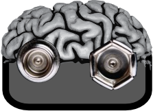

**Neuromodulation korrigiert krankhafte Gehirnaktivität mittels elektromagnetischer Felder. Neuro-Enhancement verspricht Steigerung der Gehirnleistung bei Gesunden, dies kann im Prinzip auch mit elektromagnetischen Feldern geschehen. Neuromodulation und  Neuro-Enhancement strikt trennen zu wollen, beruht letztlich auf einer unzulänglichen Unterscheidung.**

Allgemein kann man zunächst feststellen, dass sich die Debatte um das Neuro-Enhancement – und viele ihrer Missverständnisse – dadurch auszeichnet, dass es in vielen Bereichen keine scharfen Grenzen gibt.

Die Grenzen verwaschen zum Beispiel …

* … zwischen Pharmakologie und Neurotechnologie, genauer zwischen pharmakologischen Substanzen und elektrischen und magnetischen Feldern (Neuromodulation), die jeweils die psychischen Funktionen des Gehirns beeinflussen. Das eine ohne das andere bezüglich Neuro-Enhancement diskutieren zu wollen, wäre in ethischen und rechtlichen Fragen eine sinnlose Beschränkung. Auch gibt es Entwicklungen hin zu einer Verschmelzung der Verfahren (z.B. Optogenetics, Lab-on-a-Chip oder magnetische Nanopartikeln im menschlichen Organismus unter Einfluss externer Magnetfelder).
* … zwischen nicht-invasiven und invasiven Verfahren der Neuromodulation. Eine Unterscheidung ist dann unangebracht, wenn es Laien über die grundsätzlich nicht schädigende und nicht langanhaltende Wirkung auf das Hirngewebe bei diesen gegenüber jenen täuscht ([s. hier](https://scilogs.spektrum.de/graue-substanz/doch-nicht-nichtinvasive-hirnstimulation/)). Externe hochfrequente elektromagnetischer Felder werden von der [WHO als potenzielles Humankarzinogen](http://www.iarc.fr/en/media-centre/pr/2011/pdfs/pr208_E.pdf) (Gruppe 2b) eingestuft. Langanhaltende (plastische) Änderungen der Gehirnfunktionen können ebenso auftreten – genau das wird ja in einigen Fällen bezweckt. Auch kann Technik minimal invasiv sein und/oder direkt an der Grenze des Körper aufsitzen (Stichwort: [Epidermal Electronics](http://www.nationalgeographic.de/aktuelles/forscher-entwickeln-intelligente-haut)).
* … zwischen Gehirn und Körper. Rest des Körpers sollte ich wohl besser schreiben. Das [Gehirn ist das zentrale Nervensystem](https://scilogs.spektrum.de/graue-substanz/was-ist-das-gehirn/) (ZNS), Neuromodulation betrifft aber auch das periphere Nervensystem (PNS) und das PNS führt bis in die Zehenspitzen. Insbesondere das vegetative Nervensystem als Teil des PNS wird im Kopf oder Halsbereich als Zielgebiet von Neurostimulatoren manipuliert. Auch sogenannte *Neuro*peptide und ihre Rezeptoren sind im ganzen Körper verteilt und bilden ein psychosomatisches Netzwerk. So kommt man zu dem Schluss, dass es das Gehirn außerhalb der Anatomie gar nicht gibt. Insbesondere kann es in seiner Physiologie nicht strikt *funktionell* – wie in der Anatomie strukturell – isoliert werden. (Apropos, man müsste daher korrekt immer dann wenn man von Gehirn und Geist spricht eigentlich vom Körper und Geist reden, was jedoch wohl deswegen vermieden wird, weil es zu stark nach einen nicht gemeinten Dualismus klingt.)
* … zwischen Neuro-Enhancement, das über ein normales Maß steigert, und Neuromodulation, die wieder hin zu einem normalen Maß steigert.

Der zuletzt aufgeführte Punkt soll in diesem Beitrag betrachtet werden, wobei die anderen Punkte hineinspielen. Eine Übersicht über die insgesamt drei Themenfelder gibt der erste Beitrag: [Neuromodulation und Neuro-Enhancement: Verschmelzung, Türöffner und Auswirkungen](https://scilogs.spektrum.de/graue-substanz/neuromodulation-neuro-enhancement-verschmelzung-tueroeffner/).

## Was ist die Norm, was ist möglich?

Wann steigert man Gehirnfunktionen über ein normales Maß hinaus, wann führt man sie nur hin zu diesem angeblich normalen Maß?

Über die Möglichkeiten der Hirnstimulation kann man sich u.a. informieren in einem [TED Talk von Prof. A. Lozano](http://www.ted.com/talks/andres_lozano_parkinson_s_depression_and_the_switch_that_might_turn_them_off) (Toronto Western Research Institute) – ohne gleich „Opfer seiner Begeisterung“ zu werden. So drückt es Prof. J. Dichgans aus (in „Können wir das Gehirn kurieren?“ [FAZ Video, um 1:22:50](http://www.faz.net/aktuell/wissen/faz-net-livestream-koennen-wir-das-gehirn-kurieren-13094128.html)). Dichgans ist ehemaliger Direktor der Neurologischen Klinik an der Universität Tübingen. Er äußerst sich so nicht über Lozano sondern mit Hinblick auf seinen deutschen Kollegen, den Neurologen Prof. H.-J. Heinze, bezüglich der [tiefen Hirnstimulation bei Patienten mit chronischer Alkoholabhängigkeit](http://www.forschung-sachsen-anhalt.de/index.php3?option=projektanzeige&pid=15640).

Zum technischen Neuro-Enhancement und dessen Gefahren hat die BBC gerade einen Beitrag veröffentlicht ([Warning over electrical brain stimulation](http://www.bbc.com/news/health-27343047)). Das Spektrum der Anwendungen reicht von Leistungssteigerung der Gamer oder auch der Piloten militärischer Drohnen bis hin zu Steigerungen der mathematischen Fähigkeiten. Dass in solchen Fällen ein angeblich „normales Maß“ nicht Gegenstand der Diskussion sein kann, sollte sofort klar sein.

## Völkermord oder Batman?

Die Diskussion über das normale Maß und dessen Problem wird heute auch anschaulich durch extreme Positionen bei dem Cochleaimplantat geführt, eine Hörprothese, die den Hörnerv von Gehörlosen elektrisch stimuliert.

Zum einen kann man die Gehörlosengemeinschaft als ethnische Gruppe ansehen mit eigener Sprache und Kultur. Das Aufkommen der Cochleaimplantate wird, so die Befürchtung einiger, diese Gemeinschaft unterdrücken und letztlich beseitigen, was durch die Annahme eines Kulturverständnis der Taubheit als parallel zur Eugenik oder Völkermord gesehen wird. Wie gesagt, ich führe die extremen Positionen innerhalb einer meist viel differenzierter geführten Diskussion an.

Zum anderen gibt es Träger von Cochleaimplantaten, die diese durchweg als Erfolgsgeschichte sehen, die weiter und vor allem schneller fortgeschrieben werden muss, so dass Betroffene z.B. nicht nur den Normbereich zwischen etwa 20 und 20.000 Hertz hören sondern Ultraschall bis zu 150.000 Hertz, um ähnlich den Fledermäusen reflektierte Echo zu orten. Der offene Zugang zur Firmware wird gefordert für mögliche Modifikationen ganz im Sinne eines Neuro-Enhancement.

In Form gemäßigter Positionen wird einerseits die Wahlfreiheit zwischen Hören und Nicht-Hören thematisiert und andererseits der eingeschränkte Zugang, um bestimmte Parameter der Cochleaimplantatsteuerung individuell und ohne Beschränkung Dritter zu optimieren.

Ohne das Spektrum dieser Positionen auch nur ansatzweise reflektieren zu können, fällt auf, dass einmal der Weg *hin* zu einer vermeintlichen Norm als Problem gesehen wird und einmal der Weg *weg* von dieser. Beide Seiten gemein ist der Glaube an eine Unterdrückung durch Gleichmacherei.

## Neurodiversität statt Gauß-Glocke

Wenn man zugesteht, dass der Normbegriff an sich problematisch ist — und dafür gäbe es weit mehr Belege —, dass also keine feste oder gar wünschenswerte Kennlinie existiert zu der man sich hin oder von der man sich weg bewegen kann, dann ergibt sich daraus unmittelbar, dass die Unterscheidung zwischen Neuro-Enhancement und Neuromodulation zumindest in ihrem Grenzbereich nicht existiert.

Es geht dabei um weit mehr als nur die Tatsache, dass Gehirnleistung nicht unter eine Gauß-Glocke passt. Das wurde am Beispiel der Gehörlosengemeinschaft schon ersichtlich. Um grundsätzlich eine Pathologisierung zu vermeiden, spricht man von Neurodiversität.

## Übergänge: Missbrauch oder Zugewinn?

Das heißt nicht, dass die Unterscheidung von Neuro-Enhancement und Neuromodulation in keinem Fall sinnvoll ist. Im Gegenteil, es wäre zum Beispiel missverständlich, wenn nicht falsch, bei Verfahren mit medizinischer Zielsetzung (egal ob aus dem Bereich der Pharmakologie oder Neurotechnologie) den Begriff Neuro-Enhancement zu verwenden.

Man braucht die Unterscheidung in Sinne der Zielsetzung u.a. auch, um von einem Türföffner zu reden, der den Übergang von dem einen zum anderen erleichtert. Dies wird in einem folgenden Beitrag Thema sein. Dieser Übergang muss nicht (kann aber) in Form von Missbrauch stattfinden. Und natürlich betrifft dies nicht nur technische Verfahren.

Ein bekanntes Beispiel für Missbrauch ist der Weiterverkauf rezeptpflichtiger Medikamente an Gesunde als Neuro-Enhancer.  Bei Neuro-Enhancement durch neurotechnologische Verfahren kommt entsprechend die Weitergabe von tragbaren medizinischen Geräten in Betracht; worauf ich, wie gesagt, in einem Folgebeitrag zurückkomme.

Mit einem weiteren Beispiel aus der Neurotechnologie soll dieser Teil schließen, um noch einmal deutlich zu machen, wie der Übergang nicht in Form eines Missbrauchs stattfindet sondern in Form eines kollateralen Zugewinns – wenn ich es so bezeichnen darf.

Bestimmte intelligente Armprothesen der Firma Otto Bock nutzen eine gezielte chirurgische Umlenkung der Nerven zu dem segmentierten Zielmuskel ([Targeted Muscle Reinnervation](http://www.ottobock.com/cps/rde/xbcr/ob_de_de/646D385-D-02-1006w.pdf)). Damit können Träger mehrere aktive Gelenke einer Prothese gleichzeitig ansteuern. Dabei beugt dieses Verfahren auch ihren Stumpfschmerz vor, der vom periphere Nervensystem (PNS) herrührt. Und noch überraschender vielleicht, diese intelligente Armprothese hat laut Herstellter und der beteiligten Studienärzte sogar eine Rückwirkung auf das zentrale Nervensystem (ZNS), da sie selbst den dort sitzenden Phantomschmerz reduziert.

Alle drei Aspekte gehören in den medizinischen Bereich und nicht zum Neuro-Enhancement. Doch zeigt die (medizinische wünschenswerte) Verminderung des Phantomschmerzes durch eine Armprothese, dass plastische Veränderungen im ZNS auftreten. Veränderungen also an einem Ort und in einer Funktion, der bzw. die zunächst nicht primär zum therapeutischen Ziel gehörten.∗

Auch bei anderen medizinischtechnischen Verfahren im Allgemeinen, und Neurothenologie im Besonderen, können unvorhergesehene positive (wie negative) Nebenwirkungen entstehen, die ggf. im Bereich Neuro-Enhancement einzuordnen sind.

Im [Eröffnungsbeitrag](https://scilogs.spektrum.de/graue-substanz/neuromodulation-neuro-enhancement-verschmelzung-tueroeffner/) schrieb ich, dass Wissenschaftler in der Verantwortung stehen sich offen und allgemein verständlich zu Wort zu melden. Die oben verlinkten Vorträge von A. Lozano und J. Dichgans stehen dafür Beispiel.

In diesem Beitrag habe ich letztlich nur in Stichworten diverse Punkte angeführt, die alle eine strikte Unterscheidung von Neuromodulation und Neuro-Enhancement aus meiner Sicht als unzulänglich erkennen lassen. Dass sich also auch im Bereich der Neurotechnologie Neuro-Enhancement und medizinisch indizierte Neuromodulation nicht strikt trennen lassen.

Um die zukünftige Entwicklungen der Technik verantwortungsvoll zu gestalten, ist eine breitere gesellschaftliche Diskussion heute notwendig, denn technologisches Neuro-Enhancement betrifft weder weit in der Ferne liegende Fragen der Machbarkeit noch kann man diese Technik auf medizinisch notwendige Verfahren beschränken.

## 

## Fußnote

∗Ich unterstelle hier, dass die Reduktion des Phantomschmerzes nicht ursprüngliches Ziel war. Da mag ich falsch liegen und diese Möglichkeit wurde sogar vorhergesehen. Es geht aber vor allem um das Prinzip, dass ein Eingriff vielfältige Folgen hat.
