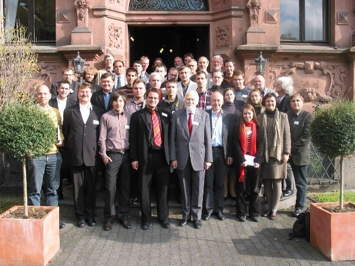
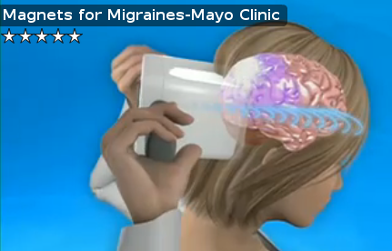

In meinem Beitrag „[Die Neurologie muss einen großen Sprung machen](http://www.brainlogs.de/blogs/blog/graue-substanz/2010-02-20/die-neurologie)“ habe ich mit dem Titel den Neurologen Oliver Sack zitiert und so auch meine Hoffnung angedeutet, dass die Neurologie in dem nächsten Jahrzehnt einen Quantensprung machen wird. Oliver Sacks tat dies schon vor über 20 Jahren und musste länger warten als er wohl dachte. Auch ich mag mich mit der Zeitspanne von nur zehn Jahren verschätzen. Aber die Entwicklung ist schon heute in ihren Anfängen erkennbar.

Zum Weiterlesen habe ich damals noch auf meinen Blogpost [Math Matters, Apply It To Neurology](http://www.scilogs.eu/en/blog/gray-matters/2010-01-30/math-matters-apply-it) (in Gray Matters auf scilogs.eu) verweisen. Nun will ich auch an dieser Stelle detaillierter in die Thematik einsteigen und insbesondere zwei Beispiele aus der Migräneforschung vorstellen.

Ich schrieb zuvor, dass aus meiner Sicht dieser Sprung durch die Verbindung zwischen Neurologie und Physik geprägt sein wird. Das Bedarf einer Erklärung. Denn fälschlich könnten Sie, liebe Leserin und lieber Leser, nun annehmen, ich beziehe mich allein auf den Fortschritt physikalischer Messmethoden, wie z.B. den der Computertomographie oder funktionellen Kernspintomographie.

In erster Linie meine ich dagegen das Fachgebiet *Theoretische Neuromodulation*, welches sich mit neuronaler Dynamik und deren unmittelbaren Kontrolle befasst.

#### Neuromodulation: Direkte Kontrolle der Dynamik

Im ursprünglich technischen Sinn beschreibt Modulation einen Vorgang, bei dem ein oder mehrere Eigenschaften einer Welle durch ein Signal verändert — also *moduliert* werden. Neuromodulation ist weiter gefasst.

Auf der Website der [International Neuromodulation Society](http://www.neuromodulation.com/mc/page.do?sitePageId=78803&orgId=inns) findet sich folgende Definition:

> Neuromodulation is technology that acts directly upon nerves. It is the alteration—or modulation—of nerve activity by delivering electrical or pharmaceutical agents directly to a target area.

In anderen Worten, Neuromodulation umgeht die Probleme der Pharmako*kinetik*, d.h. Problem die durch Aufnahme, Verteilung und Metabolisierung einer pharmazeutischen Substanz entstehen können, bevor sie wirkt, was wiederum mit Pharmako*dynamik* beschrieben wird. Die Dynamik steht also im Vordergrund.

Ich will zunächst dieses Fachgebiet in zwei Ausrichtungen einteilen, eines welches sich insbesondere mit der Geräteentwicklung befaßt und ein anderes, welches für diese Geräte Stimulationsalgorithmen entwirft. Vereinfacht gesagt: eine Einteilung in Hardware und Software.

Für die theoretische Ausrichtung des Fachgebiets Neuromodulation, also die Seite, die die Software entwickelt, ist insbesondere zu beachten, das neben den zeitlichen auch die räumlichen Eigenschaften von dynamischen Prozessen im Gehirn eingeschlossen werden können. Die gezielte Kontrolle kann insbesondere von der präzisen raumzeitlichen Dynamik abhängen. Das *Wo und Wann* ist also mit entscheidend bei Therapiemethoden der Neuromodulation.

#### Theoretische Neuromodulation

Die Theoretische Neuromodulation befasst sich mit physikalisch-mathematischen Methoden zur gezielten Steuerung unsere Hirnfunktionen.

Insbesondere werden theoretische Konzepten erforscht, die eine Minderung oder Korrektur krankheitsbedingter Fehlfunktionen des Gehirns ermöglichen. An der Universität zu Köln wurde der erste Lehrstuhl für Neuromodulation 2007 eingerichtet, der vorwiegend neuartige theoretische Konzepte ausnutzt. Dessen Leiter, Peter Tass, wurde bei Herman Haken in theoretischer Physik promoviert. Haken ist der Begründer der Synergetik, ein junges Teilgebiet der Physik, aus dem diese theoretischen Konzepten stammen.

399. WE-Heraeus-Seminar: „Synergetics: Self-Organization Principles in Animate and Inanimate Systems“, Symposium zu Ehren von Prof. Herman Haken’s 80ten Geburtstag.

Die neuartigen theoretischen Konzepte, die mit der Verbesserung der Hardware immer wichtiger werden, um diese optimal auszunutzen, finden heute in der Arbeitsgruppe von Peter Tass eine erste klinische Anwendung. Die Steuerung von Gehirnfehlfunktionen mittels Tiefenhirnstimulation, einer Gehirn-Maschine-Schnittstellen, setzt auf ein neues Verfahren, das sich [*Coordinated Reset*](http://www.anm-medical.com/index.php?option=com_content&view=article&id=16&Itemid=26&lang=de) nennt. Coordinated Reset basiert auf einer genau koordinierten räumlichen und zeitlichen Stimulation. Wie oben erwähnt, das Wann und Wo macht den Unterschied.

Aber auch die Pharmakologie profitiert von den Konzepten der Theoretischen Neuromodulation. Doch zunächst weiter zu den Möglichkeiten verschiedener Gehirn-Maschine-Schnittstellen und zu den hohen Erwartungen, die an sie gestellt werden.

#### Maschine moduliert Gehirn

Es mag für den Laien wie ein Science-Fiction klingen, dass krankheitsbedingte Fehlfunktionen des Gehirns schon heute erfolgreich maschinell gesteuert werden. Ziel der maschinellen Steuerung ist es zumeist, Krankheitssymptome abzuschwächen, eine völlige Korrektur hin zur normalen Funktion sehe ich nicht in Reichweite.

Eine spannende Frage wäre, wie es aussieht, wenn ich über ein Jahrzehnt hinaus ins Jahr [2045](http://en.wikipedia.org/wiki/The_Singularity_Is_Near#2045:_The_Singularity) blicken könnte. Dies ist für einige Wissenschaftler voraussichtlich der Zeitpunkt in dem Computer mit Menschen zu *postbiologischen Cyborgs* verschmelzen. Ich bin diesbezüglich skeptisch. Dazu habe ich einen separaten Beitrag geplant mit dem Titel „Cybernetischer Totalitarismus“.

Zukunftsvisionen hin oder her, was ist heute an der Gehirn-Maschine-Schnittstelle möglich? Welche Hoffnungen und Erwartungen dürfen wir haben?

Beispiele maschineller Steuerung von Gehirnfehlfunktionen, die insbesondere bei neurologischen Krankheiten eingesetzt werden, sind vielfältig. Sie reichen von nicht-invasiven Technologien wie  der transkraniellen Magnet- und Gleichstromstimulation (TMS und tDCS) bis hin zu invasiven Technologien, wie zum Beispiel dem oben erwähnten Verfahren des *Coordinated Reset* bei der Tiefenhirnstimulation (allgemein als Hirnschrittmacher bezeichnet) oder, um ein weiteres Beispiel zu nenne, das kortikale Oberflächen-EEG (auch ECoG genannt) mit integrierter Stimulationseinheit.

Beschränken wir uns auf TMS und tDCS. Bisher tauchen diese Technologien vorwiegend in der  neurowissenschaftlichen Grundlagenforschung auf. Nur im sehr beschränktem Umfang werden sie auch in der neurologischen Diagnostik und für die Behandlung von neurologischen Erkrankungen eingesetzt. Es bestehen aber hohe klinischen Erwartungen an diese Technologien (z.B. der TMS-basierte [Migraine-Zapper](http://www.scilogs.eu/en/blog/gray-matters/2010-01-21/the-migraine-zapper)).

 *Magnets for migraines.* Mehr über den [Migraine-Zapper](http://www.scilogs.eu/en/blog/gray-matters/2010-01-21/the-migraine-zapper).

Der enorme Fortschritte in den letzten Jahren, ich meine nun sowohl den der Grundlagenforschung zur transkraniellen Stimulation als auch den der invasiven Technologien, weist auf das große Potenzial klinischer Anwendungen. Insbesondere wenn uns theoretische Konzepte eine modellbasierte Analyse der Dynamik (und deren Kontrolle) erlauben und vorhersagen wie diese Technik sprunghaft effektiver wird. Bei diesen theoretische Konzepten geht es also nicht um eine Optimierung um wenige Prozent mehr Effekt. Intelligente Algorithmen bringen in der Regel gleich eine oder gar mehrere Größenordnungen an Effizienz.

#### Technisch-pharmakologische Modulation

Die technischen Ansätze zur maschinellen Steuerung können natürlich auch mit dem Einsatz pharmazeutischer Substanzen kombiniert werden. Im Bernstein Focus: Neurotechnology in Freiburg wird erforscht, um wieder ein Beispiel aus der Migräneforschung zu nehmen, wie sich pharmazeutische Substanzen bei Migräne durch implantierbare Microsysteme freisetzen lassen. Ein Ausschnitt aus dem [Forschungsprogramm](http://www.bfnt.uni-freiburg.de/Research/projC/C4) erklärt das Ziel:

> We will study the use of biosensor feedback from brain energy metabolism to influence brain function and behaviour. Here migraine serves here as a well defined model disease, which can be treated by drugs improving aerobic metabolism. The long term goal of the project is the development of implantable encapsulated microsensors in migraine patients, which will enable them to monitor and control local cortical metabolic activity within a physiological range to avoid breakdown of energy homeostasis with dysfunction and possibly brain tissue damage.

Sobald wir Substanzen durch Implantate vor Ort freisetzen können, wirft das die Frage auf, wie optimal räumlich und zeitlich koordiniert das Nervengewebe pharmakologisch stimmuliert wird.

Entscheidend ist, dass das Problem der Pharmakokinetik damit weitgehend umgangen wird. Darin liegt der Vorteil invasiver Methoden. Die Pharmakokinetik beschreibt alle Prozesse, angefangen von der Aufnahme, dann der Verteilung bis hin zur Metabolisierung, die eine Substanz im Körper durchläuft bevor sie wirkt, was dann als Pharmakodynamik beschrieben wird. Meist macht es zum Beispiel keinen Unterschied, ob eine Tablette ganz oder geteilt auf zwei Stücke mit fünf Minuten Zeitunterschied eingenommen wird. Die Pharmakokinetik verwischt kleine Zeitunterschiede im Körper und erlaubt auch räumlich oft wenig selektive Wirkung.

Das entscheidende *Wo und Wann* kann also bei der klassischen Therapie nicht auf kleinen Raum- und Zeitskalen ausgenutzt werden. Doch ist die Pharmakokinetik erst durch ein Implantat  überbrückt, kommt es auch bei der Pharmakodynamik auf die präzise räumlich und zeitlich koordinierte Freisetzung an, mit der dann die pathologische Dynamik moduliert und damit korrigiert wird.

Hinter *Wo und Wann* der Neuromodulation stehen immer Konzepte für sehr komplexe dynamische Systeme, die in der theoretischen Ausrichtung dieses Fachgebiets erforscht werden müssen. Die Physik entwickelt im Rahmen der Synergetik, also der Lehre des Zusammenwirkens und der Selbstorganisation von komplexen Systemen, diese theoretischen Konzepte, die den Fortschritt sprunghaft vorantreiben können.

####
