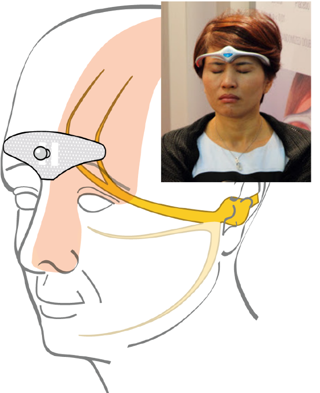

Musik, die an die Augsburger Puppenkiste erinnert, unterlegt das Werbevideo. Es zeigt, wie moderne Neurotechnologie künstliche Katzenohren auf Mädchenköpfen montiert wackeln lässt. Das passt, es hat wirklich das Antlitz der schaurig-schönen Welt eines Marionettentheaters.

https://www.youtube.com/watch?v=JblMzmAyLW8

Dies wird kein Strohfeuer, das kurz auflodert und schnell verglüht, wie so viele kuriose Kinderspielzeuge. Diese plüschigen Katzenohren weisen auf ein Mulitmilliardengeschäft. Man muss sie sowie ihre Verwandten und Nachfolger nämlich in drei verschiedenen Kontexten sehen, einordnen und bewerten. Es geht neben der Körpererweiterung auch um digitale Selbstvermessung, Zurschaustellung und Medizin.

## Sichtbar machen

Zum einen gibt es einen direkten Bezug zu Hard- und Softwarelösungen (meist Smartphones, externe Sensoren und Apps — Beispiel: Polar, fitbit, jawbone, nike fuel, runtastic, …), die heute Vitalparameter, körperliche Aktivität, Schlaf-Muster und weiteres vermessen und sichtbar machen. Genau das geschieht hier auch. Es geht nicht allein um gesundheitliche, sportliche oder auch gewohnheitsspezifische Fragestellungen sondern ebenso um emotionale, wie ein weiteres Video der Firma neurowear (Hersteller ist NeuroSky), die die Katzenohren (necomimi) vertreibt, zeigt.

https://www.youtube.com/watch?v=w06zvM2x\_lw

## Augmented Human Body

Diese Katzenohren erweitern auch die Realität, sie gehören damit in den Bereich des Augmented Human Body, ähnlich wie Google Glass und doch verschieden. Anders als bei Google Glass geht es hier um eine offene Form des Biofeedback. Als Biofeedback bezeichnet man Methoden, die ansonsten unsichtbare körperliche Veränderungen der normalen Sinneswahrnehmung zugänglich machen, um diese zu erlernende Funktion *persönlich* zu nutzen. Die Einschränkung auf das Persönliche ist bei den Katzenohren allerdings frappierend ins Gegenteil verkehrt. Alle – nur man selbst nicht – sehen, wie die aufgesetzten Plüschohren wackeln und damit (zumindest rudimentäre) Aspekte des eigenen Gemütszustands verraten. [*Nachtrag: [Stefan Greiner macht in seinem Kommentar](https://scilogs.spektrum.de/graue-substanz/neurotechnologie-im-kinderzimmer/#comment-5164) unten wohl zurecht Aufmerksam darauf, dass Muskelartefakte eher als zentrale Gehirnaktivität die Ohren steuern, zumindest wenn Plüschohrenträger nicht still sitzen, Donuts essen oder auch nur mit der Wimper zucken.*]

Der Hinweis auf Google Glass ist auch deswegen sinnvoll, da diese Daten sich leicht in die Cloud einfüttern und mit anderen Verfahren kombinieren lassen.

## Medizintechnik

Cefaly-Set zur Migräne- und Kopfschmerzbehandlung

Der dritte Bereich, der hier betroffen ist, ist die Medizintechnik, denn die Grenze zwischen Spiel – für die Erwachsenen nennen wir es Lifestyle – und Gesundheit war schon immer verwaschen.

Dabei geht es über ein Monitoring hinaus. Man kann nämlich nicht nur elekromagnetische Felder des Körpers aufnehmen (und sich selbst oder anderen sichtbar machen) sondern man kann elekromagnetische Felder auch zurück in den Körper wieder einspeisen (Beispiel: Cefaly, eNeura, CerboMed). Gleichzeitig können dezentralisierte und crowd-source-basierte Diagnoseverfahren angewandt werden (Bespiel: Propeller sensor).

Verbindet man diese Techniken, zum Beispiel indem man Signale, statt sie in Ohrenwackeln umzusetzen, in das Gehirn zurückführt, bekommen wir eine closed -loop Kontrollschleife, wie sie die Natur für jedwede physiologische Steuerung nutzt. Der Cyborg grüßt.

## Wessen Querschnittsaufgabe?

Für mich ist die Frage, wer eigentlich fachkompetent eine wissenschaftliche Risikobewertungen vornehmen kann? Wer informiert Verbraucher und die Öffentlichkeit? Liegen irgendwelche Forschungsergebnisse diesem “Spielzeug” zugrunde? Für Spielwaren wäre eigentlich das Bundesinstitut für Risikobewertung verantwortlich. Schaut man aber in dessen Aufgabenbereich, wird schnell deutlich, dass hier eine ganz anders gelagerte Kompetenz vorhanden ist, die mit der eigentlich betroffenen Datenerfassung, erweiterten Realität und Medizintechnik nur wenig gemein hat. Eine wissenschaftliche Risikobewertungen vorzunehmen überfordert zu diesem Zeitpunkt diese Bundesanstalt wahrscheinlich.

Die Entwicklung ist einfach schneller als Politik und Forschung, fürchte ich. Man kann die Katzenohren übrigens ebenso wie das Cefaly-Set zur Migräne- und Kopfschmerzbehandlung bei amazon.de kaufen. Mit Geschick und einem Lötkolben kann man beides auch vernetzen.
