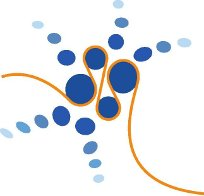
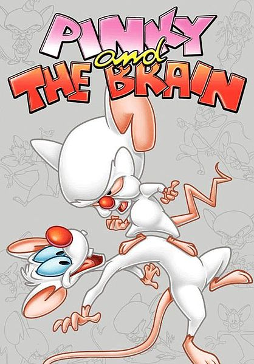
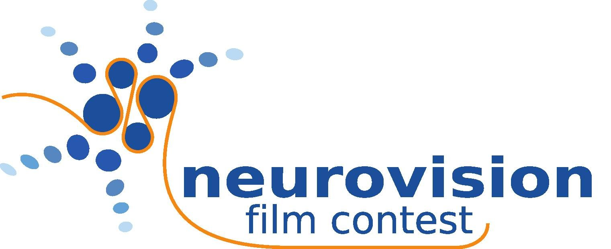

## Kreativer Umgang mit dem Thema Neurowissenschaften.

Brain hat überwiegend absurde Welteroberungspläne — auch so kann mit Hilfe zweier sprechender Labormäuse das Gehirn erklärt werden. Ob nun mittels Satire oder lieber doch ein anderes Genre, jeder kann mitmachen beim Filmwettbewerb *Neurovision 2012*, der im Rahmen der Bernstein-Konferenz vom 12.-14. September in München stattfindet. Einsendeschluss ist einen Monat zuvor, der 15. August. Ziel ist, Wissenschaftler und Filmstudenten zu animieren, einen Kurzfilm über ein Thema der Neurowissenschaften zu drehen. Es werden zwei Preise vergeben, einen für den besten Wissenstransfer und einen für den kreativsten Umgang mit dem Thema Neurowissenschaften.

Zusammen mit Armin Olbrich (Bayerischer Rundfunk), Robin Greene (on3, auch Bayerischer Rundfunk), Markus Schulte von Drach (Süddeutsche Zeitung) und dem Gewinner vom letzten Jahr, Florian Rau wurde ich gebeten der Jury für diesen Kurzfilmpreis beizutreten, was ich gerne angenommen habe und nun auch hier an dieser Stelle ein wenig die Werbetrommel schlage.

Die Filme müssen in Englisch sein oder zumindest englischen Untertitel haben. Alles weiter findet sich auf dieser [Website.](http://bccn2012.de/neurovision-film-contest)

Kontakt für weitere Fragen **Henriette Walz,** **walz@bio.lmu.de**.

Die Preise werden gesponsert von der [Elisabeth und Helmut Uhl Stiftung](http://eh-uhl-stiftung.org/index.html), [Assign Group](http://www.assigngroup.com/) und [Innovations- & Gründerzentrum Biotechnologie](http://www.izb-online.de/english/home.php).

Als kleine Anregung Steven Spielbergs *Pinky and the Brain* – es kann sicher nicht schaden, den Geschmack eines der Juroren zu kennen:

Und das gibt es sogar auch auf Deutsch, Einführung in die Teile des Gehirns, wobei wir nun über die Unterschiede von Stammhirn und Hirnstamm reden könnten.
