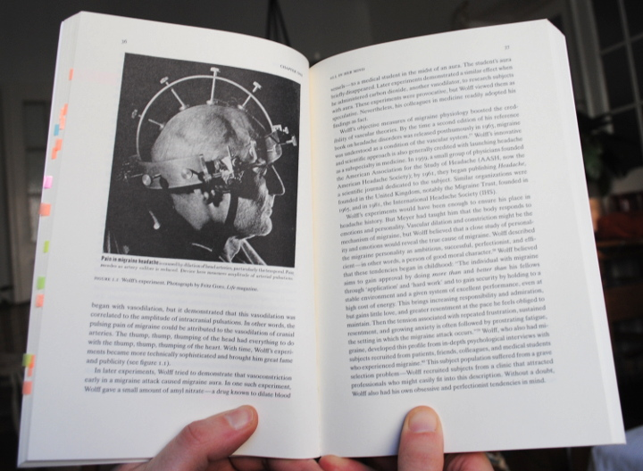

Der Countdown beginnt, wir haben bei Sciencestarter 89 Fans. 10, 9, 8, … bis heute Nacht können wir 100 Fans haben. Worum geht es? Ich denke, viele haben es schon [hier gelesen](https://scilogs.spektrum.de/graue-substanz/migraene-jetzt-sichtbarmachen-%E2%80%93-projekt-bei-sciencestarter/), deswegen will ich nochmal die Wichtigkeit von einer anderen Perspektive herausstellen. Nämlich von der Perspektive, die Joanna Kempner, Profossorin für Soziologie, mit ihrem Migränebuch “Not tonight” einnimmt.

https://twitter.com/joannakempner/status/566611990538637312

Neurologie im Allgemeinen und Migräne im Besonderen sind zu wichtig, um sie nur von der klinischen Perspektive zu sehen. So steht es auf meiner Homepage und in meiner Kurzbio bei Twitter. Naturwissenschaften, Technik und Soziologie sind neben der Medizin weitere Wissenschaftsbereiche, die bei “[*Migräne Sichtbarmachen*](https://www.sciencestarter.de/migraene-website/)” kommuniziert werden sollen.

Im [Klappentext](http://press.uchicago.edu/ucp/books/book/chicago/N/bo18785835.html) wird der Ansatz von Kempner zusammengefasst. Mit ihrem Buch beleuchtet sie, wie unsere kulturellen Vorstellungen bestimmen, wessen Leiden in der Gesellschaft für legitim befunden wird, welche medizinischen Therapien vermarktet werden, wie Medizin praktiziert wird und wie Wissen über Krankheiten entsteht.

All das bestimmt nicht (allein) medizinische Notwendigkeit, wie man es vielleicht hoffen würde, sondern die sich wandelnden kulturellen Vorstellungen.

Die Volkskrankheit Migräne macht das sehr deutlich – mit erschreckenden historischen Beispielen.

Ich bin noch nicht einmal halb durch das Buch hindurch, fürchte jedoch auch aus der heutigen Zeit finden sich weitere solche Beispiele. Es geht Kempner konkret vor allem um drei zentrale Aspekte, 1) wie Geschlechtervorstellungen, 2) wie das unsichtbare Symptom Schmerz, und 3) wie der gerade vorherrschende, vermeintliche Unterschied zwischen Geist und Körper jeweils ihren Einfluss auf das öffentliche Bild der Krankheit nehmen. Ob Migräne als psychosomatische oder neurologische eingestuft wird, ob sie ignoriert oder als stark behindernde Erkrankung anerkannt wird, es hängt von diesen drei Aspekten ab.

Um das (Krankheits)Bild der Migräne weiter in der Öffentlichkeit bekannt zu machen, sollte nicht bei 100 Fans Schluss sein.

Hier geht es [direkt zur Anmeldung](https://www.sciencestarter.de/migraene-website?like=1). Um Fan zu werden, muss man sich anmelden. Das ist nicht viel Aufwand, aber doch eine kleine Barriere. Es lohnt sich. Sciencestarter ist eine seriöse Crowdfunding-Community für die Wissenschaft. Die Plattform wurde von “Wissenschaft im Dialog” gegründet und wird vom Stifterverband für die Deutsche Wissenschaft unterstützt. Allein die Tatsache, dass es dieses Projekt dort gibt, fördert schon die Aufmerksamkeit.

## Dank

Übrigens, das schnelle Anwachsen der Fans am gestrigen Tag, verdanke ich allein der Solidarität aus einem einzigen Migräneforum, nämlich aus dem [headbook.me](http://www.headbook.me/), ein Forum der Schmerzklinik Kiel. Bettina Frank hat dort als Online Community Managerin auf “Migräne Sichtbarmachen” hingewiesen.

