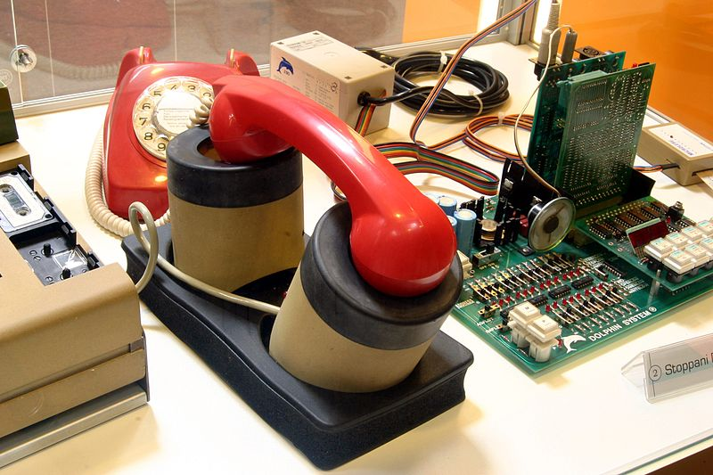

Ich schrieb viel über Karrierewege in der Wissenschaft. Heute will ich die Frage unseres Bloggewitters umformulieren und das Thema Karriere meiden. „Bloggen“ dagegen gefällt mir als Wort gut. Wir müssen die Tätigkeit im Vordergrund sehen und nicht das Werkzeug, den Blog, der uns das Bloggen erlaubt. Es geht dabei u.a. um Marktforschung und Controlling. Zumindest bei mir.

## **Nutzt Bloggen der Wissenschaft?**

Ein Absatz aber doch zur Karriere: Ich setzte mich gerne [vehement für Diversifikation und Transparenz in den wissenschaftlichen Karrierewegen ein](https://scilogs.spektrum.de/blogs/blog/graue-substanz/hochschulpolitik). Dieser Einsatz war meiner eigenen Karriere bisher eindeutig abträglich. In der Wissenschaft wollen wir aber nicht nur Konformisten, wir brauchen die  Unangepassten. Im [Flaschenhals](https://scilogs.spektrum.de/blogs/blog/graue-substanz/2012-05-01/25-akademische-juniorpositionen) ersticken als Erste diese. Neulich erst wurde sarkastisch, ohne dass es eines einzigen Wortes bedurft hätte, klargemacht, worum es bei Karriere auch geht, vor allem dann, wenn sie einspurig verläuft und mit hohen Abhängigkeiten einhergeht.

Ich blogge fast ausschließlich über meine eigene wissenschaftliche Arbeit und dessen Umfeld. Die einzige Frage, die mich dabei interessiert, ist, ob dies meiner wissenschaftlichen Arbeit nutzt. Tut es das? Dafür muss ich zuerst beantworten, worum es mir bei Wissenschaft überhaupt geht. Nicht um eine Karriere, soviel ist wohl klar. Selbst Berufung trifft es nicht. Ich kann mir wirklich sehr viele Tätigkeiten vorstellen, für die ich mich berufen fühle. Was mich antreibt ist eher was ich (etwas geschwollen) als Vermächtnis bezeichnen würde.

Auf das Wort kam ich – und vielleicht findet sich noch ein besseres –, als ich bei Stefan Rahmsdorf neulich las, die [„*meisten Forscher würden wohl stolz als Highlights ihrer Karriere auf das eine oder andere Paper zurückblicken, das mehr als einhundert mal zitiert wurde*](https://scilogs.spektrum.de/wblogs/blog/klimalounge/allgemein/2012-04-26/oeschger-mann)„. Instinktiv habe ich mich da ausgenommen, suchte aber nach etwas, nach einem Begriff, der erklärt worum es geht. Wie oft Paper zitiert werden ist eine Krücke und ganz klar nicht das Entscheidende. Und ich denke, so war es von Rahmsdorf auch in seinem Beitrag gar nicht gemeint. Es ist nicht die Krücke, mit der versucht wird wissenschaftliche Leistung zu vermessen, es ist das Vermächtnis, welches Wissenschaftler hinterlassen, auf das sie zufrieden zurückblicken werden. Keinesfalls dürfen wir die Krücke zum Selbstzweck erheben, nicht mal in einem Nebensatz.

Die Highlights in Sinne eines Vermächtnis wären Dinge wie, ob die eigene Forschung in die Lehrbücher der nächsten Generation eingegangen ist. Ob eine Anwendung entstand, vielleicht sogar eine, die die Welt verändert hat. Der Riesenmagnetowiderstand zum Beispiel, für den Grünberg seinen Nobelpreis bekam, ist ja vor allem durch die Anwendung so interessant. Oder auch ein Lehrbuch geschrieben zu haben. Denn natürlich kann ein Wissenschaftler sein Vermächtnis auch in der Lehre sich erarbeiten. Einige haben es durch [Video-Vorlesungen geschafft](https://scilogs.spektrum.de/blogs/blog/graue-substanz/2012-01-21/5-top-video-vorlesungen). Es können auch die Schüler selbst sein, die man dazu zählt.

Nicht allen, vielleicht nicht mal vielen Wissenschaftlern wird es vergönnt sein, in die Lehrbücher der Zukunft einzugehen, die Welt verändert zu haben, oder ein Meister in der Lehre zu sein. Streben sollten wir alle danach. Das allein reicht meist aus, um zufrieden zu sein.

Wie da ein Blog helfen kann? Ehrlich, ich weiß es gar nicht genau. Der Blog scheint mir heute noch etwa die Stellung zu haben, wie damals in den 80erJahre die verbotenen Akustikkoppler-Modems. Wer ein Nicht-Post-Gerät in die Leitung hing, konnte echte Probleme bekommen. Ein Blog sehen anscheinend viele als ein Nicht-Wissenschaft-Gerät, weswegen wir nun ein Gewitter machen. Ebenso gut könnten wir gelassen warten. Denn wohin uns die Akustikkoppler-Modems einmal führen würden, haben die Nerds damals so wenig geahnt, wie die Kopfschüttler den Spaß verstanden haben (was ein Teil des Spaßes ausmachte).

Nutzt bloggen meiner Wissenschaft nun konkret? Will ich der Frage ausweichen? Habe ich vielleicht nur die wage Vermutung, dass eines Tages wissenschaftliches Bloggen erwachsen geworden sein wird und ich will mich schon mal positionieren? Zwei positive Effekte kann ich nennen, aber zugegeben, es ist vor allem der Spaß, den ich dabei habe. Ein Akustikkoppler-Modem habe ich übrigens nie besessen, nur meine Freunde. Vielleicht auch deswegen.

## Marktforschung und Controlling

Wie ich schon im August 2010 im Beitrag [Dialog zwischen Wissenschaft und Gesellschaft am Beispiel meiner Migräneforschung](https://scilogs.spektrum.de/blogs/blog/graue-substanz/2010-08-11/wissenschaft-und-gesellschaft) erklärte, wurde mir vor 12 Jahren klar, dass ich für meine weitere Forschung Kontakt zu Patienten mit bestimmter Migräne-Symptomatik brauche. Heute habe ich eine [statische Website](http://www.migraine-aura.org/content/index_en.html) erstellt zusammen mit dem Mediziner Klaus Podoll, der hier überwiegend das Material gesammelt hat. Es ist mit Abstand die weltweit größte Sammlung zu dieser Thematik. Durch diese Seite habe ich über 500 Berichte über Migräneaura von Patienten gelesen, zu denen ich als Nichtmedizier sonst keinen Zugang hätte. Ungefähr weitere 500 muss ich erst noch lesen. Mein Blog ist hier ein weiterer wichtiger Ableger dieser statischen Website, der eine echte Kommunikation mit Betroffenen ermöglicht.

Wenn wir den ersten Effekt Marktforschung nennen wollen, wäre der zweite Controlling.

Das Schreiben selbst wiederum zwingt mich immer wieder neu den Blick auf den großen Zusammenhang zu richten. Um das, worauf ich mal zurückblicken will, nicht heute schon aus den Augen zu verlieren. Wenn ich erkläre, was ich als Physiker in der Migräneforschung mache, fokussiere ich mich immer wieder auf mein Ziel, anwendungsorientiert zu forschen. Allzu leicht (weil auch unbewusst) schiebt man die Motivation als quasirituelle Handlung nur vor. Zum Beispiel bei einem Forschungsantrag in den genau vorgeschriebenen fünf Zeilen, die für die Öffentlichkeit bestimmt sind. Damit sind dann die wissenschaftlichen Fragen gerechtfertigt, ohne je wieder über diese Motivation nachdenken zu müssen. Beim Abschlussbericht schaut man vielleicht nochmal kurz darauf.

Das, worauf ich am Ende meiner wissenschaftlichen Laufbahn zurückblicken will, muss ich heute machen. Es hilft, durch ständiges schreiben im Blog hier meinen Weg zu finden und zu halten. Dass ich dies mit Marktfoschung und Controlling bezeichne, ist Resultat des Prozesses, der oft erst durch Verschriftlichung einsetzt: Denken. Bloggen, wie denken, kostet Zeit. Schneller denken werden Menschen nicht unbedingt, aber Blogs, das Werkzeug zum Bloggen, werden nicht auf dem Stand der Akustikkoppler-Modems stehen bleiben.

**Bildquelle** 

Wikipedia: [Akustikkoppler](http://de.wikipedia.org/wiki/Akustikkoppler) (Creative Commons)
