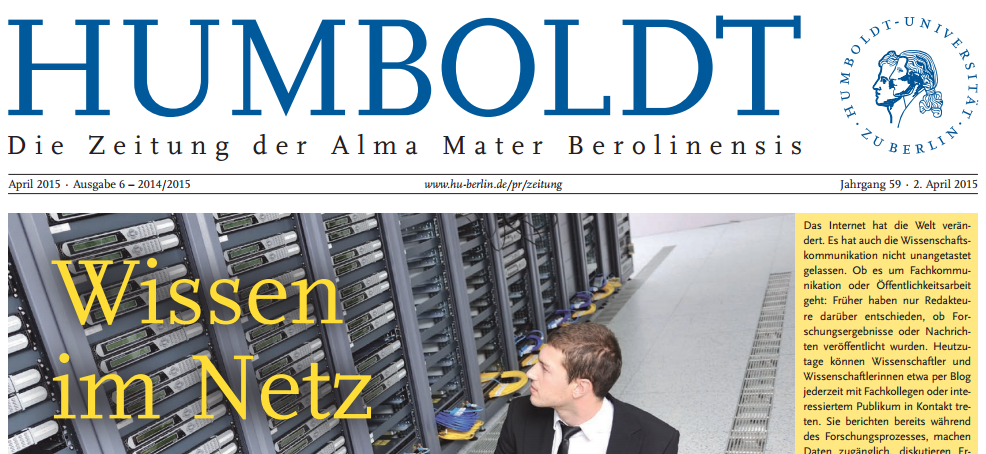

Forschung muss ihre Finanzierung rechtfertigen. Nicht nur aber auch öffentlich. Über Wissenschaft in den Medien initiierte SPON ein — sie nannten es [Streitgespräch](http://www.spiegel.de/wissenschaft/mensch/wissenschaft-in-den-medien-streitgespraech-mit-wormer-fischer-luethje-a-1014716.html). Die Reaktionen Betroffener waren eindeutig:1 [sinnloser Streit](http://scienceblogs.de/astrodicticum-simplex/2015/02/17/blogger-vs-journalisten-ein-voellig-sinnloser-streit/), [polemischer Pseudostreit](http://scienceblogs.de/sic/2015/02/19/spiegel-polemik_zu_wissenschaft_und_medien/), [kalkulierte Provokation](http://jensrehlaender.tumblr.com/post/111103780693/aktuell-das-streitgespraech-ueber), [weltfremd](https://scilogs.spektrum.de/relativ-einfach/spiegelfechten-um-wissenschaft-journalismus-und-blogs/) und [altbackener Unsinn](https://wijo.wordpress.com/2015/02/19/schon-wieder-was-zum-schamen/).

Nun gibt auch HUMBOLDT2 mit „[Wissen im Netz](https://www.hu-berlin.de/pr/medien/publikationen/humboldt/2015/201504/humboldt_201504)“ eine Antwort und lässt u.a. eine bloggende Wissenschaftlerin (Anne Baillot, [@AnneBaillot](https://twitter.com/AnneBaillot)) und einen bloggenden Wissenschaftler (mich) sowie auch einen Wissenschaftler (Olaf Müller), der bloggen explizit ablehnt, zu Wort kommen. O-Töne beleben zumindest die Diskussion. Über bloggende Wissenschaftler wurden nämlich im “Streitgespräch” nur unbelegte Aussagen gemacht, wie etwa „Forscher haben Angst, kritisch zu bloggen“ und „Blogs sind meinungsstärker und quellenärmer als Massenmedien“.  

## Große Themen, kleine Themen und noch keine Themen

Der Beitrag des nichtbloggenden Wissenschaftlers liefert Anschauungsmaterial für Vorbehalte. Olaf Müller (Lehrstuhl für Wissenschaftstheorie der Naturwissenschaften und Naturphilosophie an der HU Berlin) titelt: „Viele Kommentatoren im Netz haben sich nicht unter Kontrolle“. Eine Erfahrung, die wahrscheinlich alle mehr oder weniger machen.3

Müller hat nicht allein wegen einzelner Kommentatoren eine kritischen Meinung zu Blogs:

> Wie … soll ich die Hauptergebnisse meiner jahrelangen Arbeit am besten unters Volk bringen? In einem Blog vielleicht? … Es gibt große und kleine Themen; die kleinen behandle ich in Aufsätzen, die großen in Büchern. Wenn ich beispielsweise mit Goethes Hilfe eine Revolution gegen das stupende Selbstbewusstsein der Physiker, und zwar mit stichhaltigen Argumenten, nicht Wischiwaschi, dann ist das ein großes Thema und braucht entsprechend Platz. 15 Jahre Arbeit, 1000 Seiten Text. […] Dort und nur dort wird zum ersten Mal bewiesen, dass Goethe recht hatte; da steht sogar, womit er recht hatte – und warum das wichtig ist.  
> (*Olaf Müller*)

### „Dort und nur dort“

Zwar kaum zu glauben, dass Müller am Beispiel seines neuen Buches Kritik gegen Blogs äußern kann, es ihm gleichzeitig jedoch unmöglich ist, dieses Buch so vorzustellen, dass man zumindest ahnt, weswegen Goethe als Naturwissenschaftler rehabilitiert werden sollte. Doch bin ich nicht der Meinung, dass die Öffentlichkeit von jedem staatlich finanzierten Forscher verlangen sollte, dass er die Ergebnissen seiner vielen Jahre Arbeit frei zugänglich in wenigen kurzen Beiträgen verständlich zusammenfasst. Es gibt Fachpublikationen, die für Laien wenig Interessantes bieten. Außerdem muss sich nicht zwangsläufig der oder die Wissenschaftlerin selbst an die Öffentlichkeit wenden, wenn er oder sie es nicht ansprechend kann oder auch nur nicht mag.4

> Danke, da habe ich besseres vor. Zumal ich mit einem Thema irgendwann auch mal fertig sein möchte.  
> (*Olaf Müller*)

Selbst wenn hinter Müllers Dort-und-nur-dort-Argument bloß die Angst steckte, dass weniger Menschen sich durch sein Buch mühen würden, wenn er höchstpersönlich dessen Kernaussagen öffentlich frei zugänglich machte, hielte ich das für legitim, schade aber legitim. (Andere Blogs und Rezensionen werden sich wahrscheinlich der Aufgabe annehmen und zumindest von außen betrachtet das Buch zusammenfassen.)

### Neugier ist integraler Bestandteil der Rechtfertigung öffentlicher Finanzierung

Dem ungeachtet: Forschung muss ihre Finanzierung rechtfertigen. Die Frage ist, ob man für Forscher/innen nicht Anreize schafft, dies auch zusätzlich öffentlich zu tun, in dem sie Einblicke in ihre Arbeit geben. Warum Anreize schaffen und nicht einfach diejenigen, die ohnehin bloggen, machen und es damit bewenden lassen? Anreize sind nötig, weil – so bin ich überzeugt – das öffentliche Schreiben im eigenen Wissenschaftsblog sowohl der direkten fachinternen Begutachtung als auch der indirekten Rechtfertigung durch journalistische sowie PR-Arbeit in genau einem Punkt, der die Rechtfertigung der öffentlichen Finanzierung betrifft, überlegen ist.

Von den von Forschern initiierten Projekten wird zurecht erwartet, dass diese von ihrer Neugier getriebenen werden. Die [Förderstrategie der Deutsche Forschungsgemeinschaft](http://dfg.de/dfg_profil/geschichte/foerderung_gestern_und_heute/aktuelle_strategie/index.html) spricht von „response mode“. Es ist eine strategische Grundentscheidung bei Anträgen in diesem Modus allein wissenschaftliche Qualität zu bewerten und nicht etwa gesellschaftliche Relevanz oder ökonomische Verwertbarkeit. Wissenschaftliche Qualität einmal vorausgesetzt, wird im „response mode“ Neugier ein integraler Bestandteil der Rechtfertigung öffentlicher Finanzierung. Das ist durchaus nicht selbstverständlich und spricht für die Freiheit der Wissenschaft. Wo wenn nicht öffentlich blüht diese Neugier auf? Neugier ist ansteckend! Begutachtungen5 ohne gleichzeitig öffentliche Transparenz sind eher geeignet Neugier auszutrocknen, weil die Projekte dann vor allem von den wirklichen oder vermeintlichen Anforderungen auf erfolgreiche Förderung getrieben werden. Man fühlt sich zumindest kompromittiert.

Wie Neugier durch ein Wissenschaftsblog floriert, kann sicher jeder bezeugen, der einen offenen Wissenschaftsbetrieb zulässt. Anne Baillot, Forschungsgruppenleiterin am Institut für deutsche Literatur der HU, weist dabei auf einen zentralen Aspekt hin, den auch Müller in seinem zweiten Zitat anspricht: das Medium Blog ist gerade etwas für unfertige Themen – egal ob groß oder klein:

> Indem ich es mir zur Pflicht gemacht habe, wöchentlich über die Fortschritte meiner Forschungsgruppe zu bloggen, habe ich mir selbst eine bessere Übersicht über die Entwicklung der unterschiedlichen Arbeitsfelder verschafft.  
> (*Anne Baillot*)

Offen zu forschen ist auch nicht neu. Neu ist nur das Medium, das interaktive Web 2.0. Viele Wissenschaftler schrieben Abertausende von Briefen und tauschten sich so aus. Goethe, den ich also mal als Wissenschaftler heranziehe, schrieb über 13 500 Briefe. Googelt man dort nach dem Wort [Experiment](https://www.google.de/webhp?ion=1&espv=2&ie=UTF-8#q=Experiment+site:www.zeno.org%2FLiteratur%2FM%2FGoethe%2C%2BJohann%2BWolfgang%2FBriefe%2F), kann man nachlesen, wie schon Goethe die Wissenschaftskommunikation suchte; es ging um Regenbögen:

> Haben Sie das angegebene ganz einfache Experiment recht zu Herzen genommen, so schreiben Sie mir auf welche Weise es Ihnen zusagt, und wir wollen sehen, wie wir immer weiter schreiten, bis wir es endlich im Regenbogen wiederfinden.

## Der Schreibprozess ist Axt und Feile

Bloggen, also der Schreibprozess, selbst ist ein wichtiges Werkzeug der *laufenden* Forschung. „Writing is nature’s way of letting you know how sloppy your thinking is“ (Dick Guindon, [hier gefunden](http://www.scilogs.com/hlf/writing-for-mathematical-clarity/)). Bevor wir zur Neugier zurückkommen, lohnt ein Blick auf ihn.

Um Forschung „unters Volk bringen“, wie Müller es ausdrückt, also in Deutschland öffentlich zugänglich zu machen, sollten Publikationen deutschsprachig und gut lesbar geschrieben sein. Genau solche prämiert beispielsweise gerade wieder [die VolkswagenStiftung mit dem 10.000 Euro dotierten Förderpreis „Opus Primum“](http://www.volkswagenstiftung.de/aktuelles/aktdetnewsl/news/detail/artikel/jetzt-fuer-wissenschaftlichen-foerderpreis-opus-primum-bewerben-1/marginal/4647.html) für junge Wissenschaftler. Doch Naturwissenschaftler schreiben 200 Jahre nach Goethe eher nur noch selten deutschsprachige Primärliteratur.

Robert Lorenz (Institut für Demokratieforschung Georg-August-Universität Göttingen), der erste Gewinner des Opus Primum, „stellt heraus, dass der Schreibprozess beim Publizieren nicht zu vernachlässigen sei“, so zu lesen letzte Woche auf „[Jetzt für wissenschaftlichen Förderpreis Opus Primum bewerben](http://www.volkswagenstiftung.de/aktuelles/aktdetnewsl/news/detail/artikel/jetzt-fuer-wissenschaftlichen-foerderpreis-opus-primum-bewerben-1/marginal/4647.html)“.

> Nicht nur das Thema sollte spannend sein, sondern idealerweise sollte es ebenso verständlich präsentiert werden – etwa indem man am Ausdruck feilt, überflüssige Details auslässt, Fachbegriffe erklärt und Fremdwörter weitestgehend nur dort einsetzt, wo sie auch sinnvoll sind.  
> (*Robert Lorenz*)

Lorenz deutet es zumindest mit seinem Hinweis, dass „überflüssige Details“ auszulassen sind, an: der Schreibprozess formt Themen. Auslassen setzt voraus, dass man das Auszulassene erkennt. Aus meiner Erfahrung weiß ich, dass der Schreibprozess darüberhinaus auch die Richtung von Themen bestimmt, wenn man ihn nur rechtzeitig einleitet. Der Schreibprozess ist deswegen nicht nur die Feile am Ende sondern auch Axt am Anfang der Forschung (und bei Masterarbeiten wie Doktorarbeiten).

Ich schrieb in HUMBOLDT

> In meinen Augen könnten sie [Blogs] Forschung relevanter machen.

Das Argument dagegen, dass dies eher nicht zu mehr Neugier führt, sondern zu einer „geringere[n] Vielfalt in der Forschung […] und die Wissenschaftler versuchen, ihre Ergebnisse dem Mainstream anzugleichen“ (Wikipedia: [Selbstzensur in der Forschung](http://de.wikipedia.org/wiki/Selbstzensur#Selbstzensur_in_der_Forschung)), scheint mir gerade *nicht mehr* für das öffentliche Schreiben im Web 2.0 zu gelten, wo jeder Zugang zum Publizieren mit wenigen Klicks hat und Nischen damit Relevanz gekommen, weil man das Publikum – und sei es klein – findet. Zumindest kommt der Mainstream in der Forschung auch schon durch die Forschungsförderung.

Deswegen finde ich es schade, dass Anne Baillot ihrem Erfahrungsbericht mit einer pessimistischen Stimme endet:

> Hinsichtlich einer wissenschaftlichen Karriere wird mein Blog im besten Fall als Freizeitaktivität wahrgenommen, wenn nicht gar als ein Zeichen dafür, dass ich offensichtlich recht viel Zeit übrig habe – also eher als unseriös.  
> (*Anne Baillot*)

Obwohl ich genau diese Erfahrung auch gemacht habe:

> Wissenschaftsblogs haben in Deutschland noch nur Feigenblattfunktion.

## Fußnoten

1 Zumindest in meiner Filterblase. Wenn es positive Resonanz von Wissenschaftsjournalisten, Wissenschaftlern oder auch anderen gab, wäre ich für einen Hinweis dankbar.

2 HUMBOLDT ist die Zeitung der Alma Mater Berolinensis, also der Humboldt-Universität zu Berlin.

3 Ohne große Suche habe ich drei Beitrag herausgegriffen: [SciLogs](https://scilogs.spektrum.de/quantenwelt/debattenkultur-kommentare-als-mehrwert/), [Scienceblogs](http://scienceblogs.de/sic/2013/03/29/trolle-in-wissenschaftsblogs/) und [Hypotheses](http://rkb.hypotheses.org/290).

4 Müller scheint nur nicht zu mögen. In der Einleitung zu seinem Buch schreibt er: „Keine Sorge, man benötigt keine physikalischen Spezialkenntnisse, um meiner Untersuchung folgen zu können; ich werde alles erklären, was sie fürs Verständnis der Experimente brauchen.“ Übrigens: Die ursprünglich 1000 Seiten mussten, wie wir in HUMBOLDT lesen, auf 500 Seiten gekürzt werden in neun Absätzen. Mir erscheint es durchaus sinnvoll die weggefallenen Seiten ergänzend nun öffentlich zugänglich zu machen.

[Hier geht es zum Buch](http://www.fischerverlage.de/buch/mehr_licht/9783100022073).

Olaf Müller  
Mehr Licht  
Goethe mit Newton im Streit um die Farben  
Sachbuch

Verlag S. Fischer Wissenschaft  
Hardcover  
Preis € (D) 26,99 | € (A) 27,80 | SFR 36,90  
ISBN: 978-3-10-002207-3

5 Man müsste hier näher auf die Begutachtung eingehen, was den Rahmen des Beitrages sprengt. Kurz: Bei der DFG erfolgt die Begutachtung entweder schriftlich oder durch eine Begutachtungsgruppe. Letztere bieten zumindest einen gewissen offenen, transparenten Rahmen. Dieses Verfahren wird jedoch nur bei Verbundprojekten durchgeführt, die immer schon ein wenig mehr gemainstreamt sind.
