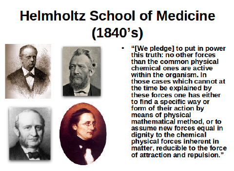
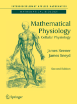

Neulich hörte ich von einem Gelöbnis „die Wahrheit geltend zu machen“. Ein Kollege zeige diese Folie (unten) in seinem Übersichtsvortrag „Dynamische Krankheiten: eine historische Perspektive mit einem Blick auf die Zukunft“ ([Dynamical diseases: a historical perspective with an eye to the future](http://dtc.mib.manchester.ac.uk/mcm_people/john-milton-claremont-mckenna-college-california/), von John Milton).

Soweit ich es zurückverfolgen konnte, ist dieses Gelöbnis von Ernst Wilhelm Brücke (unten links) und Emil du Bois-Reymond (oben rechts) ursprünglich abgelegt worden und später erst sind Hermann von Helmholtz (oben links) und Carl Ludwig (unten rechts) dazugestossen.

> Brücke und ich, wir haben uns verschworen, die Wahrheit geltend zu machen, daß im Organismus keine anderen Kräfte wirksam sind, als die gemeinen physikalisch-chemischen; daß, wo diese bislang nicht zur Erklärung ausreichten, mittels der physikalisch-mathematischen Methode entweder nach ihrer Art und Weise der Wirksamkeit im konkreten Fall gesucht werden muß, oder daß neue Kräfte angenommen werden müssen, welche, von gleicher Dignität mit den physikalisch-chemischen, der Materie inhärent, stets auf nur abstoßende oder anziehende Componenten zurückzuführen sind.

Diese vier wurden als „Berliner Schule“ bezeichnet sowie auch, wie auf der Folie, als „Helmholtz School of Medicine*„*. Wobei Emil du Bois-Reymond sicher die wesentliche Triebfeder in der Medizin war. Den viern war ihr eigener Gruppenname wahrscheinlich reichlich egal, sie versuchten den Begriff der „organischen Physik“ zu prägen, um damit die Physiologie als Teilbereich der Physik zu etablieren.

**Messen ja, erklären nein**

Was wurde daraus? Sie vertrieben zunächst einmal erfolgreich das Konzept der „Lebenskraft“ und damit den Vitalismus (vgl. aber [hier](https://scilogs.spektrum.de/blogs/blog/menschen-bilder/2012-02-17/vitalismus-und-warum-wissenschaft-f-r-die-angewandte-ethik-wichtig-ist)). Die Physiologie wurde außerdem eigenständiger, sie wurde aus der „[Umklammerung der Anatomie](http://medphysiol.charite.de/service/instrumentensammlung/einleitung/)“ gelöst, wie es Uwe Heinemann als Nachfolger auf dem Lehrstuhl von Emil du Bois-Reymond ausdrückte. Die Physiologie blieb allerdings der Physik lange fern. Zumindest waren physikalisch-mathematische Methoden zunächst wenig erfolgreich um physiologische Mechanismen und damit die [Ursache biologischer Funktionen](https://scilogs.spektrum.de/blogs/blog/graue-substanz/2012-07-25/ursache-und-mechanismus) zu erklären. Was nicht heißt, dass physikalisch-experimentelle Methoden zu dieser Zeit nicht vermehrt aufkamen. [Messen konnte man einiges](https://scilogs.spektrum.de/blogs/blog/graue-substanz/2011-01-12/der-freie-wille-des-froschschenkels). Helmholtz nutzte z.B. seine Messungen über den organischen Stoffwechsel, insbesondere Prozesse der Gärung, Fäulnis und Verwesung für den Energieerhaltungssatz in der Thermodynamik. Die Physik wurde also zunächst stärker von der Medizin beeinflusst als umgekehrt. Allein das erstaunt eigentlich.

Theorie und Experiment sind in der Physiologie eben nicht zeitgleich voran geschritten, also anders als in der Physik, die meist parallel zu neuen Experimenten auch fundamentale mathematische Theorien aufweisen konnte. Die Umsetzung dieses Erfolgsrezept in der Physiologie sollte lange auf sich warten lassen.

**Theorie und Experiment finden nicht zusammen**

Erst hundert Jahre später, um 1952, entstand das mathematische Modell für Nervenzellen von Alan Lloyd Hodgkin und Andrew Fielding Huxley ([der neulich erst verstarb](https://scilogs.spektrum.de/blogs/blog/graue-substanz/2012-06-07/andrew-f.-huxley-1917-2012)) auf der Grundlage präziser neuer Messungen. In den 1970er Jahren wurden dann mathematische Modelle für Nervenzellverbünde von Hugh R. Wilson and Jack D. Cowan aufgestellt, die dem Experiment voraus waren! Außerdem wiesen in dieser Zeit Uwe an der Heiden, Leon Glass und Michael C. Mackey darauf hin, dass eine enge Beziehung zwischen dem mathematischen Gebiet der nichtlinearen Dynamik und dem zeitlichen Verlauf einiger Krankheiten existiert. Dies führte zum Konzept der „dynamischen Krankheit“. In diesem Fall gab es also zunächst unabhängig voneinander eine parallele Entwicklung von Theorie und Experiment (wobei wir empirische Untersuchungen bei Krankheiten nicht Experimente sondern vornehm klinische Studien nennen).

**Lücken verfestigen sich**

Entscheidend scheint mir zu sein, dass Theorie und Experiment lange nicht zusammengefunden haben. Natürlich gibt es weitere Beispiele und nicht nur die oben genannten. Das Fick’sche Diffusionsgesetz ist sicher prominent zu nennen (s. Lehrbuch „[Mathematical Physiology](http://www.springer.com/new+%26+forthcoming+titles+%28default%29/book/978-0-387-75846-6)„). Doch auch heute haben wir noch riesige Lücken im theoretischen Fundament der Physiologie. Diese sind so groß, dass die meisten sie nicht als Lücken sondern Grenze der Physiologie empfinden. Dieses Missverständnis spiegelt sich zum Nachteil einer Weiterentwicklung des Faches Physiologie in den Hochschulen wider, wo es in Deutschland bis heute [keinen Masterstudiengang Physiologie](https://scilogs.spektrum.de/blogs/blog/graue-substanz/2010-09-08/masterstudiengang-physiologie-pro) gibt, also einen Studiengang, der die systematisch wissenschaftliche Ausbildung in Physiologie in den Vordergrund stellt!

Vielleicht bleiben diese Lücken, es sind trotzdem Lücken nicht Grenzen einer Disziplin. Ich kann heute mehr denn je ohne zu zögern die Physiologie als organische Physik bezeichnen auch wenn es reichen würde, die Physiologie als eigenständige Naturwissenschaft, die der Biologie schon längst entwachsen ist, anzusehen.

Aus den Lücken folgt nicht zwangsläufig Raum für eine „Lebenskraft“ sondern die Tatsache, dass die Systeme so komplex werden, das mathematische Modelle ein Probleme haben können: Niemand hat uns versprochen, dass diese Modelle „kleine“ mathematische Modelle sind. Damit meine ich Modelle mit sehr wenigen Freiheitsgraden, die vollständig alle anderen versklaven (so nennt man es wirklich). Deswegen ist in dem Gelöbnis auch kein Widerspruch im Sinne eines „heiligen“ Eides zu sehen sondern die Erkenntnis trotz eingeplanten Misserfolges weiter in dieser einen Richtung zu suchen.

Emil Du Bois-Reymond und Ernst Wilhelm von Brücke waren übrigens Gründungsmitglieder der physikalischen Gesellschaft zu Berlin aus der dann die Deutsche Physikalische Gesellschaft (DPG) wurde. Für das bald aktuelle Oktoberheft  der DPG-Mitgliederzeitschrift „[Physik Journal](http://www.pro-physik.de/phy/physik/journalHome.html)“ beschreibe ich mathematische Modelle der Migräne, die man in dieser Tradition als dynamische Krankheit auffassen kann: also als organische Physik.

—

**Nachtrag 25.9.2012**

Gerade sah ich, dass das Video des oben erwähnten Vortrages mittlerweile online ist.

**Dank**

Dieser Beitrag entstand auf meiner von [Mitacs unterstützten](http://www.mitacs.ca/) Kanada-Reise, wo ich mit Leon Glass, Michael Mackey, Hugh Wilson und vielen weiteren über die Geschichte ihrer Entdeckungen reden konnte. Vorab habe ich mit John Milton über diese historische Perspektive diskutiert. Mein Dank gilt ihnen für viele Anregungen, die ich hier in dem Beitrag einbrachte.

© 2012, Markus A. Dahlem
