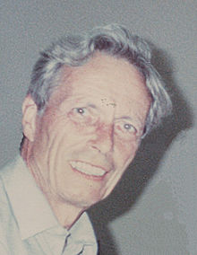
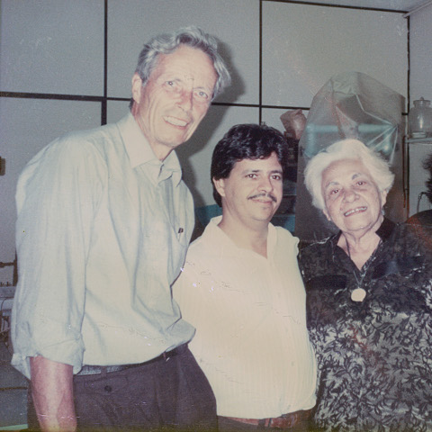

Otto Creutzfeldt und sein Werk hatten tiefgreifenden Einfluss auf die neurowissenschaftliche Landschaft in Deutschland.\* Allein an der ungewöhnlich großen Zahl seiner Schüler kann das abgelesen werden. Sie wurden Professoren an Universitäten, Max-Planck-Instituten und Leibniz-Instituten, mittlerweile sind die meisten selbst schon pensioniert.

Um ihn zu Ehren, den Hirnrindenforscher, wird seit seinem Tod 1992, zunächst jährlich später alle zwei Jahre, die „Otto-Creutzfeldt-Lecture“ von hochkarätigen Wissenschaftlern während der Tagung der Deutschen Gesellschaft für Neurowissenschaften an der Universität Göttingen gehalten.

Die bemerkenswerte Karriere von Otto Detlev Creutzfeldt begann in den Geisteswissenschaften, er wechselte aber bald zur Medizin und folgte den Fußspuren seines Vaters, nach dem die Creutzfeldt-Jakob-Krankheit benannt ist. Im Jahr 1953 erhielt er seinen Abschluss an der Universität Freiburg.

Ich will eine frühe Station seiner Karriere hervorheben, noch bevor er 1971 von Manfred Eigen nach Göttingen geholt wurde, wo er bis zu seinem frühen Tod einer der Direktoren des Max-Planck-Institut für biophysikalische Chemie war.

Diese von mir ausgewählte Station und die Verbindung zu zwei anderen Neurowissenschafftlern muss sein Interesse an der Migräne geweckt haben, auch wenn ich das so genau nicht weiß. Natürlich ist meine Auswahl eine sehr selektive und durch mein Forschungsinteresse geleitet. Creutzfeldts Interesse galt der Hirnrinde ganz allgemein, Cortex Cerebri (Großhirnrinde), es galt dessen Leistung, der strukturellen und funktionellen Organisation, so der Titel seines Lehrbuchs. Aber eben auch die Fehlfunktionen der Hirnrinde bieten einen Schlüssel zu unseren Hirnfunktionen. Migräne ist hier besonders hervorzuheben, da wir durch die Aura viel über die normale Funktionsweise der Hirnrinde gelernt haben.

Otto Creutzfeldt kam nach kurzer Tätigkeit in Bern wieder nach Freiburg zurück, in die Neurophysiologie und Neurologie zu Richard Jung (1911-1986). Jung hat großes Interesse an der Migräneaura. Er, Jung, setzte sich zum Beispiel währen seiner Migräne auf einen Drehstuhl, drehte sich schnell und immer schneller, wie sonst es nur Kinder tun, stoppe dann schlagartig und beobachtete, wie die Migräne-Sehstörungen auf Bildverschiebungen durch Schwindel reagieren. Drehen sie sich mit? (Das wird mal ein eigener Beitrag.)

Auch der Hirnforscher Otto-Joachim Grüsser (1932-1995) arbeite in Freiburg und auch er machte interessante Selbstversuche mit Migräne. Dies geschah nicht alles zeitgleich. Als Creutzfeld 1971 nach Göttingen ging, wurde Grüsser in Berlin Professor. Erst in diese Zeit fallen die Veröffentlichungen  von Jung und Grüsser zur Migräneaura. Soweit mir bekannt, hatte Creutzfeld auch keine solche Selbstbeobachtungen gemacht sondern diese hatten sein Interesse für die corticale Ursache, der Spreading Depression, geweckt. Er besuchte öfter Aristides Leão (1914-1993) und andere Wissenschaftler  in Brasilien (s. Bildquelle unten). Leão war der Entdecker der Spreading Depression. Schon 1945 sagte er vorher, dass dieses Phänomen die Pathophysiologie der Migräneaura ist.

Bei diesen kurzen Blick auf einige Wissenschaftler, deren Arbeiten zur Migräne bzw. Spreading Depression mich selbst sehr beeinflußt haben, will ich es belassen.

Die nächste Otto-Creutzfeldt-Lecture wird leider erst 2013 wieder gehalten, so dass dieses Jahr nach meiner Kenntnis leider ohne eine spezielle Veranstaltung vorbei gehen wird.

**Fußnote**

\*Ich erlaube mir einige Passagen aus der [englischen Wikipedia-Seite](http://en.wikipedia.org/wiki/Otto_Detlev_Creutzfeldt) übersetzt zu übernehmen, da ich diese Seite selbst 2009 verfasste.

**Bildquelle**

Ausschnitt, hier Original, aus dem ich diesen für die Wikipediaseite entnahm.

Das Photo wurde 1990 gemacht, in Recife. Neben Otto Creutzfeldt ist Rubem Guedes und Prof. Naíde Teodósio. Rubem Guedes ist heute Professor in Recife, er war 1992 in Göttingen bei Creutzfeldt.
