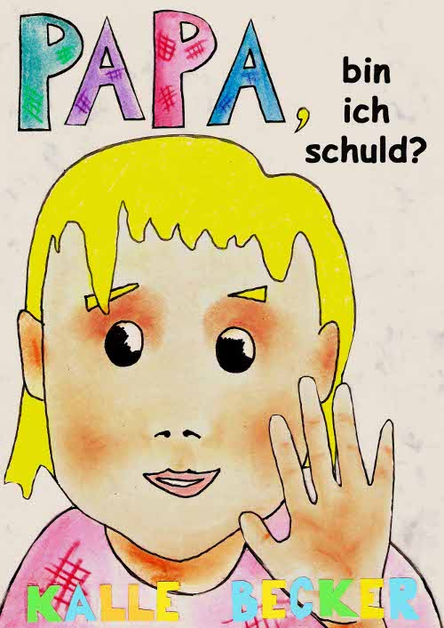
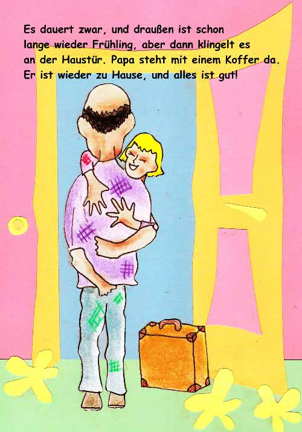
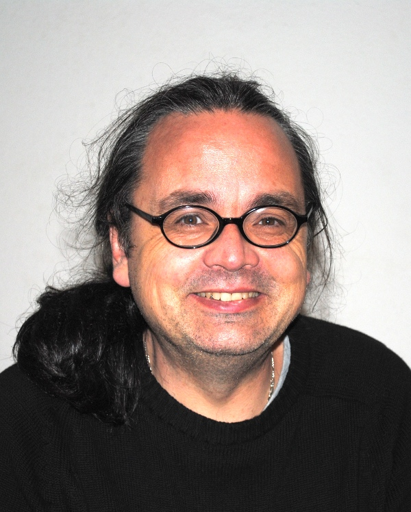

**Markus**: Wieso hast du dieses Buch geschrieben?

**Kalle**: Von der Schizophrenie ist etwa 1% der Bevölkerung weltweit in allen Kulturen betroffen. Von der manisch depressiven Erkrankung sind es sogar 3-4%. Das sind in der Bundesrepublik allein 4 Millionen Menschen mit Psychose. Etwa genauso viel, nämlich 5 Millionen leben hier mit der Diagnose Krebs. Im Vergleich dazu gibt es erschreckend wenig Material zu diesem Thema. Dabei gibt es viele Kinder, die zu den Betroffenen zählen. Ihnen auseinanderzusetzen, was in der Krankheit passiert, ist schwer…

**Markus**: Was macht es so schwierig, über das Thema zu reden?

**Kalle**: Als erkrankter Elternteil versteht man die Zusammenhänge selber kaum. Hinzu kommt noch die Scham. Wer sagt schon gern von sich: Ich bin verrückt, durchgeknallt, habe einen Schaden, bin nicht normal. Und das noch der eigenen Tochter oder dem eigenen Sohn! Also flüchtet man sich lieber ins Schweigen, und die Kinder müssen raten, was um sie herum vor sich geht. Dieses Schweigen will ich brechen. Das Buch ersetzt zwar keinen Dialog innerhalb der Familie, aber es macht ihn leichter.

**Markus**: Das Buch ist nicht gerade „Main-Stream“. Auf welche Weise trägst du es an die Leserschaft heran?

**Kalle**: Erste Reaktionen habe ich bereits im Vorfeld meiner Arbeit bekommen; klassische Kinderbuchverlage werden ein solches Thema kaum angehen. Bei meiner Suche nach Interessenten werde ich nun freundlich unterstützt durch Herrn Professor Pajonk von der [Privat-Nerven-Klinik Dr. Med. Kurt Fontheim](http://www.klinik-dr-fontheim.de/einrichtung.htm) in Liebenburg. Um eine möglichst große Verbreitung zu erreichen, die ja im Interesse aller liegt, treten wir in Kontakt mit Firmen der Pharmaindustrie. Diese haben Verbindungen zu ihren Ärzten, die wiederum reichen die Bücher an ihre Patienten weiter, und die lesen es dann ihren Kindern vor… So jedenfalls wünschen wir es uns.

**Markus**: Liegt dir noch etwas am Herzen?

**Kalle**: Begleitet auf einem Stück meines Weges hat mich Katja Beeck von „[Netz und Boden](http://www.netz-und-boden.de)„, einer Initiative für Kinder mit psychisch kranken Eltern. Bei ihr möchte ich mich bedanken. Außerdem widme ich dieses Buch meiner Tochter.

**Markus**: Ich danke dir für dieses Gespräch, und wir werden noch mehr über deinen Umgang mit dieser Krankheit hören.

*Interessierte erfahren Näheres zu Kalle Becker und seiner Geschichte auf seiner [Webseite](http://www.kallebecker.com/freie-arbeiten/papa-bin-ich-schuld.html).*

~~*www.kallebecker.com/freie-arbeiten/papa-bin-ich-schuld.html*~~

<http://www.kallebecker.com/index.php/als-papa-mit-den-kerzen-tanzte> (aktualisiert am 9. April 2017 )

Weitere Informationen sind auch auf den Seiten des Projektes [KIDS STRENGHTS](http://www.strong-kids.eu/index.php?menupos=0&submenupos=0&setlang=1).  Dieses von der Europäischen Kommission finanziel unterstützte Projekt fördert die Resilienzprozesse bei Kindern und Jugendlichen, die im Kontext von psychisch verletzlichen Eltern aufwachen.
