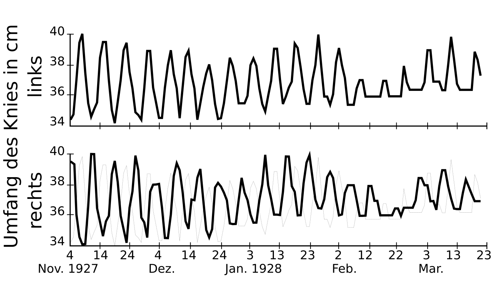

Die Patientin kam in die Sprechstunde, wurde aufgerufen, legte sich auf die Liege, und Dr. Reimann vermaß mit einem Maßband ihre beiden Knie. 39,7 cm maß der Umfang rechts, 34,3 cm links. Das rechte Knie war also in seinem Durchmesser fast 2 cm angeschwollen.

Dass bei jungen Frauen im Kniegelenk mit bestimmter Regelmäßigkeit Ergüsse auftreten, war schon seit 1845 bekannt. So maß Dr. Reimann zwischen dem 4. November 1927, als die Patientin zum ersten Mal zu ihm kam, und dem 23. März des Folgejahres jeden Tag beide Knieumfänge. In diesem Zeitraum beobachtete er bei seiner Patientin 19 periodische Schwellungen rechts und ebenso 19 links mit einer Phasenverschiebung um genau 180°, d. h. wenn das rechte Knie anschwoll, tat es das linke nicht und umgekehrt.

Historisches Fallbeispiel einer krankhaften Ansammlung von Flüssigkeit in beiden Kniegelenken, beobachtet zwischen dem 4. 10. 1927 und 23. 3. 1928. Neunzehn periodische Schwellungen mit einer Phasenverschiebung um genau 180° offenbarten sich. Dem unteren Graphen ist die Kurve des rechten Knieumfangs als dünnen Linie unterlegt, um die Phasenverschiebung deutlich zu kennzeichnen. Modifiziert aus Ref. 1.

Reimann interessierten solche eigenartigen periodischen Krankheiten. Er übertitelte mit „Periodische Erkrankungen“ 41 Jahre später seine Fachpublikation1 über eine Gruppe von zehn solcher Krankheiten unbekannter Ursache, „*die wahrscheinlich erbbedingt sind, die zu irgendeiner Lebenszeit beginnen oder aufhören, während Jahren in regelmäßigen oder unregelmäßigen kurzen Abständen bei sonst gesunden Patienten auftreten, einer Behandlung trotzen und gelegentlich zum Tode führen.*“

Reimann wies darauf hin, dass erst insgesamt 2.000 Fälle beschrieben waren. Der erste davon war eine periodische Peritonitis (Entzündung des Bauchfells), die schon im 17. Jahrhundert beschrieben wurde, und ein anderer Fall war seine Patientin mit einer intermittierenden Hydarthrose.

## Erkrankungen, die biologischen Uhren folgen

Auffällig ist, dass die periodischen Krankheiten alle idiopathisch sind und die Ursachen bis heute weitgehend unbekannt blieben. Was Reimann damals schrieb, gilt heute noch:

> „Theoretisch scheint ein unbekannter fundamentaler Biorhythmus, eine sog. biologische Uhr, periodische Entladungen des Diencephalons auszulösen, die Episoden gleichartiger Erkrankungen herbeiführen. Die Entladungen laufen über das vegetative Nervensystem ab und offenbaren sich als neurovaskuläre Reaktionen. […] Die einzelnen Körperteile verhalten sich entsprechend ihrer vererbten Reaktionsfähigkeit im Einzelfall verschieden, was dann die verschiedenen Krankheitsgruppen erklärt. Personen, in deren Erbverwandtschaft Neurosen, Migräne oder Epilepsie vorkommen, leiden besonders unter periodisch auftretenden Erkrankungen.“

Reimann sah die Migräne zunächst nur als Risikofaktor einer der zehn von ihm bestimmten periodischen Erkrankungen an. Heute zählt die Migräne selbst als periodische Krankheit: Es ist mittlerweile bekannt, dass das Zwischenhirn (Diencephalon) im Zusammenspiel mit dem Hirnstamm neurovaskuläre Kopfschmerzen über das vegetative Nervensystem hervorruft, und auch der Biorhythmus bekam einen Namen: der Migränezyklus. Im Rahmen der [Kipppunkttheorie der Migräne](https://scilogs.spektrum.de/graue-substanz/was-bedeutet-ein-migraenegehirn-kippt/) haben wir die alte These über periodische Erkrankungen wiederbelebt und entwickeln auf dieser theoretischen Grundlage eine präemptive Migränetherapie, die das Beste aus den beiden Welten der Akuttherapie und Prophylaxe zusammenführt.

Der Text oben ist der Anfang eines Gastbeitrages, den ich zum Anlass der Auszeichnung mit dem Eugen Münch-Preis 2016 schrieb. Die ausgezeichnete Migräne-App [M-sense](http://m-sense.de/) verfolgt langfristig das Ziel, periodische Krankheiten für Betroffene frühzeitig kontrollierbar zu machen, indem Betroffene lernen, mit ihrer biologischen Uhr therapeutisch zu arbeiten, was es unter anderem erlauben wird, so rechtzeitig Maßnahmen einzuleiten, das Attacken schon im Keim ersticken. Dieses Vorgehen nennt man präemptiv. Wieso eine solche präemptive Therapie bedeutet, das Beste aus den beiden Welten der Akuttherapie und Prophylaxe zusammenzuführen, auf welchen neuen Mega-Trends dieser Ansatz beruht und auch warum Dr. Reimann diesen Trends 90 Jahre voraus war, kann man nun im [April Magazin der Stiftung Münch nachlesen.](http://www.stiftung-muench.org/category/stiftung-muench-themen/)

## Literatur

1 Reimann, Hobart A. „Periodische Erkrankungen.“ *Krankheiten durch Bakterien*. Springer Berlin Heidelberg, 1968. 948-958.
