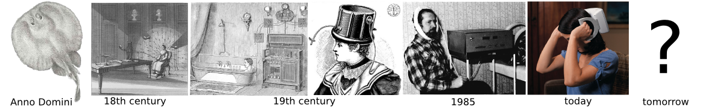

We have a [new preprint](https://peerj.com/preprints/515) online.

In this study, we explore with computer models why protocols for the use of medical devices that treat migraines should be personalized.

Our numerical simulations suggest that in migraine pathological activity nucleates in hot spots and traverses the convoluted cortical surface like being in a labyrinth. As a result, accessible target structures for neuromodulation are like fingerprints, they are individual features of each migraine sufferer.

Within the scientific community, the preprint can and should be discussed [directly on PeerJ](https://peerj.com/preprints/515/).

Let me just highlight the background for a wider public engagement.

If we look back at the history of electrical treatment of migraine, we may be surprised. In the beginning, the medical “device” was a fish. Scribonius Largus, court physician to the Roman emperor Claudius 47AD, used the black torpedo fish (electric rays) to treat migraine headaches. If we could look ahead, we most certainly would be even more surprised by what we find at the end of this development. In the journal Nature, Kristoffer Famm, vice-president of bioelectronics research and development at GlaxoSmithKline comments:

> “[Tools, such as optogenetics, that enable cellular-level control have improved researchers’ ability to analyse the signals in circuits, and they provide a mechanism by which future electroceuticals could elicit action potentials.](http://www.nature.com/nature/journal/v496/n7444/full/496159a.html)”

Famm envisions a day when electrical impulses are a mainstay of medical treatment and coined the term electroceuticals for medical devices that target specific cells within neural circuits. This may seem a long way to go, but also came a long way.

The moment electricity could be stored in the Leiden jar in the 18th century, the electrical fish for migraine treatment was replaced by it. The next developmental steps in the 19th century were to better control electricity and to miniaturize devices. Pulsed magnetic fields were studied since the mid 1980ies for headaches of various etiology. Recently, two devices got FDA approved. (Picture to the right, transcranial magnetic stimulation (TMS), SpringTMS®, courtesy of eNeura Inc. © 2014.)

As a 21st century step, computer models will help to design stimulation protocols more rationally. Just consider the new US\$4.5 billion NIH 12-year scientific vision for the BRAIN Initiative, published June 5 ([link](http://www.nih.gov/news/health/jun2014/od-05.htm)). The focus is not on theoretical concepts and technology per se, but on the development and use of these tools for acquiring fundamental insight about how the nervous system functions in health and disease.

Computer model are of particular value for pain research and neuromodulation.

First, the absence of classical biomarkers in migraine and other chronic pain conditions\* suggest that these conditions manifest in the electrical circuits of functional brain networks rather than in biochemistry (cf. our recent paper on [Understanding migraine using dynamic network biomarkers](http://cep.sagepub.com/content/early/2014/09/15/0333102414550108), Cephalalgia, 2014).

Second, episodic and chronic pain is a highly important health problem that not only significantly reduces quality of life by causing suffering and disability but also has high socio-economic burden by harming family and social relationships and losing work productivity.

Third, experiments on pain using human subjects and non-human animals pose the greatest ethical problems.

Computer models of pain formation could provide the means to design stimulation protocols rationally and they are also a remedy to the challenges mentioned above. Such models for migraine are currently developed in our group. They provide individualized neural tissue simulations. The goal is to explore whether they can deliver the same output as clinical data and thus would become a test bed for the development and quality assurance of biomedical engineering approaches in form of electrical and magnetic stimulation of the brain.

## Footnote

\* Calcitonin gene related peptide (CGRP) is increased in peripheral blood outside chronic migraine attacks. In the absence of symptomatic medication this could be a classical biomarker helping in the diagnosis of chronic migraine but not in the more common form of episodic migraine for which we suggest personalized strategies. Other than that, there are presently no validated biomarkers for any chronic pain condition, including migraine.
