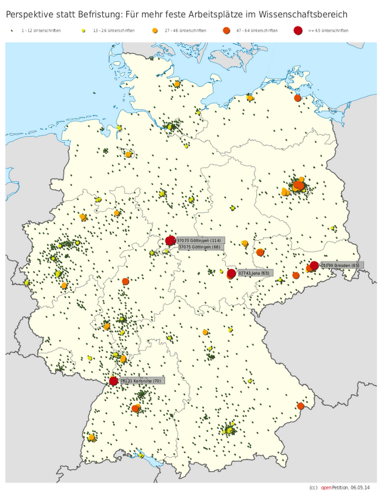
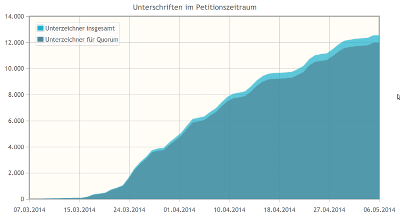

Seit einigen Wochen gibt es [auf openPetition eine Petition](https://www.openpetition.de/petition/online/perspektive-statt-befristung-fuer-mehr-feste-arbeitsplaetze-im-wissenschaftsbereich), die ich für unterstützenswert halte. Sie läuft noch 124 Tage und hat aktuell (6. Mai) 12.542 Unterzeichner.

Unterschriftenverteilung in Deutschland  
Jeder Punkt steht für die Anzahl der Unterschriften in einem Postleitzahlenbereich. Je größer der Punkt ist, desto so mehr Unterschriften wurden geleistet. Die Unterschriften in einer Stadt mit mehreren Postleitzahlen werden nicht zusammengefasst. Die 5 Bereiche mit den meisten Unterschriften sind extra markiert mit Postleitzahl, Ort und in Klammern der Anzahl der Unterschriften.

Unterschriften im Petitionszeitraum 124 Tage vor Petitionsende

> Sehr geehrte Frau Ministerin Dr. Wanka, sehr geehrter Herr Minister Gabriel,
>
> beenden Sie den Zustand der Massenbefristung im Wissenschaftsbereich.
>
> Wir bitten Sie:  
> Treffen Sie Maßnahmen, die Zahl unbefristeter Beschäftigungsverhältnisse im Wissen-schaftsbereich deutlich zu erhöhen. Geben Sie den Wissenschaftsinstitutionen die Möglichkeit und den Auftrag, als verantwortliche Arbeitgeber zu agieren.
>
> Setzen Sie sich für eine deutliche Begrenzung des Anteils befristeter Arbeitsverhältnisse in den Bereichen Wissenschaft und Technik ein. Insbesondere sind außer-hochschulische Forschungseinrichtungen nicht primär Ausbildungsstätten, sondern wesentlicher Teil des wissenschaftlichen Arbeitsmarktes.
>
> Öffentliche Fördergelder sollen der thematischen Förderung dienen, nicht einer automatisierten Personalpolitik. Wechselnde Themen erfordern kein wechselndes Personal. Exzellenz erfordert keine Unsicherheit der Existenz.  
> Öffentliche Gelder und Gesetze sollen Arbeitsplätze schaffen, keine Befristungsblase.
>
> Wir schlagen vor:  
> 1) Das Wissenschaftszeitvertragsgesetz soll weiter entwickelt werden:
>
> Die personenbezogenen Begrenzungen der Befristungsdauer sollen insbesondere für außer-hochschulische Einrichtungen ergänzt werden durch institutionsbezogene Begrenzungen des Befristungsanteils deutlich unterhalb des gegenwärtigen Niveaus. […]

[Weiterlesen und ggf. unterzeichnen.](https://www.openpetition.de/petition/online/perspektive-statt-befristung-fuer-mehr-feste-arbeitsplaetze-im-wissenschaftsbereich)
