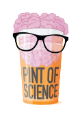
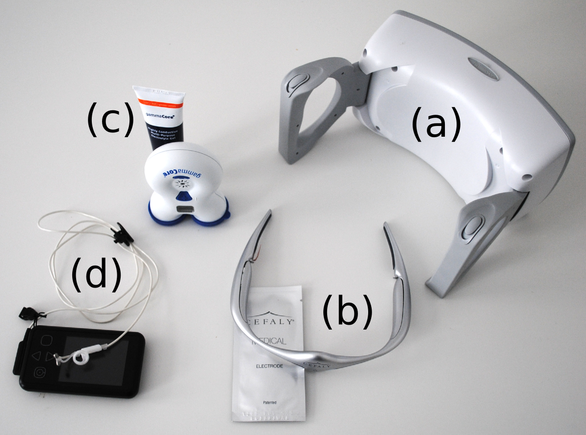

[*Transcript of my talk at the Pint of Science Festival in Berlin*]



Physics and headaches—I’m afraid for many people, who hear these two words, they think of them in one and only one combination, namely that physics causes a headache. Think about this. If I were to say that, for example, literature, Goethe and Shakespeare give me a headache, everyone would look at me as a complete philistine. While one usually gets away with saying that physics causes a headache.

**Physics is woven into what makes us human beings**

Let me elaborate this a bit before I proceed to the main issue. Because at least to my mind, physics, as a scientific discipline, is woven into what makes us human beings at least as much as any discipline from humanities. If this is understood, then we can also understand that there is a direct line form the traditional branches of physics to a physics of headaches and thus a physics against headaches.

**Branches of physics are organized along human motor and sensory systems**

Image back 2000 years, if I had to talk to 50 or 100 people, like I do now, then unamplified, of course, I would still be heard – in a greek theater. Even in one with more than 10,000 people. My *whispering* voice could be heard in the back rows. This is because the architectures at that time knew something about acoustics, a traditional branch of physics. Thus, physics can improve our hearing.

Optics, another branch of physics, has its origin in the quest to improve our sight. Mechanics, another branch of physics, increases our motor capabilities. Along our sensory and motor systems, we developed the traditional branches of physics. How much deeper can a scientific discipline get to the root of what makes us human beings? And physics dives even deeper into our inner organ functioning and into our mind.

**Relation between matter and mind**

You may wonder what about our other senses? The traditional five senses are, beside hearing and sight, taste, smell, and touch. In each there is a relation between a physical quantity and the subjective experience. In other words, there is a relation between matter and mind. If the physical quantity varies, the subjective experience will vary, too. How do we call the study of this phenomenon?

Psycho*physics*.

There is reason why the word physics appears here. Gustav Fechner, who developed the mathematical formula of this relationship between matter and mind, was by training a physician who turned to physics early in his career—not an unusual career step at his time.

At last, we can look beyond the traditional senses, slowly approaching pain. We are not quit yet there. Let’s first talk about our temperature sense. We have a sense for hot and cold. From this we derived the concept of heat, the study of which led its way to a whole new field in physics: thermodynamics, which is my field of expertise.

**Inner organ functioning was the role model of a steam engine**

It were Julius von Mayer and Hermann von Helmholtz, both, like Gustav Fechner, trained physicians but turned to physics, and both thought about how our inner organs work in connection with our metabolism producing heat and mechanical force. From their considerations they derived the first law of thermodynamics.

Putting things simply, one can say that thermodynamics arose from inner organ functioning. The inspiring view that a machine could use heat to produce force, which back then seemed to mimic organic functions, revolutionized our society. And I will come back to steam engines later again.

**Pain – not simply an overload**

Finally, what about pain? What about headaches? Pain is of course a sense. For a long time, it was believed that pain is simply an overload of the other senses: too hot, too much pressure, too much others things; but pain is a distinct sense on its own account.

On the matter side of pain, what is the physical quantity? In a broad “sense”, it is tissue damage—this intertwines, of course, with the other senses, in particular with touch and temperature. It gets a bit more complicated, because pain can also be a signal of potential tissue damage, that is, a sense of the risk of tissue damage. And in certain circumstances, pain, rather chronic pain, may even be a sign of malfunctioning risk assessment.

On the other side, on the mind side, there is the subjective experience. Pain can be experienced as being mild or severe and it can have further qualities, like being a throbbing, a sharp, a stabbing pain.

Let’s talk about one particular kind of pain: headaches. For this, we will go back again 2000 thousand years. If you opened a medical textbook back then, you could find the following description:

“To immediately remove and permanently cure a headache, …. a live black torpedo1 is put on the place which is in pain, until the pain ceases and the part grows numb.”

(1*A black torpedo is also called atlantic torpedo or dark electric ray. Electric rays have enough electricity to kill a horse, and there is a reason, why naval weapons are today called torpedos.*)

This is a text from Scribonius Largus, court physician to the Roman emperor Claudius, 47 Common Era. You can find similar descriptions by a contemporary of Scribonius Largus, Pliny the Elder, who, by the way, gave his name to a Double India Pale Ale. (Since this is the Pint of Science Festival, I thought I should mention this.)

Another method was to put one hand on the head and the other on the fish.

“One will be helped not only immediately but also without exception.”

Well, as we learn from these old textbooks, this latter method was used on slaves, who complained about headache. So you may wonder, whether the effect size was really that impressive.

Let’s fast forward quite a bit to the 18th century. The Leiden jar was invented in 1745. The Leiden jar is a famous device to store electricity. Today you would call it a capacitor. A capacitor can replace the living electric fish. A sufficiently powerful discharge of a capacitor could send sparks on the place which is in pain for up to 15 minutes. Exactly this was the first use of the Leiden jar as a new method to treat headaches, migraine in particular, as mentioned in a textbook form 1788.

Let’s fast forward a bit more to today. Today, we have these devices.

The first device (a) is a portable transcranial magnetic stimulator. The SpringTMS. You can administer pulses, each approximately 0.9 Tesla lasting less than a millisecond. Two such pulses 30 seconds apart were used in the aura phase in people suffering from migraine with aura in a study with a very similar device that got FDA approved.

Cefaly (b) is the first transcutaneous electrical nerve stimulation for migraine prevention. Patients are instructed to use the device once daily for a maximum of 20 minutes. The target is the upper, the ophthalmic branch of the fifths cranial nerve, the trigeminal nerve, which plays a fundamental role in primary headaches.

Last, there are two devices that target another cranial nerve, the vagus nerve. The one from electroCore (c) is placed on the skin of the neck over the vagus nerve for awhile. To be precise, the treatment consists of a first dose of one and a half minute stimulation, followed by a second dose 15 minutes later.

The other one, Vitos from CerboTec (d), is stimulating a branch of the vagus nerve in a particular region of the outer ear also through the skin for 4 hours spread out over each day.

**Cybernetics – A machine on the driver’s seat**

How do these devices work? Why is one for acute treatment the other for prevention? Which is the best target nerve? How long should a dose be; they range from less than a millisecond to hours. And how many such doses should be administered?

In other words, how much more do we know today as compared to what Scribonius Largus already knew? If truth be told, not that much. It is often simply try and error to find the right target point and an effective stimulation protocol. The mode of action is still to a great part unclear. This is, however, not different from pharmaceutical research. It is interesting to note that effective stimulation protocols are also called electroceutica, a term coined by the pharmaceutical company GlaxoSmithKline.

How can we learn more? How can we optimize electroceuticals? You may have guessed the answer: We need physics. Luckily, we already have a branch of physics that was developed exactly for such questions. So to be clear, all this is not physics just because these devices use electrical currents and magnetic fields. No, it is physics, because methods from physics will guide us in developing optimal control. Very much in the same way, as acoustics guides us in building great theaters.

First, if I talk about control, I mean the german word “Steuerung”. (This is why we have on our german keyboards “Strg” instead of “Ctrl”.) Control or “steuern” means to govern the course. On a ship, for example, the person on the wheel is also called the governor. Derived from “governance” this field of study is called cybernetics. Norbert Wiener suggested the greek word cybernetics in 1948, but the field is much older. James Maxwell wrote in 1868 one of the first papers “On governors” that control the speed of steam engines in a closed-loop paradigm. You may think of the pain in the migraine brain as generated by a population of cellular steam engines running too fast (see [here](http://journals.plos.org/ploscompbiol/article?id=10.1371/journal.pcbi.1003941) and [here](http://journal.frontiersin.org/article/10.3389/fncom.2015.00029/abstract)) and these devices control these populations and take them back to normal functioning.

Let me summarize this: There is a branch of physics called cybernetics, in which we study (among other things) how these devices can temporarily replace the governor of your brainship because he is asleep at the wheel. Why asleep? Primary headaches are considered idiopathic in origin, that means they are not caused by some other pathology but by failure of control within the brain. Therefore, these devices can target the cause of a migraine attack and not just pain as a mere symptom of the disease.
